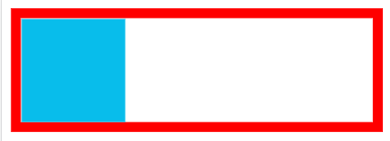
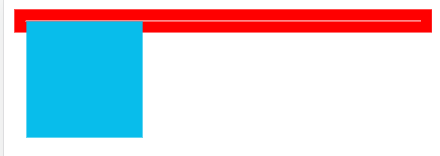
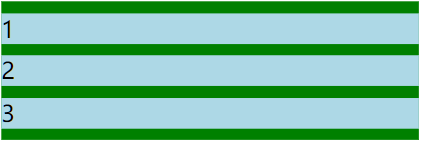
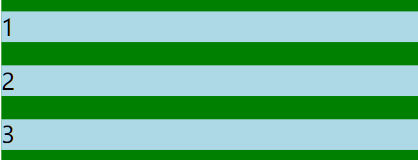
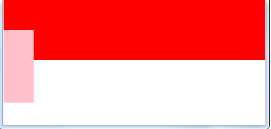
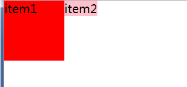

# CSS

## 1. BFC

### 1.1 什么是BFC？

> `W3C` 对 `BFC` 的定义如下： 浮动元素和绝对定位元素，非块级盒子的块级容器（例如 `inline-blocks`, `table-cells`, 和 `table-captions`），以及 `overflow` 值不为 `visitable` 的块级盒子，都会为他们的内容创建新的 `BFC`（`Block Formatting Context`， 即块级格式上下文）。

### 1.2 触发条件

一个 `HTML` 元素要创建 `BFC`，则满足下列的任意一个或多个条件即可： 下列方式会创建块格式化上下文：

- 根元素(`root`)
- 浮动元素（元素的 `float`不是 `none`）
- 绝对定位元素（元素的 `position`为 `absolute`或 `fixed`）
- 行内块元素（元素的 `display`为 `inline-block`）
- 表格单元格（元素的 `display`为 `table-cell`，`HTML`表格单元格默认为该值）
- 表格标题（元素的 `display`为 `table-caption`，`HTML`表格标题默认为该值）
- 匿名表格单元格元素（元素的`display`为`table、table-row、 table-row-group、table-header-group、table-footer-group`（分别是`HTML table、row、tbody、thead、tfoot`的默认属性）或`inline-table`）
- `overflow`值不为`visible`的块元素-弹性元素（`display`为 `flex`或 `inline-flex`元素的直接子元素）
- 网格元素（`display`为`grid`或`inline-grid`元素的直接子元素） 等等。

### 1.3 BFC渲染规则

- `BFC` 内部垂直方向外边距重叠
- `BFC` 的区域不会与浮动元素的 box 重叠
- `BFC` 是一个独立的容器，外面的元素不会影响里面的元素
- 计算 `BFC` 高度的时候浮动元素也会参与计算

### 1.4 应用场景

#### 1.4.1. 防止浮动导致父元素高度塌陷

现有如下页面代码:

```html
<!DOCTYPE html>
<html lang="en">
  <head>
    <meta charset="UTF-8">
    <meta name="viewport" content="width=device-width, initial-scale=1.0">
    <meta http-equiv="X-UA-Compatible" content="ie=edge">
    <title>Document</title>
    <style>
      .container {
        border: 10px solid red;
      }
      .inner {
        background: #08BDEB;
        height: 100px;
        width: 100px;
      }
    </style>
  </head>
  <body>
    <div class="container">
      <div class="inner"></div>
    </div>
  </body>
</html>
```



接下来将 `inner` 元素设为浮动:

```css
  .inner {
    float: left;
    background: #08BDEB;
    height: 100px;
    width: 100px;
  }
```

会产生这样的塌陷效果：



但如果我们对父元素设置 `BFC` 后, 这样的问题就解决了:

```css
.container {
    border: 10px solid red;
    overflow: hidden;
}
```

同时这也是清除浮动的一种方式。

#### 1.4.2. 避免外边距折叠

两个块同一个 `BFC` 会造成外边距折叠，但如果对这两个块分别设置 `BFC` ，那么边距重叠的问题就不存在了。

现有代码如下:

```html
<!DOCTYPE html>
<html lang="en">

<head>
  <meta charset="UTF-8">
  <meta name="viewport" content="width=device-width, initial-scale=1.0">
  <meta http-equiv="X-UA-Compatible" content="ie=edge">
  <title>Document</title>
  <style>
    .container {
      background-color: green;
      overflow: hidden;
    }

    .inner {
      background-color: lightblue;
      margin: 10px 0;
    }
  </style>
</head>

<body>
  <div class="container">
    <div class="inner">1</div>
    <div class="inner">2</div>
    <div class="inner">3</div>
  </div>
</body>

</html>
```



此时三个元素的上下间隔都是 10px , 因为三个元素同属于一个 `BFC` 。现在我们做如下操作:

```html
  <div class="container">
    <div class="inner">1</div>
    <div class="bfc">
      <div class="inner">2</div>
    </div>
    <div class="inner">3</div>
  </div>
```

style 增加:

```css
.bfc{
    overflow: hidden;
}
```

效果如下:



可以明显地看到间隔变大了，而且是原来的两倍，符合我们的预期。

>tips 要在目标元素外面套一层块级元素

## 2. 盒子模型

- 标准盒子模型：(宽度 = 内容的宽度 [content]) + border + padding + margin `content-box`
- 怪异盒子模型：(宽度 = 内容宽度 [content + padding + border]) + margin `border-box`

### 2.1 box-sizing 的使用

如果想要切换盒模型也很简单，这里需要借助 css3 的`box-sizing`属性

- `box-sizing: content-box` 是 W3C 盒子模型
- `box-sizing: border-box` 是 IE 盒子模型

> tips `box-sizing` 的默认属性是 `content-box`

## 3. CSS 选择器, 属性继承

### 3.1 CSS 选择器

1. id 选择器 (#myId)
2. 类选择器 (.myClassName)
3. 标签选择器(div, h1, p)
4. 相邻选择器 / 兄弟选择器 (h1 + p) (对 p 进行选择)
5. 子选择器 (ul > li)
6. 后代选择器 (li a)
7. 通配符选择器 (*)
8. 属性选择器 (a[rel = "external"])
9. 伪类选择器 (a: hover, li: nth-child)

- 不可继承样式：`display、margin、border、padding、background、height、min-height、max-height、width、min-width、max-width、overflow、position、left、right、top、bottom、z-index、float、clear`
- 可以继承的样式：`letter-spacing、word-spacing、white-space、line-height、color、font、font-family、font-size、font-style、font-variant、font-weight、text-decoration、text-transform、direction、visibility、cursor` 以文本样式为主

### 3.2 CSS 优先级算法

优先级（就近原则）：!important > [ id > class > tag ]
!important 比内联优先级高

- !important 最高
- 内联样式 权重 1000
- id 选择器 权重 100
- 类选择器、伪类选择器、属性选择器 权重10
- 标签选择器、伪元素选择器 权重1
- 通配符选择器、子选择器、相邻同胞选择器 权重0

1. !important 声明的样式优先级最高，如果冲突再进行计算。
2. 如果优先级相同，则选择最后出现的样式。
3. 继承得到的样式的优先级最低。

## 4. 元素水平垂直居中

### 4.1 水平居中

#### 4.1.1 行内元素

对于**行内元素**: `text-align: center`

#### 4.1.2 确定宽度

1. `width` 和 `margin` 实现。`margin: 0 auto`
    如果不生效，请检查是否有确定宽度和是否为块状元素

    ```css
    div {
      background: #000;
      width: 200px;
      margin: 0 auto;
    }
    ```

2. 绝对定位和`margin-left: calc(50% - width/2)`, 前提是父元素`position: relative/absolute 等可以帮助定位的属性`

    `margin` 的 50% 是以父元素的宽度计算的

    使用 `calc` 函数进行计算

    ```css
    div {
      background: #000;
      width: 200px;
      position: absolute;
      margin-left: calc(50% - 100px);
    }
    ```

3. `absolute`和 `fixed`

    ```css
    div {
        position: absolute;
        margin: auto; //关键
        left: 0;
        right: 0;
    }
    /* 同理所有脱离文档流的都可以 */
    /* 需要上下居中，那么 bottom: 0 或者 top: 0 即可 */
    /*  前提是父元素 position: relative/absolute 等可以帮助定位的属性 */
    ```

#### 4.1.3 宽度未知

1. `table` 标签配合 `margin` 左右 `auto` 实现水平居中。使用 `table` 标签（或直接将块级元素设值为`display: table`），再通过给该标签添加左右 `margin` 为 `auto`

    ```css
    div{
      display: table;
      margin: 0 auto;
    }
    ```

2. `inline-block` 实现水平居中方法。`display：inline-block` 和 `text-align: center` 实现水平居中。

    - 子级 `display: inline-block` 父级 `text-align: center` 实现水平居中。
    - `display`，前面 `inline-` 都是；本质上转成行内元素

3. `( relative + absolute / relative ) + transform`，`translateX`可以移动本身元素的 50%，同时设置 `left` 为 50%

    ```css
    div {
      position: absolute;
      left: 50%;
      transform: translateX(-50%);
    }
    ```

4. flex 布局使用 `justify-content: center`

    ```css
    div {
      display: flex;
      justify-content: center;
    }
    ```

5. 父级设置`display: flex/inline-flex;`子级设置`margin: auto`实现自适应居中

### 4.2 垂直居中

前三种即可

1. 利用 `line-height` 实现居中，这种方法适合纯文字类、icon
2. 父级设置 `display: flex/inline-flex;` 子级设置 `margin: auto` 实现自适应居中
3. **已知父元素高度**。子级: `position: relative; top: 50%; transform: translateY(-50%)`
4. **已知父元素高度**。父级:  `position: relative;` 子级: `position: absolute; top: 50%; transform: translateY(-50%);`
5. 父元素 `display: table;` 子元素 `display：table-cell; vertical-align: middle;`
6. flex方案: `align-items: center;`

>tips 子 relative = 父relative + 子abstract

## 5. 浮动布局

### 5.1 优点

这样做的优点就是在图文混排的时候可以很好的使文字环绕在图片周围。另外当元素浮动了起来之后，它有着块级元素的一些性质例如可以设置宽高等，但它与 `inline-block` 还是有一些区别的，第一个就是关于横向排序的时候，`float` 可以设置方向而 `inline-block` 方向是固定的；还有一个就是 `inline-block` 在使用时有时会有空白间隙的问题。

### 5.2 缺点

最明显的缺点就是浮动元素一旦脱离了文档流，就无法撑起父元素，会造成父级元素的高度塌陷。

### 5.3 清除浮动的方式

1. 添加额外标签 `<br>` 或 `clear: both;`

    ```html
    <div class="fa">
      <div class="son">1111</div>
      <div style="clear: both;"></div>
    </div>
    ```

2. 父级添加 `overflow` 属性，或者设置高度

    ```css
    .fa {
      overflow: hidden; 
    }
    ```

3. 建立伪类选择器清除浮动（推荐）

    ```css
    .fa::after{
      /* 设置添加子元素的内容是空 */
      content: '';  
      /* 设置添加子元素为块级元素 */
      display: block;
      /* 设置添加的子元素的高度0 */
      height: 0;
      /* 设置添加子元素看不见 */
      visibility: hidden;
      /* 设置clear：both */
      clear: both;
    }
    ```

## 6. @media 查询

**CSS 语法：**

```css
@media *mediatype* and|not|only *(media feature)* {*
  CSS-Code;
*}

//如:当屏幕的最大宽度小于300px时
@media screen and (max-width: 300px) {
    body {
        background-color:lightblue;
    }
}
```

**mediatype:**

- all 适用于所有类型
- print 适用于打印机和打印预览
- screen 适用于电脑屏幕、平板电脑、智能手机等
- speech 适用于屏幕阅读器

**逻辑运算符：**

- **not**：用来排除某种设备。比如，排除打印设备 `@media not print`；
- **only**：用以指定某特定媒体设备。对于支持 Media Queries 的移动设备来说，如果存在 only 关键字，移动设备的 Web 浏览器会忽略 only关键字并直接根据后面的表达式应用样式文件。对于不支持 Media Queries 的设备但能够读取 Media Type 类型的 Web浏览器，遇到 only 关键字时会忽略这个样式文件。
- **all**：适用于所有的设备类型；
- **and**：媒体查询中使用来连接多种媒体特性,一个媒体查询中可以包含0或多个表达式，表达式可以是0或多个关键字，以及一种媒体类型。如：`@media screen and ( max-width: 800px ) and ( min-width: 400px )`

**media feature:**

| aspect-ratio            | 定义输出设备中的页面可见区域宽度与高度的比率                 |
| ----------------------- | ------------------------------------------------------------ |
| color                   | 定义输出设备每一组彩色原件的个数。如果不是彩色设备，则值等于0 |
| color-index             | 定义在输出设备的彩色查询表中的条目数。如果没有使用彩色查询表，则值等于0 |
| device-aspect-ratio     | 定义输出设备的屏幕可见宽度与高度的比率。                     |
| device-height           | 定义输出设备的屏幕可见高度。                                 |
| device-width            | 定义输出设备的屏幕可见宽度。                                 |
| grid                    | 用来查询输出设备是否使用栅格或点阵。                         |
| height                  | 定义输出设备中的页面可见区域高度。                           |
| max-aspect-ratio        | 定义输出设备的屏幕可见宽度与高度的最大比率。                 |
| max-color               | 定义输出设备每一组彩色原件的最大个数。                       |
| max-color-index         | 定义在输出设备的彩色查询表中的最大条目数。                   |
| max-device-aspect-ratio | 定义输出设备的屏幕可见宽度与高度的最大比率。                 |
| max-device-height       | 定义输出设备的屏幕可见的最大高度。                           |
| max-device-width        | 定义输出设备的屏幕最大可见宽度。                             |
| max-height              | 定义输出设备中的页面最大可见区域高度。                       |
| max-monochrome          | 定义在一个单色框架缓冲区中每像素包含的最大单色原件个数。     |
| max-resolution          | 定义设备的最大分辨率。                                       |
| max-width               | 定义输出设备中的页面最大可见区域宽度。                       |
| min-aspect-ratio        | 定义输出设备中的页面可见区域宽度与高度的最小比率。           |
| min-color               | 定义输出设备每一组彩色原件的最小个数。                       |
| min-color-index         | 定义在输出设备的彩色查询表中的最小条目数。                   |
| min-device-aspect-ratio | 定义输出设备的屏幕可见宽度与高度的最小比率。                 |
| min-device-width        | 定义输出设备的屏幕最小可见宽度。                             |
| min-device-height       | 定义输出设备的屏幕的最小可见高度。                           |
| min-height              | 定义输出设备中的页面最小可见区域高度。                       |
| min-monochrome          | 定义在一个单色框架缓冲区中每像素包含的最小单色原件个数       |
| min-resolution          | 定义设备的最小分辨率。                                       |
| min-width               | 定义输出设备中的页面最小可见区域宽度。                       |
| monochrome              | 定义在一个单色框架缓冲区中每像素包含的单色原件个数。如果不是单色设备，则值等于0 |
| orientation             | 定义输出设备中的页面可见区域高度是否大于或等于宽度。         |
| resolution              | 定义设备的分辨率。如：96dpi, 300dpi, 118dpcm                 |
| scan                    | 定义电视类设备的扫描工序。                                   |
| width                   | 定义输出设备中的页面可见区域宽度。                           |

## 7. flex

[阮一峰的flex系列](https://www.ruanyifeng.com/blog/2015/07/flex-grammar.html)

以下6个属性设置在容器上。

- `flex-direction`属性决定主轴的方向 `row` | `row-reverse` | `column` | `column-reverse`
- `flex-wrap`如何换行 `nowrap` | `wrap` | `wrap-reverse`
- `flex-flow`: 是`flex-direction`属性和`flex-wrap`属性的简写形式，默认值为`row nowrap`
- `justify-content`定义了项目在主轴上的对齐方式: `flex-start` | `flex-end` | `center` | `space-between` | `space-around`
- `align-items` 定义项目在交叉轴上如何对齐 `flex-start` | `flex-end` | `center` | `baseline` | `stretch`
- `align-content`属性定义了多根轴线的对齐方式 `flex-start` | `flex-end` | `center` | `space-between` | `space-around` | `stretch`
- `baseline`: 项目的第一行文字的基线对齐

**align-items:**


**align-content:**


- `order`：属性定义项目的排列顺序。数值越小，排列越靠前，默认为0。
- `flex-grow`：属性定义项目的放大比例，默认为`0`，即如果存在剩余空间，也不放大。如果所有项目的 `flex-grow` 属性都为1，则它们将等分剩余空间（如果有的话）。如果一个项目的 `flex-grow` 属性为2，其他项目都为1，则前者占据的剩余空间将比其他项多一倍。
- `flex-shrink`：如果所有项目的 `flex-shrink` 属性都为1，当空间不足时，都将等比例缩小。如果一个项目的 `flex-shrink` 属性为0，其他项目都为1，则空间不足时，前者不缩小。
- `flex-basis`：`flex-basis` 属性定义了在分配多余空间之前，项目占据的主轴空间（main size）。浏览器根据这个属性，计算主轴是否有多余空间。它的默认值为 `auto`，即项目的本来大小。可以设为跟 `width` 或 `height` 属性一样的值（比如 350px ），则项目将占据固定空间
- `flex`: 是 `flex-grow`, `flex-shrink` 和 `flex-basis` 的简写，默认值为 `0 1 auto`。后两个属性可选。
- `align-self`：`align-self` 属性允许单个项目有与其他项目不一样的对齐方式，可覆盖 `align-items` 属性。默认值为 `auto`，表示继承父元素的 `align-items` 属性，如果没有父元素，则等同于 `stretch`。

## 8. CSS 优化

1. 避免过度约束
2. 避免后代选择符
3. 避免链式选择符
4. 使用紧凑的语法
5. 避免不必要的命名空间
6. 避免不必要的重复
7. 最好使用表示语义的名字。一个好的类名应该是描述他是什么而不是像什么
8. 避免`!important`，可以选择其他选择器
9. 尽可能的精简规则，你可以合并不同类里的重复规则

## 9. 浏览器解析 CSS 选择器

浏览器会『从右往左』解析 `CSS` 选择器。
我们知道 `DOM Tree` 与 `Style Rules` 合成为 `Render Tree`，实际上是需要将 `Style Rules` 附着到 `DOM Tree`上，
因此需要根据选择器提供的信息对 `DOM Tree` 进行遍历，才能将样式附着到对应的 `DOM` 元素上。
以下这段 `CSS` 为例

```html
<style type="text/css">
.mod-nav ul li {font-size: 16px;}
</style>
```

若从左向右的匹配，过程是：

从 `.mod-nav` 开始，遍历子节点 `ul`，然后各自向子节点遍历，最后遍历到叶子节点 `li`
发现不符合规则，需要回溯到 `ul` 节点，再遍历下一个 `ul - li`，一颗 `DOM` 树的节点动不动上千，这种效率很低。

如果从右至左的匹配：

先找到所有的最右节点 `li`，对于每一个 `li`，向上寻找节点 `ul`
由 `ul` 再向上寻找 `class = "mod-nav"` 的节点
最后找到根元素 `html` 则结束这个分支的遍历。

后者匹配性能更好，是因为从右向左的匹配在第一步就筛选掉了大量的不符合条件的最右节点（叶子节点）；而从左向右的匹配规则的性能都浪费在了失败的查找上面。

而在 `CSS` 解析完毕后，需要将解析的结果与 `DOM Tree` 的内容一起进行分析建立一棵 `Render Tree`，最终用来进行绘图。在建立 `Render Tree` 时（`WebKit` 中的`「Attachment」`过程），浏览器就要为每个 `DOM Tree` 中的元素根据 `CSS` 的解析结果 `Style Rules` 来确定生成怎样的 `Render Tree`。

## 10. css3动画

```css
div{
  width:100px;
  height:100px;
  background:red;
  animation:myFirst 5s;
}

@keyframes myFirst{
  from {background:red;}
  to {background:yellow;}
}

@keyframes myFirst{
  0%   {background: red;}
  25%  {background: yellow;}
  50%  {background: blue;}
  100% {background: green;}
}
```

| 属性                                                         | 描述                                                         |
| :----------------------------------------------------------- | :----------------------------------------------------------- |
| [@keyframes](https://www.runoob.com/cssref/css3-pr-animation-keyframes.html) | 规定动画。                                                   |
| [animation](https://www.runoob.com/cssref/css3-pr-animation.html) | 所有动画属性的简写属性。                                     |
| [animation-name](https://www.runoob.com/cssref/css3-pr-animation-name.html) | 规定 `@keyframes` 动画的名称。                                 |
| [animation-duration](https://www.runoob.com/cssref/css3-pr-animation-duration.html) | 规定动画完成一个周期所花费的秒或毫秒。默认是 0。             |
| [animation-timing-function](https://www.runoob.com/cssref/css3-pr-animation-timing-function.html) | 规定动画的速度曲线。默认是 `ease`。                          |
| [animation-fill-mode](https://www.runoob.com/cssref/css3-pr-animation-fill-mode.html) | 规定当动画不播放时（当动画完成时，或当动画有一个延迟未开始播放时），要应用到元素的样式。 |
| [animation-delay](https://www.runoob.com/cssref/css3-pr-animation-delay.html) | 规定动画何时开始。默认是 0。                                 |
| [animation-iteration-count](https://www.runoob.com/cssref/css3-pr-animation-iteration-count.html) | 规定动画被播放的次数。默认是 1。                             |
| [animation-direction](https://www.runoob.com/cssref/css3-pr-animation-direction.html) | 规定动画是否在下一周期逆向地播放。默认是 `normal`。          |

## 11. 设置div元素的高度为宽度的一半

```html
<!-- 利用padding-bottom==父元素的height -->
<style>
.out {
  width: 100%;
  height: 100%;
  background: #ccc;
}

.in {
  background: #000;
  padding: 25% 0;
}
</style>


<div class="out">
  <div class="in"></div>
</div>

<!-- vw和calc属性 -->
<style>
.out {
  width: 100%;
  height: 100%;
  background: red;
}
.in {
  background: #000;
  height: calc(50vw - 10px);
}
</style>
```

## 12.rem、em、vw、vh详解

| 单位 | 说明                                                         | 兼容性                       |
| ---- | :----------------------------------------------------------- | ---------------------------- |
| em   | 相对长度单位，相对于当前对象内文本的字体尺寸， 根据父元素字体大小而变化。元素的 `width/height/padding/margin` 用 em 的话是相对于该元素的 `font-size` | 良好                         |
| rem  | 相对长度单位，相对于根元素（ 即 html 元素）`font-size` 的倍数， 不会被它的父元素影响 | IE9+、火狐 3.6+、 safari5.0+ |
| vw   | 相对于视口的宽度， 视口被均分为 100 单位的 vw                | 高版本浏览器均支持           |
| vh   | 相对于视口的宽度， 视口被均分为 100 单位的 vh                | 高版本浏览器均支持           |

## 13. 半像素

**transform 进行偏转：**

```css
{
  width: 200px;
  height: 1px;
  background: #000;
  transform: scale(1, 0.5);
  transform-origin: 0 0;
}
```

## 14. 元素隐藏

`display: none` 和 `visibility: hidden` 都能把网页上某个元素隐藏起来，但是两者有区别：

一、`display: none`

1. 不为被隐藏的对象保留其物理空间。html 对象在页面上彻底消失 `display: none` 会让元素完全从渲染树中消失，渲染的时候不占据任何空间）。
2. 是非继承属性，子孙节点消失由于元素从渲染树消失造成的，通过修改子孙节点，属性无法显示。
3. 修改常规文档流元素的 `display` 通常会造成文档的重排 `reflow` 重绘 `repaint`。

二、`visibility: hidden`

1. 为隐藏的对象保留其物理空间，`html` 对象仅仅是在视觉上看不见（完全透明），而它所占据的空间位置仍然存在（`visibility: hidden`不会让元素从渲染树中消失，渲染树元素继续占据空间，只是内容不可见）。
2. 是继承，子孙节点消失由于继承了 `hidden`，通过`visibility: visible`可以让子孙节点显示。
3. 修改 `visibility` 属性只会造成文档的重绘 `repaint` 。

## 15. 块级元素和行内元素

### 块级元素

每个块级元素通常都会独占一行或者是多行，可以对其单独设置高度,宽度以及对齐等属性

常见的块级元素有：`<h1>~<h6>,<p>,<div>,<ul>,<ol>,<li>` 等

块级元素的特点：

- 块级元素会独占一行
- 高度，行高，外边距和内边距都可以**单独设置**
- 宽度默认是容器的 100%
- 可以容纳内联元素和其他的块级元素

### 行内元素

行内元素（内联元素）：不占有独立的区域，仅仅依靠自己的字体大小或者是图像大小来支撑结构。一般不可以设置宽度，高度以及对齐等属性。

常见的行内元素有：`<a>,<strong>,<b>,<em>,<del>,<span>`等
行内元素的特点：

- 和相邻的行内元素在一行上
- 高度和宽度无效，但是水平方向上的`padding`和`margin`可以设置，垂直方向上的无效
- 默认的宽度就是它本身的宽度
- 行内元素只能容纳纯文本或者是其他的行内元素（a标签除外）

**注意：**

只有文字才能组成段落，因此类似`<p>,<h1>~<h6>,<dt>`等里面不能放块级元素；因为它们都是文字块级标签，里面不能再存放其他的块级标签。

链接里面不能再存放链接

### 行内块级元素

在行内元素中有几个特殊的标签，`,<input/>,<td/>,<button/>`,可以设置它们的宽高度以及对齐属性

行内块级元素的特点：

- 和相邻的行内元素（行内块）在一行上，但是中间会有空白的间隙
- 默认的宽度就是本身内容的宽度
- 高度，行高，内边距和外边距都可以设置

## 16. 图片剪裁 object-fit

| 属性       | 说明                                                         |
| ---------- | ------------------------------------------------------------ |
| fill       | 默认，不保证保持原有的比例，内容拉伸填充整个内容容器。       |
| contain    | 保持原有尺寸比例。内容被缩放。                               |
| cover      | 保持原有尺寸比例。但部分内容可能被剪切。                     |
| none       | 保留原有元素内容的长度和宽度，也就是说内容不会被重置。       |
| scale-down | 保持原有尺寸比例。内容的尺寸与 `none` 或 `contain` 中的一个相同，取决于它们两个之间谁得到的对象尺寸会更小一些。 |

## 17. 图片懒加载

`img` `loading` 属性

```html

```

**属性值:**

| 值    | 描述                                                 |
| :---- | :--------------------------------------------------- |
| eager | 默认，图像立即加载。                                 |
| lazy  | 图像延迟加载，只有鼠标滚动到该图片所在位置才会显示。 |

最后，总结下，原生懒加载的5个行为特性：

`Lazy loading` 加载数量与屏幕高度有关，高度越小加载数量越少，但并不是线性关系。
`Lazy loading` 加载数量与网速有关，网速越慢，加载数量越多，但并不是线性关系。
`Lazy loading` 加载没有缓冲，滚动即会触发新的图片资源加载。
`Lazy loading` 加载在窗口 `resize` 尺寸变化时候也会触发，例如屏幕高度从小变大的时候。
`Lazy loading` 加载也有可能会先加载后面的图片资源，例如页面加载时滚动高度很高的时候。

与 `JavaScript` 有关的几个行为特征：

判断浏览器是否支持原生 `loading`，最好使用`loading in XXX` 判断。
获取 `loading` 属性值可以直接 `img.loading`；
原生 `loading` 不可写，例如 `HTMLImageElement.prototype.loading` 会报错 `Illegal invocation`。

## 18.100% 100vw

没有发生滚动时

100vw = 100% + 滚动条(如果有)

## 19. 鼠标阻断css

> `pointer-events`

- `auto`：效果和没有定义 `pointer-events` 属性相同，鼠标不会穿透当前层。在 `SVG` 中，该值和 `visiblePainted` 的效果相同。
- `none`：元素永远不会成为鼠标事件的 [target](https://developer.mozilla.org/en-US/docs/Web/API/event.target)（目标）。但是，当其后代元素的`pointer-events`属性指定其他值时，鼠标事件可以指向后代元素，在这种情况下，鼠标事件将在捕获或冒泡阶段触发父元素的事件侦听器。实际上默认就可以穿透当前层，因为`pointer-events`默认为`auto`

当两个标签嵌套时，点击内部的会依次触发内部-外部，若在内部增加 `pointer-events` 进行阻断，只会触发外部监听的事件

## 20. display

**块级元素(block)**：独占一行，对宽高的属性值生效；如果不给宽度，块级元素就默认为浏览器的宽度，即就是100%宽。

**行内元素(inline)**：可以多个标 签存在一行，对宽高属性值不生效，完全靠内容撑开宽高。

**行内块元素(inline-block)**：结合的行内和块级的优点，既可以设置长宽，可以让 `padding` 和 `margin` 生效，又可以和其他行内元素并排。**img 和 input为行内块元素**

### 行内元素与块状元素之间的转换:

**float:** 当把行内元素设置完 `float: left/right` 后，该行内元素的 `display` 属性会被赋予 `block` 值，且拥有浮动特性。行内元素去除了之间的莫名空白。

**position:** 当为行内元素进行定位时， `position: absolute` 与 `position: fixed` 都会使得原先的行内元素变为块级元素。

**display:**

1、块级标签转换为行内标签：`display: inline`

2、行内标签转换为块级标签：`display: block`

3、转换为行内块标签：`display：inline-block`

### 特性

1.`text-align` 属性对块级元素起作用，对行内元素不起作用：原因是块级标签如果不给宽度，块级元素就默认为浏览器的宽度，即就是100%宽，那么在100%的宽度中居中生效；但是行内元素的宽完全是靠内容撑开，所以宽度就是内容撑开的宽：


​所以块级是在盒子中间居中了，但是因为行内元素的宽就是内容宽，没有可居中的空间，所以 `text-align: center` 就没有作用；但是如果给font转换为块级就不一样了：


2.块级元素独自占一行且宽度会占满父元素宽度，行内元素不会独占一行，相邻行内元素可以排在同一行。


3.块级元素可以设置 `width` 和 `height`，行内元素设置 `width` 和 `height` 无效，而且块级元素即使设置宽度也还是独占一行。注意但块级元素当没有明确指定 `width` 和 `height` 值时，块级元素尺寸由内容确定，当指定了 `width` 和 `height` 的值时，内容超出块级元素的尺寸就会溢出，这时块级元素要呈现什么行为要看其 `overflow` 的值 (`visible,hidden,overflow,scroll`)

4.块级元素可以设置 `margin` 和 `padding` 属性，行内元素水平方向的 `margin` 和 `padding` 如 `margin-left、padding-right` 可以产生边距效果，但是竖直方向的`margin-top、margin-bottom`不起作用

5.行内元素的 `padding-top` 和 `padding-bottom` 会起作用，不过就像脱离了标准流一样（即`padding-left` 和 `padding-right` 的层级比其他元素高），并不会占据位置，并且还把其他元素给盖住了。但是，假如`inline` 的元素没有内容，`padding-top`、`padding-bottom` 将不起作用。如果想要起作用，只需要给 `padding-left` 或者 `padding-right` 设置一个值，或者当 `inline` 的元素有内容时就会起作用。

```html
<style type="text/css">        
div{
  background-color: green;
  height: 50px;
  width: 40%;;
  padding: 20px;
  margin: 20px;
}        
span{
  background-color: 
  gray;height: 70px;
  padding: 40px;margin: 20px;}        
  strong{background-color: blue;
  height: 70px;
  padding: 40px;
  margin: 20px;
  float: left;
}    
</style>
<div>块级元素一</div>
<span>行内元素一</span>
<strong>行内元素二</strong>
```


如图所示，当我们改变 `padding` 值时，效果是背景向四个方向扩展，`padding-top` 和 `padding-bottom` 是增大的，但是对于块状元素一是没有影响的（在竖直方向上），不然行内元素一也不会挤入块状元素了。

------

下面的实例可以看到如果 `inline` 的元素没有内容，`padding-top`、`padding-bottom` 将不起作用

```html
<style>
body,div{
  margin: 0;
  padding:0;
}
.item1{
  height:100px;
  background-color: red;
}
.item2{
  display: inline;
  padding-top: 50px;
  padding-bottom: 50px;
  background-color: pink;
}
</style>
<div class="item1"></div>
<div class="item2"></div>
```


------

如果想让 `padding-top` 或者 `padding-bottom` 起作用，只需要给 `padding-left` 或者 `padding-right` 设置一个值，或者当 `inline` 的元素有内容时就会起作用。

```html
<style>
body,div{
  margin: 0;
  padding:0;
}
.item1{
  height:100px;
  background-color: red;
}
.item2{
  display: inline;
  padding-top: 50px;
  padding-bottom: 50px;
  padding-left: 50px;
  background-color: pink;
}
</style>
<div class="item1"></div>
<div class="item2"></div>
```



6.当 `inline-block` 碰到同类 `inline，inline-block` 时，谁的上下 `margin、padding` 或 `line-height` 大，就听谁的。除非它是 `inline`，因为 `inline` 的 `margin` 是不起作用的。且 `inline` 的 `padding` 是不占空间的。

```html
<style>
  body,
  div {
    margin: 0;
    padding: 0;
  }

  .item1 {
    display: inline-block;
    width: 100px;
    height: 100px;
    margin-top: 20px;
    background-color: red;
  }

  .item2 {
    margin-top: 100px;
    display: inline-block;
    background-color: pink;
  }
</style>

<div class="item1">item1</div>
<div class="item2">item2</div>
```


------

```html
<style>
body,div{
  margin: 0;
  padding:0;
}
.item1{
  display: inline-block;
  width: 100px;
  height:100px;
  line-height: 100px;
  background-color: red;
}
.item2{
  display: inline-block;
  background-color: pink;
}
</style>
<div class="item1">item1</div>
<div class="item2">item2</div>
```


如图所示，`inline-block` 碰到同类时，行高也会一起使用。其他的 `padding-top` 和 `margin-top` 甚至都会一起使用

7.`inline` 和 `inline-block` 会引起间距的空格

```html
<style>
body,div{
  margin: 0;
  padding:0;
}
div{
  display: inline;
  background-color: #61dafb;
}
</style>

<div class="item1">item1</div>
<div class="item2">item2</div>
```


可以看到两个 div 之间会有几个像素的间距，这个间距是有换行或回车导致的。有以下解决方法

**(1) 将空格直接删除，放到一行:**

```html
<div class="item1">item1</div><div class="item2">item2</div>
```

**(2) 在空格代码中加入注释:**

```html
<div class="item1">item1</div><!--
--><div class="item2">item2</div>
```

**(3) 设置 `margin-left` 为负值，但是每个浏览器的间距不一样，所以基本不用这种方法:**

```css
.item2{
  margin-left:-8px;
  display:inline;
  background-color:pink;
}
```

**(4) 给父元素增加 `font-size：0px`**

```html
<style>
body,
div {
  margin: 0;
  padding: 0;
}

body {
  font-size: 0px;
}

.item1 {
  display: inline-block;
  width: 100px;
  height: 100px;
  font-size: 20px;
  background-color: red;
}

.item2 {
  display: inline-block;
  font-size: 20px;
  background-color: pink;
}
</style>

<div class="item1">item1</div>
<div class="item2">item2</div>
```



**(5) 给父元素加 `letter-spacing` 负值，然后通过子元素清除 `letter-spacing` 值**

```html
<style>
body,
div {
  margin: 0;
  padding: 0;
}

body {
  letter-spacing: -8px;
}

body * {
  letter-spacing: 0px;
}

.item1 {
  display: inline-block;
  width: 100px;
  height: 100px;
  background-color: red;
}

.item2 {
  display: inline-block;
  background-color: pink;
}
</style>

<div class="item1">item1</div>
<div class="item2">item2</div>
```

## 21. font-size 小于12px

`chrome` 认为 `font-size` 小于 `12px` 是不利于用户体验的，可以使用 `transform: scale(0.7)` 进行缩放

`transform` 适用于：所有块级元素及某些内联元素。

对与 `span` 这样的内联元素

更改 `span` 样式，将其改为内联块状元素

```css
span{
  display:inline-block;
  transform:skew(-30deg);
}
```

## 22. link 与 @import 的区别

1.从属关系区别
`@import` 是 `CSS` 提供的语法规则，只有导入样式表的作用；`link` 是HTML提供的标签，不仅可以加载 `CSS` 文件，还可以定义 `RSS`、`rel` 连接属性等。

2.加载顺序区别
加载页面时，`link`标签引入的 `CSS` 被同时加载；`@import` 引入的 `CSS` 将在页面加载完毕后被加载。

3.兼容性区别
`@import` 是 `CSS2.1` 才有的语法，故只可在 IE5+ 才能识别；`link`标签作为 `HTML` 元素，不存在兼容性问题。

4.`DOM` 可控性区别
可以通过 `JS` 操作 `DOM`，插入`link`标签来改变样式；由于 `DOM` 方法是基于文档的，无法使用`@import`的方式插入样式。

5.权重区别(该项有争议，下文将详解)
`link`引入的样式权重大于`@import`引入的样式。

**结论**
就结论而言，强烈建议使用 `link` 标签，慎用 `@import` 方式。
这样可以避免考虑 `@import` 的语法规则和注意事项，避免产生资源文件下载顺序混乱和 `http` 请求过多的烦恼。
