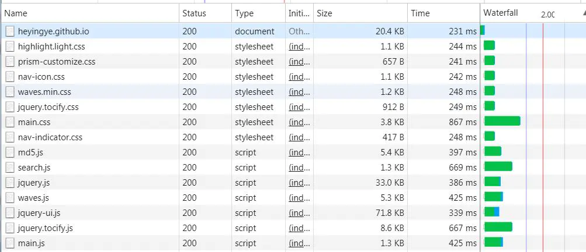
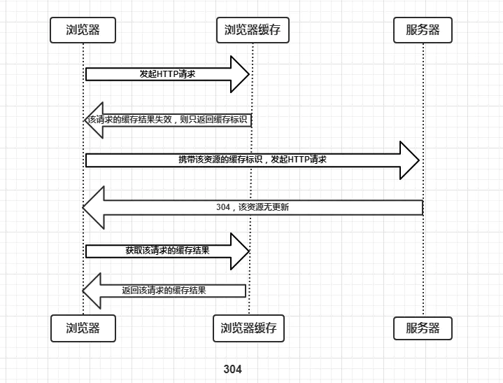
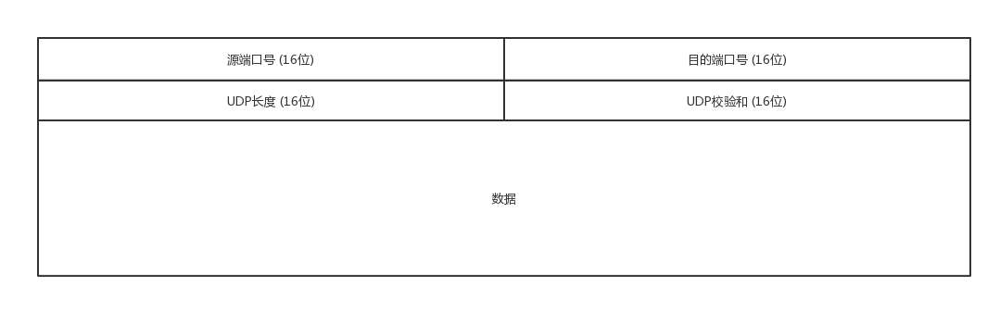
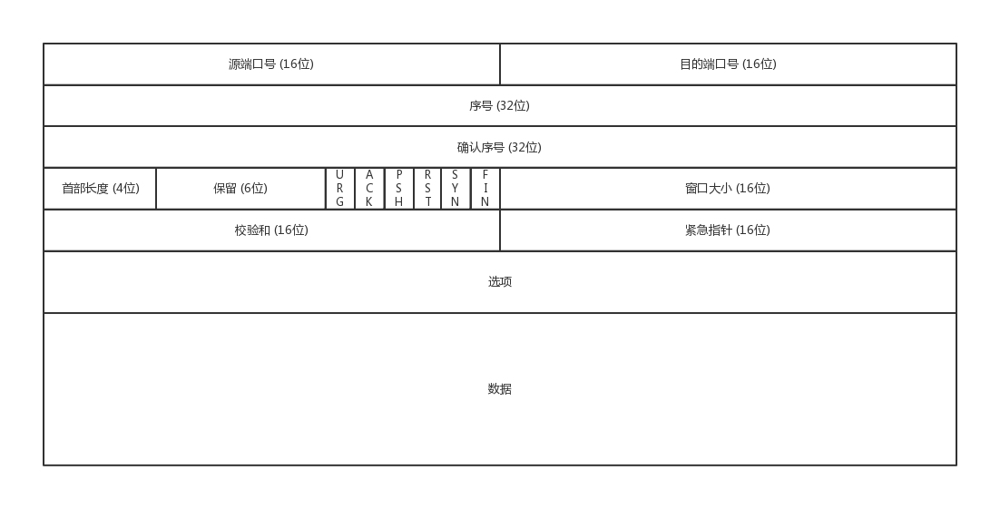
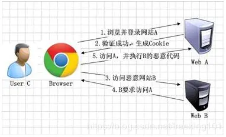

# HTML

## 1. 常见状态码

| 分类 | 分类描述                                       |
| :--- | :--------------------------------------------- |
| 1**  | 信息，服务器收到请求，需要请求者继续执行操作   |
| 2**  | 成功，操作被成功接收并处理                     |
| 3**  | 重定向，需要进一步的操作以完成请求             |
| 4**  | 客户端错误，请求包含语法错误或无法完成请求     |
| 5**  | 服务器错误，服务器在处理请求的过程中发生了错误 |

**2开头 （请求成功）表示成功处理了请求的状态代码。**

- 200 （成功） 服务器已成功处理了请求。 通常，这表示服务器提供了请求的网页。
- 201 （已创建） 请求成功并且服务器创建了新的资源。
- 202 （已接受） 服务器已接受请求，但尚未处理。
- 203 （非授权信息） 服务器已成功处理了请求，但返回的信息可能来自另一来源。
- 204 （无内容） 服务器成功处理了请求，但没有返回任何内容。
- 205 （重置内容） 服务器成功处理了请求，但没有返回任何内容。
- 206 （部分内容） 服务器成功处理了部分 `GET` 请求。

**3开头 （请求被重定向）表示要完成请求，需要进一步操作。 通常，这些状态代码用来重定向。**

- 300  （多种选择） 针对请求，服务器可执行多种操作。服务器可根据请求者 (`user agent`) 选择一项操作，或提供操作列表供请求者选择。

- 301  （永久移动） 请求的网页已永久移动到新位置。服务器返回此响应（对 `GET` 或 `HEAD` 请求的响应）时，会自动将请求者转到新位置。

  - `http` 网站跳转到 `https` 网站
  - 二级域名跳转到主域名，`http://www.abc.com`跳转到`http://abc.com`
  - 404页面失效跳转到新的页面
  - 老的域名跳转到新的域名
  
- 302   （临时重定向）  服务器目前从不同位置的网页响应请求，但请求者应继续使用原有位置来进行以后的请求。

  - 网站短时间内进行改版，在不影响用户体验的情况下，临时把页面跳转到临时页面。

>
301 和302 本来在 `http/1.0` 规范中是不允许重定向时改变请求 `method` 的（将 `POST` 改为 `GET` ），实际许多浏览器实现的时候允许重定向时改变请求 `method`。这就出现了规范和实现不一致的问题
由于历史原因，用户代理可能会在重定向后的请求中把 `POST` 方法改为 `GET` 方法。如果不想这样，应该使用 307（`Temporary Redirect`） 状态码
对比 301 好处是搜索引擎保持对原页面的索引

- 303（查看其他位置）请求者应当对不同的位置使用单独的 `GET` 请求来检索响应时，服务器返回此代码。

>
303 和 302 状态码有着相同的功能，但是303明确表示客户端应当采用 `GET` 方法获取资源，这点与 302 状态码有区别。
比如，当使用 `POST` 方法访问 CGI 程序，其执行后的处理结果为希望客户端能以 `GET` 方法重定向到另一个 `url` 上去时，返回 303 状态码。虽然 302 也可实现相同的功能，但这里使用 303 状态码是最理想的

- 304 （未修改） 自从上次请求后，请求的网页未修改过。 服务器返回此响应时，不会返回网页内容。
- 305 （使用代理） 请求者只能使用代理访问请求的网页。 如果服务器返回此响应，还表示请求者应使用代理。
- 307 （临时重定向）  服务器目前从不同位置的网页响应请求，但请求者应继续使用原有位置来进行以后的请求。

> 状态码 307 与 302 之间的唯一区别在于，当发送重定向请求的时候，307 状态码可以确保请求方法和消息主体不会发生变化。如果使用 302 响应状态码，一些旧客户端会错误地将请求方法转换为 `GET`：也就是说，在 Web 中，如果使用了 `GET` 以外的请求方法，且返回了 302 状态码，则重定向后的请求方法是不可预测的；但如果使用 307 状态码，之后的请求方法就是可预测的。对于 `GET` 请求来说，两种情况没有区别。

**4开头 （请求错误）这些状态代码表示请求可能出错，妨碍了服务器的处理。**

- 400 （错误请求） 服务器不理解请求的语法。
- 401 （未授权） 请求要求身份验证。 对于需要登录的网页，服务器可能返回此响应。
- 403 （禁止） 服务器拒绝请求。 **跨域下会显示**
- 404 （未找到） 服务器找不到请求的网页。
- 405 （方法禁用） 禁用请求中指定的方法。
- 406 （不接受） 无法使用请求的内容特性响应请求的网页。
- 407 （需要代理授权） 此状态代码与 401（未授权）类似，但指定请求者应当授权使用代理。
- 408 （请求超时）  服务器等候请求时发生超时。
- 409 （冲突）  服务器在完成请求时发生冲突。 服务器必须在响应中包含有关冲突的信息。
- 410 （已删除）  如果请求的资源已永久删除，服务器就会返回此响应。
- 411 （需要有效长度） 服务器不接受不含有效内容长度标头字段的请求。
- 412 （未满足前提条件） 服务器未满足请求者在请求中设置的其中一个前提条件。
- 413 （请求实体过大） 服务器无法处理请求，因为请求实体过大，超出服务器的处理能力。
- 414 （请求的 URI 过长） 请求的 URI（通常为网址）过长，服务器无法处理。
- 415 （不支持的媒体类型） 请求的格式不受请求页面的支持。
- 416 （请求范围不符合要求） 如果页面无法提供请求的范围，则服务器会返回此状态代码。
- 417 （未满足期望值） 服务器未满足"期望"请求标头字段的要求。

**5开头（服务器错误）这些状态代码表示服务器在尝试处理请求时发生内部错误。 这些错误可能是服务器本身的错误，而不是请求出错。**

- 500 （服务器内部错误）  服务器遇到错误，无法完成请求。
- 501 （尚未实施） 服务器不具备完成请求的功能。 例如，服务器无法识别请求方法时可能会返回此代码。
- 502 （错误网关） 服务器作为网关或代理，从上游服务器收到无效响应。
- 503 （服务不可用） 服务器目前无法使用（由于超载或停机维护）。 通常，这只是暂时状态。
- 504 （网关超时）  服务器作为网关或代理，但是没有及时从上游服务器收到请求。
- 505 （`HTTP` 版本不受支持） 服务器不支持请求中所用的 `HTTP` 协议版本。

## 2. 跨域

跨域概念解释：当前发起请求的域与该请求指向的资源所在的域不一样。这里的域指的是这样的一个概念：我们认为若协议 + 域名 + 端口号均相同，那么就是同域。 如下表

|        源URL         | 请求URL                | 跨域 | 说明                                               |
| :------------------: | ---------------------- | ---- | -------------------------------------------------- |
|   `http://a.com/a`   | `http://a.com/b`       | 否   | 同协议同域名、同端口号，不同资源请求，不是跨域请求 |
|   `http://a.com/a`   | `http://a.coms:8080/b` | 是   | 端口不同                                           |
|   `http://a.com/a`   | `https://a.com/b`      | 是   | 协议不同                                           |
| `http://www.a.com/a` | `http://x.a.com/b`     | 是   | 主域名相同，但是子域名不相同                       |
|   `http://a.com/a`   | `http://b.com/b`       | 是   | 域名不同                                           |

### 2.1 jsonp

跨域限制是浏览器对 **JavaScript** 施加的安全限制，自然对 `html` 标签无影响

```js
//原生
var script = document.createElement('script');
script.type = 'text/javascript';

// 传参并指定回调执行函数为 onBack
script.src = 'http://www.domain2.com:8080/login?user=admin&callback=onBack';
document.head.appendChild(script);

// 回调执行函数
function onBack(res) {
  alert(JSON.stringify(res));
}

//jquery
$.ajax({
  url: 'http://www.domain2.com:8080/login',
  type: 'get',
  dataType: 'jsonp',  // 请求方式为 jsonp
  jsonpCallback: "onBack",    // 自定义回调函数名
  data: {}
});

//配合的后端 node 实现,其他服务器语言也可以
const querystring = require('querystring');
const http = require('http');
const server = http.createServer();
server.on('request', function(req, res) {
  var params = querystring.parse(req.url.split('?')[1]);
  var fn = params.callback;

  // jsonp 返回设置
  res.writeHead(200, { 'Content-Type': 'text/javascript' });
  res.write(fn + '(' + JSON.stringify(params) + ')');
  res.end();
});
server.listen('8080');

//jsonp 缺点只能实现 get 请求
```

`jsonp` 安全性防范，分为以下几点：

1. 防止 `callback` 参数意外截断js代码，特殊字符单引号双引号，换行符均存在风险
2. 防止 `callback` 参数恶意添加标签（如 `script` ），造成 `XSS` 漏洞
3. 防止跨域请求滥用，阻止非法站点恶意调

针对第三点，我们可以通过来源 `refer` 白名单匹配，以及 `cookieToken` 机制来限制

### 2.2 CORS

浏览器将 `CORS` 请求分成两类：简单请求（`simple request`）和非简单请求（预检请求）（`not-so-simple request`）

只要同时满足以下两大条件，就属于简单请求。

1. 请求方法是以下三种方法之一：
   1. `HEAD`
   2. `GET`
   3. `POST`

2. `HTTP` 请求头信息不超出以下几种字段：
   1. `Accept`
   2. `Accept-Language`
   3. `Content-Language`
   4. `Last-Event-ID`
   5. `Content-Type`：只限于三个值 `application/x-www-form-urlencoded`（浏览器的原生form表单）、`multipart/form-data`（浏览器的原生form表单）、`text/plain`（html的源码会显示到页面上）

#### 2.2.1 简单请求

对于简单请求，浏览器直接发出 `CORS` 请求。具体来说，就是在头信息之中，增加一个 `Origin` 字段。

下面是一个例子，浏览器发现这次跨源 `AJAX` 请求是简单请求，就自动在头信息之中，添加一个 `Origin` 字段。

```apl
GET /cors HTTP/1.1 
Origin: http://m.xin.com
Host: api.alice.com
Accept-Language: en-US
Connection: keep-alive
User-Agent: Mozilla/5.0...
```

上面的头信息中，`Origin` 字段用来说明，本次请求来自哪个源（协议 + 域名 + 端口）。服务器根据这个值，决定是否同意这次请求。

如果 `Origin` 指定的源，不在许可范围内，服务器会返回一个正常的HTTP回应。浏览器发现，这个回应的头信息没有包含 `Access-Control-Allow-Origin` 字段（详见下文），就知道出错了，从而抛出一个错误，被 `XMLHttpRequest` 的 `onerror` 回调函数捕获。注意，这种错误无法通过状态码识别，因为 `HTTP` 回应的状态码有可能是 200。

如果`Origin`指定的域名在许可范围内，服务器返回的响应，会多出几个头信息字段。

```apl
Access-Control-Allow-Origin: http://api.bob.com
Access-Control-Allow-Credentials: true
Access-Control-Expose-Headers: FooBar 
Content-Type: text/html; charset=utf-8
```

上面的头信息之中，有三个与CORS请求相关的字段，都以 `Access-Control-` 开头。

（1）**Access-Control-Allow-Origin**

该字段是必须的。它的值要么是请求时`Origin`字段的值，要么是一个`*`，表示接受任意域名的请求。

（2）**Access-Control-Allow-Credentials**

该字段可选。它的值是一个布尔值，表示是否允许发送 `Cookie`。默认情况下，`Cookie` 不包括在 CORS 请求之中。设为`true`，即表示服务器明确许可，`Cookie` 可以包含在请求中，一起发给服务器。这个值也只能设为`true`，如果服务器不要浏览器发送 `Cookie`，删除该字段即可。

（3）**Access-Control-Expose-Headers**

该字段可选。CORS 请求时，`XMLHttpRequest`对象的`getResponseHeader()`方法只能拿到6个基本字段：`Cache-Control`、`Content-Language`、`Content-Type`、`Expires`、`Last-Modified`、`Pragma`。如果想拿到其他字段，就必须在`Access-Control-Expose-Headers`里面指定。上面的例子指定，`getResponseHeader('FooBar')`可以返回`FooBar`字段的值。

**withCredentials 属性:**

上面说到，`CORS` 请求默认不发送 `Cookie` 和 `HTTP` 认证信息。如果要把 `Cookie` 发到服务器，一方面要服务器同意，指定`Access-Control-Allow-Credentials`字段。

```js
"Access-Control-Allow-Credentials": true
```

另一方面，开发者必须在 AJAX 请求中打开`withCredentials`属性。

```js
var xhr = new XMLHttpRequest();
xhr.withCredentials = true;
```

否则，即使服务器同意发送 `Cookie`，浏览器也不会发送。或者，服务器要求设置 `Cookie`，浏览器也不会处理。

但是，如果省略`withCredentials`设置，有的浏览器还是会一起发送 `Cookie`。这时，可以显式关闭`withCredentials`。

```js
xhr.withCredentials = false;
```

**需要注意的是，如果要发送Cookie，`Access-Control-Allow-Origin`就不能设为星号**，必须指定明确的、与请求网页一致的域名。同时，`Cookie` 依然遵循同源政策，只有用服务器域名设置的 `Cookie` 才会上传，其他域名的 `Cookie` 并不会上传，且（跨源）原网页代码中的 `document.cookie` 也无法读取服务器域名下的 `Cookie`

#### 2.2.2 CORS 非简单请求-预检请求

**触发预检请求首先要使跨域请求**

非简单请求是那种对服务器有特殊要求的请求，比如请求方法是 `PUT` 或 `DELETE`，或者 `Content-Type` 字段的类型是 `application/json`。

非简单请求的 `CORS` 请求，会在正式通信之前，增加一次 `HTTP` 查询请求，称为"预检"请求 `preflight`

浏览器先询问服务器，当前网页所在的域名是否在服务器的许可名单之中，以及可以使用哪些 `HTTP` 动词和头信息字段。只有得到肯定答复，浏览器才会发出正式的 `XMLHttpRequest` 请求，否则就报错。

下面是一段浏览器的 `JavaScript` 脚本。

```javascript
var url = 'http://api.uxin.com/user';
var xhr = new XMLHttpRequest();
xhr.open('PUT', url, true);
xhr.setRequestHeader('X-Custom-Header', 'value');
xhr.send();
```

上面代码中，`HTTP` 请求的方法是 `PUT`，并且发送一个自定义头信息 `X-Custom-Header`

浏览器发现，这是一个非简单请求，就自动发出一个"预检"请求，要求服务器确认可以这样请求。下面是这个"预检"请求的 `HTTP` 头信息。

```http
OPTIONS /cors HTTP/1.1
Origin: http://m.a.com   //
Access-Control-Request-Method: PUT  //
Access-Control-Request-Headers: X-Custom-Header   //
Host: api.alice.com
Accept-Language: en-US
Connection: keep-alive
User-Agent: Mozilla/5.0...
```

"预检"请求用的请求方法是 `OPTIONS`,表示这个请求是用来询问的。头信息里面，关键字段是 `Origin`，表示请求来自哪个源。

除了 `Origin` 字段，"预检"请求的头信息包括两个特殊字段。

（1）**Access-Control-Request-Method**

该字段是必须的，用来列出浏览器的 `CORS` 请求会用到哪些 `HTTP` 方法，上例是 `PUT`

（2）**Access-Control-Request-Headers**

该字段是一个逗号分隔的字符串，指定浏览器 `CORS` 请求会额外发送的头信息字段，上例是 `X-Custom-Header`

**CORS预检请求的响应:**

服务器收到"预检"请求以后，检查了 `Origin`、`Access-Control-Request-Method` 和 `Access-Control-Request-Headers` 字段以后，确认允许跨源请求，就可以做出回应。

```http
HTTP/1.1 200 OK
Date: Mon, 01 Dec 2008 01:15:39 GMT
Server: Apache/2.0.61 (Unix)
Access-Control-Allow-Origin: http://m.a.com   //
Access-Control-Allow-Methods: GET, POST, PUT  //
Access-Control-Allow-Headers: X-Custom-Header  //
Content-Type: text/html; charset=utf-8
Content-Encoding: gzip
Content-Length: 0
Keep-Alive: timeout=2, max=100
Connection: Keep-Alive
Content-Type: text/plain
```

上面的 `HTTP` 回应中，关键的是 `Access-Control-Allow-Origin` 字段，表示 `http://m.a.com` 可以请求数据。该字段也可以设为星号，表示同意任意跨源请求。

```apl
Access-Control-Allow-Origin: *
```

如果浏览器否定了"预检"请求，会返回一个正常的 `HTTP` 回应，但是没有任何 `CORS` 相关的头信息字段。这时浏览器就会认定，服务器不同意预检请求，因此触发一个错误，被 `XMLHttpRequest` 对象的 `onerror` 回调函数捕获。控制台会打印出如下的报错信息。

```apl
XMLHttpRequest cannot load http://m.a.com.
Origin http://m.a.com is not allowed by Access-Control-Allow-Origin.
```

服务器回应的其他 `CORS` 相关字段如下。

```apl
Access-Control-Allow-Methods: GET, POST, PUT
Access-Control-Allow-Headers: X-Custom-Header
Access-Control-Allow-Credentials: true
Access-Control-Max-Age: 1728000
```

（1）**Access-Control-Allow-Methods**

该字段必需，它的值是逗号分隔的一个字符串，表明服务器支持的所有跨域请求的方法。注意，返回的是所有支持的方法，而不单是浏览器请求的那个方法。这是为了避免多次"预检"请求。

（2）**Access-Control-Allow-Headers**

如果浏览器请求包括 `Access-Control-Request-Headers` 字段，则 `Access-Control-Allow-Headers` 字段是必需的。它也是一个逗号分隔的字符串，表明服务器支持的所有头信息字段，不限于浏览器在"预检"中请求的字段。

（3）**Access-Control-Allow-Credentials**

该字段与简单请求时的含义相同。

（4）**Access-Control-Max-Age**

该字段可选，用来指定本次预检请求的有效期，单位为秒。上面结果中，有效期是20天（1728000秒），即允许缓存该条回应 1728000 秒（即20天），在此期间，不用发出另一条预检请求。

**CORS浏览器的正常请求和回应:**

一旦服务器通过了"预检"请求，以后每次浏览器正常的 `CORS` 请求，就都跟简单请求一样，会有一个 `Origin` 头信息字段。服务器的回应，也都会有一个 `Access-Control-Allow-Origin` 头信息字段。

下面是"预检"请求之后，浏览器的正常 `CORS` 请求。

```http
PUT /cors HTTP/1.1
Origin: http://m.a.com
Host: api.alice.com
X-Custom-Header: value
Accept-Language: en-US
Connection: keep-alive
User-Agent: Mozilla/5.0..
```

上面头信息的 `Origin` 字段是浏览器自动添加的。

下面是服务器正常的回应。

```apl
Access-Control-Allow-Origin: http://m.a.com
Content-Type: text/html; charset=utf-8
```

上面头信息中，`Access-Control-Allow-Origin` 字段是每次回应都必定包含的。

```js
//node
router.use((req, res, next) => {
  res.header('Access-Control-Allow-Origin', '*')
  res.header('Access-Control-Allow-Headers', 'Authorization,X-API-KEY, Origin, X-Requested-With, Content-Type, Accept, Access-Control-Request-Method')
  res.header('Access-Control-Allow-Methods', 'GET, POST, OPTIONS, PATCH, PUT, DELETE')
  res.header('Allow', 'GET, POST, PATCH, OPTIONS, PUT, DELETE')
  next();
});
```

**与JSONP的比较:**

`CORS` 与 `JSONP` 的使用目的相同，但是比 `JSONP` 更强大。

`JSONP` 只支持 `GET` 请求，`CORS` 支持所有类型的 `HTTP` 请求。`JSONP` 的优势在于支持老式浏览器，以及可以向不支持 `CORS` 的网站请求数据。

#### 2.3 其它方法

- 前端设置跨域
  - 其实就是因为浏览器同源协议无法请求非同源的地址，但是服务器直接没有同源协议，利用将本地请求转到本地服务器进行代理转发，从而绕过了同源协议的限制，通过代理的实现可以解决跨域的问题，换了个思路去解决实际产生的问题，实在是一个比较好的解决方法
- 设置代理服务器

## 3. 缓存

 **前端缓存主要是分为HTTP缓存和浏览器缓存。其中HTTP缓存是在HTTP请求传输时用到的缓存，主要在服务器代码上设置；而浏览器缓存则主要由前端开发在前端js上进行设置。**


### 3.1 强制缓存

浏览器向服务器发起请求时，服务器会将缓存规则放入 `HTTP` 响应报文的 `HTTP` 头中和请求结果一起返回给浏览器，控制强制缓存的字段分别是 `Expires` 和 `Cache-Control`，其中 `Cache-Control` 优先级比 Expires 高。

#### Expires

`Expires` 是 `HTTP/1.0` 控制网页缓存的字段，其值为服务器返回该请求结果缓存的到期时间，即再次发起该请求时，如果客户端的时间小于 `Expires` 的值时，直接使用缓存结果。

到了 `HTTP/1.1`，`Expires` 已经被 `Cache-Control` 替代，原因在于 `Expires` 控制缓存的原理是使用客户端的时间与服务端返回的时间做对比，那么如果客户端与服务端的时间因为某些原因（例如时区不同；客户端和服务端有一方的时间不准确）发生误差，那么强制缓存则会直接失效，这样的话强制缓存的存在则毫无意义。

#### Cache-Control

在 `HTTP/1.1` 中，`Cache-Control` 是最重要的规则，主要用于控制网页缓存，主要取值为：

1. `public`：所有内容都将被缓存（客户端和代理服务器都可缓存）
2. `private`：所有内容只有客户端可以缓存，`Cache-Control` 的默认取值
3. `no-cache`：客户端缓存内容，但是是否使用缓存则需要经过协商缓存来验证决定
4. `no-store`：所有内容都不会被缓存，即不使用强制缓存，也不使用协商缓存
5. `max-age = xxx (xxx is numeric)`：缓存内容将在 xxx 秒后失效

强制缓存就是向浏览器缓存查找该请求结果，并根据该结果的缓存规则来决定是否使用该缓存结果的过程，强制缓存的情况主要有三种，如下：

> **①不存在该缓存结果和缓存标识，强制缓存失效，则直接向服务器发起请求（跟第一次发起请求一致），如下图：**


> **②存在该缓存结果和缓存标识，但该结果已失效，强制缓存失效，则使用协商缓存，如下图**


> **③存在该缓存结果和缓存标识，且该结果尚未失效，强制缓存生效，直接返回该结果，如下图**


**了解强制缓存的过程后，我们进行下一步思考：浏览器的缓存存放在哪里，如何在浏览器中判断强制缓存是否生效？**


这里我们以博客的请求为例，状态码为灰色的请求则代表使用了强制缓存，请求对应的 `Size` 值则代表该缓存存放的位置，分别为 `from memory cache` 和 `from disk cache`。那么`from memory cache` 和 `from disk cache` 又分别代表的是什么呢？什么时候会使用 `from disk cache`，什么时候会使用 `from memory cache`呢？`from memory cache` 代表使用内存中的缓存，`from disk cache` 则代表使用的是硬盘中的缓存，浏览器读取缓存的顺序为 `memory –> disk –> 服务器请求`。

那么接下来我们一起详细分析一下缓存读取问题，这里仍让以我的博客为例进行分析：

**首次访问页面:**



**关闭博客的标签页，重新打开页面:**


**刷新页面:**


>
**内存缓存(from memory cache)**：内存缓存具有两个特点，分别是速度快和时间限制。
**硬盘缓存(from disk cache)**：硬盘缓存则是直接将缓存写入硬盘文件中，读取缓存需要对该缓存存放的硬盘文件进行I/O操作，然后重新解析该缓存内容，读取复杂，速度比内存缓存慢。

​在浏览器中，浏览器会在js和图片等文件解析执行后直接存入内存缓存中，那么当刷新页面时只需直接从内存缓存中读取(`from memory cache`)；而 `css` 文件则会存入硬盘文件中，所以每次渲染页面都需要从硬盘读取缓存(`from disk cache`)

​因为 `CSS` 文件加载一次就可渲染出来，我们不会频繁读取它，所以它不适合缓存到内存中，但是 `js` 之类的脚本却随时可能会执行，如果脚本在磁盘当中，我们在执行脚本的时候需要从磁盘取到内存中来，这样 IO 开销就很大了，有可能导致浏览器失去响应

### 3.2 协商缓存

协商缓存就是强制缓存失效后，浏览器携带缓存标识向服务器发起请求，由服务器根据缓存标识决定是否使用缓存的过程，主要有以下两种情况：

> **①协商缓存生效，返回304，如下**



> **②协商缓存失效，返回200和请求结果结果，如下**


同样，协商缓存的标识也是在响应报文的 HTTP 头中和请求结果一起返回给浏览器的，控制协商缓存的字段分别有：**Last-Modified / If-Modified-Since和Etag / If-None-Match**，其中**Etag / If-None-Match的优先级比Last-Modified / If-Modified-Since高**

> **Last-Modified / If-Modified-Since**

`Last-Modified` 是服务器响应请求时，返回该资源文件在服务器最后被修改的时间，如下。


`If-Modified-Since` 则是客户端再次发起该请求时，携带上次请求返回的 `Last-Modified` 值，通过此字段值告诉服务器该资源上次请求返回的最后被修改时间。服务器收到该请求，发现请求头含有 `If-Modified-Since` 字段，则会根据 `If-Modified-Since` 的字段值与该资源在服务器的最后被修改时间做对比，若服务器的资源最后被修改时间大于 `If-Modified-Since` 的字段值，则重新返回资源，状态码为 200；否则则返回 304，代表资源无更新，可继续使用缓存文件，如下。


> **Etag / If-None-Match**

`Etag` 是服务器响应请求时，返回当前资源文件的一个唯一标识(由服务器生成)，如下。


`If-None-Match` 是客户端再次发起该请求时，携带上次请求返回的唯一标识 `Etag` 值，通过此字段值告诉服务器该资源上次请求返回的唯一标识值。服务器收到该请求后，发现该请求头中含有 `If-None-Match`，则会根据 `If-None-Match` 的字段值与该资源在服务器的 `Etag` 值做对比，一致则返回304，代表资源无更新，继续使用缓存文件；不一致则重新返回资源文件，状态码为 200，如下。


注：`Etag / If-None-Match` 优先级高于 `Last-Modified / If-Modified-Since`，**同时存在则只有 Etag / If-None-Match生效**。对于协商缓存，使用 Ctrl+F5 强制刷新可以使得缓存无效。但是对于强缓存，在未过期时，必须更新资源路径才能发起新的请求（更改了路径相当于是另一个资源了，这也是前端工程化中常用到的技巧）。

#### 总结

​强制缓存优先于协商缓存进行，若强制缓存( `Expires` 和 `Cache-Control` )生效则直接使用缓存，若不生效则进行协商缓存( `Last-Modified` / `If-Modified-Since` 和 `Etag` / `If-None-Match` )，协商缓存由服务器决定是否使用缓存，若协商缓存失效，那么代表该请求的缓存失效，重新获取请求结果，再存入浏览器缓存中；生效则返回 304，继续使用缓存，主要过程如下：


### 3.3 浏览器缓存

#### 3.3.1 本地存储小容量

1. `Cookie`主要用于用户信息的存储，`Cookie`的内容可以自动在请求的时候被传递给服务器。

   1. 本来 `session` 是一个抽象概念，开发者为了实现中断和继续等操作，将 `user agent` 和 `server` 之间一对一的交互，抽象为“会话”，进而衍生出“会话状态”，也就是 `session` 的概念。
   2. 而 `cookie` 是一个实际存在的东西，`http` 协议中定义在 `header` 中的字段。可以认为是 `session` 的一种后端无状态实现。
   3. 而我们今天常说的 `session`，是为了绕开 `cookie` 的各种限制，通常借助 `cookie` 本身和后端存储实现的，一种更高级的会话状态实现。
   4. 所以 `cookie` 和 `session`，你可以认为是同一层次的概念，也可以认为是不同层次的概念。具体到实现，`session` 因为 `session id`  的存在，通常要借助 `cookie` 实现，但这并非必要，只能说是通用性较好的一种实现方案。

2. `LocalStorage` 的数据将一直保存在浏览器内，直到用户清除浏览器缓存数据为止

   ```js
   window.localStorage
   ```

   保存数据语法：

   ```js
   localStorage.setItem("key", "value");
   ```

   读取数据语法：

   ```js
   var lastName = localStorage.getItem("key");
   ```

   删除数据语法：

   ```js
   localStorage.removeItem("key");
   ```

3. `SessionStorage` 的其他属性同 `LocalStorage`，只不过它的生命周期同标签页的生命周期，当标签页被关闭时，`SessionStorage` 也会被清除。

   ```js
   window.sessionStorage
   ```

   保存数据语法：

   ```js
   sessionStorage.setItem("key", "value");
   ```

   读取数据语法：

   ```js
   var lastname = sessionStorage.getItem("key");
   ```

   删除指定键的数据语法：

   ```js
   sessionStorage.removeItem("key");
   ```

   删除所有数据：

   ```js
   sessionStorage.clear();
   ```

   

#### 3.3.2 本地存储大容量

`WebSql` 和 `IndexDB` 主要用在前端有大容量存储需求的页面上，例如，在线编辑浏览器或者网页邮箱。


### 3.3.3 往返缓存

往返缓存又称为 `BFCache`，是浏览器在前进后退按钮上为了提升历史页面的渲染速度的一种策略。该策略具体表现为，当用户前往新页面时，将当前页面的浏览器 `DOM` 状态保存到 `BFCache` 中；当用户点击后退按钮的时候，将页面直接从 `BFCache` 中加载，节省了网络请求的时间。

## 4. get post

|                  | GET                                                                                                                  | POST                                                                                           |
| :--------------- | :------------------------------------------------------------------------------------------------------------------- | ---------------------------------------------------------------------------------------------- |
| 后退按钮/刷新    | 无害                                                                                                                 | 数据会被重新提交（浏览器应该告知用户数据会被重新提交）                                         |
| 书签             | 可收藏为书签                                                                                                         | 不可收藏为书签                                                                                 |
| 缓存             | 能被缓存                                                                                                             | 不能缓存                                                                                       |
| 编码类型         | `application` / `x-www-form-urlencoded`                                                                              | `application` / `x-www-form-urlencoded` 或 `multipart` / `form-data`。为二进制数据使用多重编码 |
| 历史             | 参数保留在浏览器历史中                                                                                               | 参数不会保存在浏览器历史中                                                                     |
| 对数据长度的限制 | 是的。当发送数据时，`GET` 方法向 `URL` 添加数据；`URL` 的长度是受限制的（`URL` 的最大长度是 2048 个字符）            | 无限制                                                                                         |
| 对数据类型的限制 | 只允许 `ASCII` 字符                                                                                                  | 没有限制。也允许二进制数据                                                                     |
| 安全性           | 与 `POST` 相比，`GET` 的安全性较差，因为所发送的数据是 `URL` 的一部分。在发送密码或其他敏感信息时绝不要使用 `GET` ！ | `POST` 比 `GET` 更安全，因为参数不会被保存在浏览器历史或 `web` 服务器日志中                    |
| 可见性           | 数据在 `URL`中对所有人都是可见的                                                                                     | 数据不会显示在 URL 中                                                                          |

## 5.http

### HTTP 消息结构

`HTTP` 是基于客户端/服务端（`C/S`）的架构模型，通过一个可靠的链接来交换信息，是一个无状态的请求/响应协议。

一个 `HTTP` "客户端"是一个应用程序（`Web`浏览器或其他任何客户端），通过连接到服务器达到向服务器发送一个或多个 `HTTP` 的请求的目的。

一个 `HTTP` "服务器"同样也是一个应用程序（通常是一个 `Web` 服务，如 `Apache Web` 服务器或 `IIS` 服务器等），通过接收客户端的请求并向客户端发送 `HTTP` 响应数据。

`HTTP` 使用统一资源标识符（`Uniform Resource Identifiers`, `URI`）来传输数据和建立连接。

一旦建立连接后，数据消息就通过类似 Internet 邮件所使用的格式 [RFC5322] 和多用途 `Internet` 邮件扩展（`MIME`）[RFC2045] 来传送。

> 客户端请求消息

客户端发送一个 `HTTP` 请求到服务器的请求消息包括以下格式：请求行（`request line`）、请求头部（`header`）、空行和请求数据四个部分组成，下图给出了请求报文的一般格式。


> 服务器响应消息

HTTP 响应也由四个部分组成，分别是：状态行、消息报头、空行和响应正文。


### 请求方法

根据 `HTTP` 标准，`HTTP` 请求可以使用多种请求方法。

`HTTP1.0` 定义了三种请求方法： `GET`、`POST` 和 `HEAD` 方法。

`HTTP1.1` 新增了六种请求方法：`OPTIONS、PUT、PATCH、DELETE、TRACE` 和 `CONNECT` 方法。

| 方法      | 描述                                                                                                                                       |
| :-------- | :----------------------------------------------------------------------------------------------------------------------------------------- |
| `get`     | 请求指定的页面信息，并返回实体主体。                                                                                                       |
| `head`    | 类似于 `GET` 请求，只不过返回的响应中没有具体的内容，用于获取报头                                                                          |
| `post`    | 向指定资源提交数据进行处理请求（例如提交表单或者上传文件）。数据被包含在请求体中。`POST` 请求可能会导致新的资源的建立和/或已有资源的修改。 |
| `put`     | 从客户端向服务器传送的数据取代指定的文档的内容。                                                                                           |
| `delete`  | 请求服务器删除指定的页面。                                                                                                                 |
| `connect` | `HTTP/1.1` 协议中预留给能够将连接改为管道方式的代理服务器。                                                                                |
| `options` | 允许客户端查看服务器的性能。                                                                                                               |
| `trace`   | 回显服务器收到的请求，主要用于测试或诊断。                                                                                                 |
| `patch`   | 是对 `PUT` 方法的补充，用来对已知资源进行局部更新 。                                                                                       |

### HTTP 响应头信息

| 应答头             | 说明                                                                                                                                                                                                                                                                                                                                                                                                                                                                                                                                                                                                                                                                                                                                                             |
| :----------------- | :--------------------------------------------------------------------------------------------------------------------------------------------------------------------------------------------------------------------------------------------------------------------------------------------------------------------------------------------------------------------------------------------------------------------------------------------------------------------------------------------------------------------------------------------------------------------------------------------------------------------------------------------------------------------------------------------------------------------------------------------------------------- |
| `Allow`            | 服务器支持哪些请求方法（如`GET`、`POST`等）                                                                                                                                                                                                                                                                                                                                                                                                                                                                                                                                                                                                                                                                                                                      |
| `Content-Encoding` | 文档的编码（`Encode`）方法。只有在解码之后才可以得到`Content-Type`头指定的内容类型。利用`gzip`压缩文档能够显著地减少`HTML`文档的下载时间。`Java`的`GZIPOutputStream`可以很方便地进行`gzip`压缩，但只有`Unix`上的`Netscape`和Windows上的IE 4、IE 5才支持它。因此，`Servlet`应该通过查看`Accept-Encoding`头（即`request.getHeader("Accept-Encoding")`）检查浏览器是否支持`gzip`，为支持`gzip`的浏览器返回经`gzip`压缩的`HTML`页面，为其他浏览器返回普通页面                                                                                                                                                                                                                                                                                                        |
| `Content-Length`   | 表示内容长度。只有当浏览器使用持久`HTTP`连接时才需要这个数据。如果你想要利用持久连接的优势，可以把输出文档写入 `ByteArrayOutputStream`，完成后查看其大小，然后把该值放入`Content-Length`头，最后通过`byteArrayStream.writeTo(response.getOutputStream())`发送内容                                                                                                                                                                                                                                                                                                                                                                                                                                                                                                |
| `Content-Type`     | 表示后面的文档属于什么`MIME`类型。`Servlet`默认为`text/plain`，但通常需要显式地指定为`text/html`。由于经常要设置`Content-Type`，因此`HttpServletResponse`提供了一个专用的方法`setContentType`                                                                                                                                                                                                                                                                                                                                                                                                                                                                                                                                                                    |
| `Date`             | 当前的`GMT`时间。你可以用`setDateHeader`来设置这个头以避免转换时间格式的麻烦                                                                                                                                                                                                                                                                                                                                                                                                                                                                                                                                                                                                                                                                                     |
| `Expires`          | 应该在什么时候认为文档已经过期，从而不再缓存它？                                                                                                                                                                                                                                                                                                                                                                                                                                                                                                                                                                                                                                                                                                                 |
| `Last-Modified`    | 文档的最后改动时间。客户可以通过`If-Modified-Since`请求头提供一个日期，该请求将被视为一个条件`GET`，只有改动时间迟于指定时间的文档才会返回，否则返回一个304（Not Modified）状态。`Last-Modified`也可用`setDateHeader`方法来设置                                                                                                                                                                                                                                                                                                                                                                                                                                                                                                                                  |
| `Location`         | 表示客户应当到哪里去提取文档。`Location`通常不是直接设置的，而是通过`HttpServletResponse`的`sendRedirect`方法，该方法同时设置状态代码为302                                                                                                                                                                                                                                                                                                                                                                                                                                                                                                                                                                                                                       |
| `Refresh`          | 表示浏览器应该在多少时间之后刷新文档，以秒计。除了刷新当前文档之外，你还可以通过`setHeader("Refresh", "5; URL=<http://host/path")`让浏览器读取指定的页面。> 注意这种功能通常是通过设置HTML页面HEAD区的`＜META HTTP-EQUIV="Refresh" CONTENT="5;URL=<http://host/path"＞`实现，这是因为，自动刷新或重定向对于那些不能使用CGI或`Servlet`的HTML编写者十分重要。但是，对于`Servlet`来说，直接设置`Refresh`头更加方便。>  注意`Refresh`的意义是"N秒之后刷新本页面或访问指定页面"，而不是"每隔N秒刷新本页面或访问指定页面"。因此，连续刷新要求每次都发送一个`Refresh`头，而发送204状态代码则可以阻止浏览器继续刷新，不管是使用`Refresh`头还是`＜META HTTP-EQUIV="Refresh" ...＞`。  注意`Refresh`头不属于HTTP 1.1正式规范的一部分，而是一个扩展，但Netscape和IE都支持它 |
| `Server`           | 服务器名字。`Servlet`一般不设置这个值，而是由Web服务器自己设置                                                                                                                                                                                                                                                                                                                                                                                                                                                                                                                                                                                                                                                                                                   |
| `Set-Cookie`       | 设置和页面关联的`Cookie`。`Servlet`不应使用`response.setHeader("Set-Cookie", ...)`，而是应使用`HttpServletResponse`提供的专用方法`addCookie`。参见下文有关`Cookie`设置的讨论                                                                                                                                                                                                                                                                                                                                                                                                                                                                                                                                                                                     |
| `WWW-Authenticate` | 客户应该在`Authorization`头中提供什么类型的授权信息？在包含401（Unauthorized）状态行的应答中这个头是必需的。例如，`response.setHeader("WWW-Authenticate", "BASIC realm=＼"executives＼"")`。 注意Servlet一般不进行这方面的处理，而是让Web服务器的专门机制来控制受密码保护页面的访问（例如.htaccess）                                                                                                                                                                                                                                                                                                                                                                                                                                                             |

### http2.0 vs http1.x

1. `HTTP2.0` 的基本单位为二进制帧：`HTTP1.x` 的解析是基于文本存在缺陷，`HTTP2.0`的协议解析决定采用二进制格式
2. `HTTP2.0` 中帧具有优先级
3. `HTTP2.0` 多路复用，让所有数据流共用同一个连接，可以更有效地使用 `TCP` 连接
4. `HTTP2.0` 压缩消息头：`HTTP1.x` 的 `header` 带有大量信息，而且每次都要重复发送，`HTTP2.0` 使用   来减少需要传输的 `header` 大小，通讯双方各自 `cache` 一份 `header fields` 表，既避免了重复 `header` 的传输，又减小了需要传输的大小
5. `HTTP2.0` 服务推送，提前缓存可能需要的文件
6. `HTTP2.0` 只适用于 `HTTPS` 的场景

### HTTP 与 HTTPS 的区别

- `HTTP` 是明文传输，`HTTPS` 通过 `SSL\TLS` 进行了加密
- `HTTP` 的端口号是 80，`HTTPS` 是 443
- `HTTPS` 需要到 CA 申请证书，一般免费证书很少，需要交费
- `HTTPS` 的连接很简单，是无状态的；`HTTPS` 协议是由 `SSL+HTTP` 协议构建的可进行加密传输、身份认证的网络协议，比 `HTTP` 协议安全。

## 6. TCP UDP

`TCP` 支持的应用协议：`TELNET`（远程终端登录协议）,`FTP`（文件传输协议）,`SMTP`（简单邮件传送协议）,`HTTP`（传送协议）

`UDP` 支持的应用协议：`NFS` (网络文件系统)，`SNMP`（简单网络管理协议），`DNS`（域名服务），`TFTP`（简单文件传输协议）

### TCP三次握手

建立连接前，客户端和服务端需要通过握手来确认对方:

- 客户端发送 `syn`(同步序列编号) 请求，进入 `syn_send` 状态，等待确认  //我准备来了
- 服务端接收并确认 `syn` 包后发送 `syn+ack` 包，进入 `syn_recv` 状态    //我也准备好了
- 客户端接收 `syn+ack` 包后，发送 `ack` 包，双方进入 `established` 状态  //那我来了。。。

### TCP四次挥手

- 客户端 -- `FIN` --> 服务端， `FIN—WAIT`   //我差不多了
- 服务端 -- `ACK` --> 客户端， `CLOSE-WAIT`   //我也差不多了
- 服务端 -- `ACK,FIN` --> 客户端， `LAST-ACK`   //我要结束了
- 客户端 -- `ACK` --> 服务端，`CLOSED`  //那我也结束了

> TCP 和 UDP 的区别

- `TCP` 是面向连接的，`UDP` 是面向无连接的
- `UDP` 程序结构较简单
- `TCP` 是面向字节流的，`UDP` 是基于数据报的
- `TCP` 保证数据正确性，`UDP` 可能丢包
- `TCP` 保证数据顺序，`UDP` 不保证

### UDP

要想理解 `TCP` 和 `UDP` 的区别，首先要明白什么是 `TCP`，什么是 `UDP`

`TCP` 和 `UDP` 是传输层的两个协议



由上图可以看出，`UDP` 除了端口号，基本啥都没有了。如果没有这两个端口号，数据就不知道该发给哪个应用。

所以 `UDP` 就像一个小孩子，特别简单，有如下三个特点

> `UDP` 的特点

- 沟通简单，不需要大量的数据结构，处理逻辑和包头字段
- 轻信他人。它不会建立连接，但是会监听这个地方，谁都可以传给它数据，它也可以传给任何人数据，甚至可以同时传给多个人数据。
- 愣头青，做事不懂变通。不会根据网络的情况进行拥塞控制，无论是否丢包，它该怎么发还是怎么发

因为 `UDP` 是"小孩子"，所以处理的是一些没那么难的项目，并且就算失败的也能接收。基于这些特点的话，`UDP` 可以使用在如下场景中

> `UDP` 的主要应用场景

- 需要资源少，网络情况稳定的内网，或者对于丢包不敏感的应用，比如 DHCP 就是基于 `UDP` 协议的。
- 不需要一对一沟通，建立连接，而是可以广播的应用。因为它不面向连接，所以可以做到一对多，承担广播或者多播的协议。
- 需要处理速度快，可以容忍丢包，但是即使网络拥塞，也毫不退缩，一往无前的时候

> 基于 `UDP` 的几个例子

- 直播。直播对实时性的要求比较高，宁可丢包，也不要卡顿的，所以很多直播应用都基于 `UDP` 实现了自己的视频传输协议
- 实时游戏。游戏的特点也是实时性比较高，在这种情况下，采用自定义的可靠的 `UDP` 协议，自定义重传策略，能够把产生的延迟降到最低，减少网络问题对游戏造成的影响
- 物联网。一方面，物联网领域中断资源少，很可能知识个很小的嵌入式系统，而维护 TCP 协议的代价太大了；另一方面，物联网对实时性的要求也特别高。比如 Google 旗下的 Nest 简历 Thread Group，推出了物联网通信协议 `Thread`，就是基于 `UDP` 协议的

### TCP



- 首先，源端口和目标端口是不可少的。
- 接下来是包的序号。主要是为了解决乱序问题。不编好号怎么知道哪个先来，哪个后到
- 确认序号。发出去的包应该有确认，这样能知道对方是否收到，如果没收到就应该重新发送，这个解决的是不丢包的问题
- 状态位。`SYN` 是发起一个链接，`ACK` 是回复，`RST` 是重新连接，`FIN` 是结束连接。因为 `TCP` 是面向连接的，因此需要双方维护连接的状态，这些状态位的包会引起双方的状态变更
- 窗口大小，`TCP` 要做流量控制，需要通信双方各声明一个窗口，标识自己当前的处理能力。

通过对 `TCP` 头的解析，我们知道要掌握 `TCP` 协议，应该重点关注以下问题：

- 顺序问题
- 丢包问题
- 连接维护
- 流量控制
- 拥塞控制

### 总结及面试问题

> `TCP` 和 `UDP` 的区别

- `TCP` 是面向连接的，`UDP` 是面向无连接的
- `UDP` 程序结构较简单
- `TCP` 是面向字节流的，`UDP` 是基于数据报的
- `TCP` 保证数据正确性，`UDP` 可能丢包
- `TCP` 保证数据顺序，`UDP` 不保证

> 什么是面向连接，什么是面向无连接

在互通之前，面向连接的协议会先建立连接，如 `TCP` 有三次握手，而 UDP 不会

> `TCP` 为什么是可靠连接

- 通过 `TCP` 连接传输的数据无差错，不丢失，不重复，且按顺序到达。
- `TCP` 报文头里面的序号能使 `TCP` 的数据按序到达
- 报文头里面的确认序号能保证不丢包，累计确认及超时重传机制
- `TCP` 拥有流量控制及拥塞控制的机制

> `TCP` 的顺序问题，丢包问题，流量控制都是通过**滑动窗口**来解决的
> 拥塞控制时通过**拥塞窗口**来解决的

## 7. Web安全

### 7.1 XSS攻击

`XSS`(Cross-Site Scripting，跨站脚本攻击)是一种代码注入攻击。攻击者在目标网站上注入恶意代码，当被攻击者登陆网站时就会执行这些恶意代码，这些脚本可以读取 `cookie`，`session`，`tokens`，或者其它敏感的网站信息，对用户进行钓鱼欺诈，甚至发起蠕虫攻击等。

`XSS` 的本质是：恶意代码未经过滤，与网站正常的代码混在一起；浏览器无法分辨哪些脚本是可信的，导致恶意脚本被执行。由于直接在用户的终端执行，恶意代码能够直接获取用户的信息，利用这些信息冒充用户向网站发起攻击者定义的请求。

> `XSS` 分类

根据攻击的来源，`XSS` 攻击可以分为存储型(持久性)、反射型(非持久型)和 `DOM` 型三种。下面我们来详细了解一下这三种 `XSS` 攻击：

**后两种类型要注意 `v-html` 这样子直接修改 `DOM`**

#### 7.1.1 反射型XSS

当用户点击一个恶意链接，或者提交一个表单，或者进入一个恶意网站时，注入脚本进入被攻击者的网站。Web服务器将注入脚本，比如一个错误信息，搜索结果等，未进行过滤直接返回到用户的浏览器上。

> 反射型 `XSS` 的攻击步骤：

1. 攻击者构造出特殊的 `URL`，其中包含恶意代码。
2. 用户打开带有恶意代码的 `URL` 时，网站服务端将恶意代码从 `URL` 中取出，拼接在 `HTML` 中返回给浏览器。
3. 用户浏览器接收到响应后解析执行，混在其中的恶意代码也被执行。
4. 恶意代码窃取用户数据并发送到攻击者的网站，或者冒充用户的行为，调用目标网站接口执行攻击者指定的操作。

反射型 `XSS` 漏洞常见于通过 `URL` 传递参数的功能，如网站搜索、跳转等。由于需要用户主动打开恶意的 `URL` 才能生效，攻击者往往会结合多种手段诱导用户点击。

`POST` 的内容也可以触发反射型 `XSS`，只不过其触发条件比较苛刻（需要构造表单提交页面，并引导用户点击），所以非常少见。

```js
// http://localhost:3000/?type=<script>alert(%27恶意内容%27)</script>

router.get("/", function (req, res, next) {
  // res.send("hello world");
  res.send(`${req.query.type}`);
});
```

> 如何防范反射型 `XSS` 攻击

**对字符串进行编码。**

对 `url` 的查询参数进行转义后再输出到页面。

```js
app.get('/welcome', function(req, res) {
    //对查询参数进行编码，避免反射型 XSS攻击
    res.send(`${encodeURIComponent(req.query.type)}`); 
});
//http://w3cschool.cc/welcome'?name=ståle&car=saab =>http%3A%2F%2Fw3cschool.cc%2welcome%3Fname%3Dst%C3%A5le%26car%3Dsaab
```

服务器可以用 `decodeURIComponent` 方法对转义后的字符串进行解码，则可以获取正确的参数。

#### 7.1.2 DOM 型 XSS

`DOM` 型 `XSS` 攻击，实际上就是前端 `JavaScript` 代码不够严谨，把不可信的内容插入到了页面。在使用 `.innerHTML`、`.outerHTML`、`.appendChild`、`document.write()`等API时要特别小心，不要把不可信的数据作为 `HTML` 插到页面上，尽量使用 `.innerText`、`.textContent`、`.setAttribute()` 等。

> DOM 型 XSS 的攻击步骤：

1. 攻击者构造出特殊数据，其中包含恶意代码。
2. 用户浏览器执行了恶意代码。
3. 恶意代码窃取用户数据并发送到攻击者的网站，或者冒充用户的行为，调用目标网站接口执行攻击者指定的操作。

```js

```

> 如何防范 `DOM 型 XSS` 攻击

防范 `DOM 型 XSS` 攻击的核心就是对输入内容进行转义(`DOM` 中的内联事件监听器和链接跳转都能把字符串作为代码运行，需要对其内容进行检查)。

1.对于 `url` 链接(例如图片的 `src` 属性)，那么直接使用 `encodeURIComponent` 来转义。

2.非 `url`，我们可以这样进行编码：

```js
function encodeHtml(str) {
   return str.replace(/"/g, '&quot;')
      .replace(/'/g, '&apos;')
      .replace(/</g, '&lt;')
      .replace(/>/g, '&gt;');
}
```

`DOM 型 XSS` 攻击中，取出和执行恶意代码由浏览器端完成，属于前端 `JavaScript` 自身的安全漏洞。

#### 7.1.3 存储型XSS

恶意脚本永久存储在目标服务器上。当浏览器请求数据时，脚本从服务器传回并执行，影响范围比反射型和 `DOM 型 XSS` 更大。`存储型 XSS` 攻击的原因仍然是没有做好数据过滤：前端提交数据至服务端时，没有做好过滤；服务端在接受到数据时，在存储之前，没有做过滤；前端从服务端请求到数据，没有过滤输出。

> `存储型 XSS` 的攻击步骤：

1. 攻击者将恶意代码提交到目标网站的数据库中。
2. 用户打开目标网站时，网站服务端将恶意代码从数据库取出，拼接在 `HTML` 中返回给浏览器。
3. 用户浏览器接收到响应后解析执行，混在其中的恶意代码也被执行。
4. 恶意代码窃取用户数据并发送到攻击者的网站，或者冒充用户的行为，调用目标网站接口执行攻击者指定的操作。

这种攻击常见于带有用户保存数据的网站功能，如论坛发帖、商品评论、用户私信等。

```html
//比如输入
<script>alert("xxs")</script>
```

> 如何防范 `存储型 XSS` 攻击：

1. 前端数据传递给服务器之前，先转义/过滤(防范不了抓包修改数据的情况)
2. 服务器接收到数据，在存储到数据库之前，进行转义/过滤
3. 前端接收到服务器传递过来的数据，在展示到页面前，先进行转义/过滤

### 7.2 CSRF

`CSRF`（Cross-site request forgery）跨站请求伪造：攻击者诱导受害者进入第三方网站，在第三方网站中，向被攻击网站发送跨站请求。利用受害者在被攻击网站已经获取的注册凭证，绕过后台的用户验证，达到冒充用户对被攻击的网站执行某项操作的目的。

> 典型的 `CSRF` 攻击流程：

1. 受害者登录 A 站点，并保留了登录凭证（`Cookie`）。
2. 攻击者诱导受害者访问了站点 B。
3. 站点 B 向站点 A 发送了一个请求，浏览器会默认携带站点 A 的 `Cookie` 信息。
4. 站点 A 接收到请求后，对请求进行验证，并确认是受害者的凭证，误以为是无辜的受害者发送的请求。
5. 站点  A 以受害者的名义执行了站点B的请求。
6. 攻击完成，攻击者在受害者不知情的情况下，冒充受害者完成了攻击。

> 一图胜千言：



> `CSRF` 的特点

1. 攻击通常在第三方网站发起，如图上的站点B，站点A无法防止攻击发生。
2. 攻击利用受害者在被攻击网站的登录凭证，冒充受害者提交操作；并不会去获取 cookie 信息( cookie 有同源策略)
3. 跨站请求可以用各种方式：图片URL、超链接、CORS、Form 提交等等(来源不明的链接，不要点击)

> `CSRF` 攻击防御

**1. 添加验证码(体验不好):**

验证码能够防御 `CSRF` 攻击，但是我们不可能每一次交互都需要验证码，否则用户的体验会非常差，但是我们可以在转账，交易等操作时，增加验证码，确保我们的账户安全。

**2. 判断请求的来源：检测 Referer(并不安全，Referer 可以被更改):**

`Referer` 可以作为一种辅助手段，来判断请求的来源是否是安全的，但是鉴于 `Referer` 本身是可以被修改的，因为不能仅依赖于 `Referer`

**3. 使用 Token (主流):**

`CSRF` 攻击之所以能够成功，是因为服务器误把攻击者发送的请求当成了用户自己的请求。那么我们可以要求所有的用户请求都携带一个 `CSRF` 攻击者无法获取到的 `Token`。服务器通过校验请求是否携带正确的 `Token`，来把正常的请求和攻击的请求区分开。跟验证码类似，只是用户无感知。

- 服务端给用户生成一个 `token`，加密后传递给用户
- 用户在提交请求时，需要携带这个 `token`
- 服务端验证 `token` 是否正确

**4. Samesite Cookie属性:**

为了从源头上解决这个问题，Google 起草了一份草案来改进 `HTTP` 协议，为 `Set-Cookie` 响应头新增 `Samesite` 属性，它用来标明这个 `Cookie` 是个“同站 `Cookie`”，同站 `Cookie` 只能作为第一方 `Cookie`，不能作为第三方 `Cookie`，`Samesite` 有两个属性值，分别是 `Strict` 和 `Lax`。

部署简单，并能有效防御 `CSRF` 攻击，但是存在兼容性问题。

- `Samesite=Strict` 被称为是严格模式,表明这个 `Cookie`在任何情况都不可能作为第三方的 `Cookie`，有能力阻止所有`CSRF`攻击。此时，我们在B站点下发起对 A 站点的任何请求，A 站点的 Cookie 都不会包含在 cookie 请求头中。
- `Samesite=Lax` 被称为是宽松模式，与 `Strict`相比，放宽了限制，允许发送安全 `HTTP`方法带上 `Cookie`，如 `Get / OPTIONS 、HEAD` 请求。但是不安全 `HTTP` 方法，如： `POST, PUT, DELETE` 请求时，不能作为第三方链接的 `Cookie`

为了更好的防御 `CSRF` 攻击，我们可以组合使用以上防御手段。

### 7.3 SQL注入漏洞

`SQL 注入`攻击（SQL Injection），简称注入攻击、`SQL注入`，被广泛用于非法获取网站控制权，是发生在应用程序的数据库层上的安全漏洞。在设计程序，忽略了对输入字符串中夹带的 SQL 指令的检查，被数据库误认为是正常的SQL指令而运行，从而使数据库受到攻击，可能导致数据被窃取、更改、删除，以及进一步导致网站被嵌入恶意代码、被植入后门程序等危害。
通常情况下，`SQL注入`的位置包括：
（1）表单提交，主要是 `POST` 请求，也包括 `GET` 请求；
（2）`URL` 参数提交，主要为 `GET` 请求参数；
（3）`Cookie` 参数提交；
（4）`HTTP` 请求头部的一些可修改的值，比如 `Referer`、`User_Agent` 等；
（5）一些边缘的输入点，比如.mp3文件的一些文件信息等。
常见的防范方法
（1）所有的查询语句都使用数据库提供的参数化查询接口，参数化的语句使用参数而不是将用户输入变量嵌入到SQL语句中。当前几乎所有的数据库系统都提供了参数化SQL语句执行接口，使用此接口可以非常有效的防止`SQL注入`攻击。
（2）对进入数据库的特殊字符（’”<>&*;等）进行转义处理，或编码转换。
（3）确认每种数据的类型，比如数字型的数据就必须是数字，数据库中的存储字段必须对应为int型。
（4）数据长度应该严格规定，能在一定程度上防止比较长的`SQL注入`语句无法正确执行。
（5）网站每个数据层的编码统一，建议全部使用UTF-8编码，上下层编码不一致有可能导致一些过滤模型被绕过。
（6）严格限制网站用户的数据库的操作权限，给此用户提供仅仅能够满足其工作的权限，从而最大限度的减少注入攻击对数据库的危害。
（7）避免网站显示SQL错误信息，比如类型错误、字段不匹配等，防止攻击者利用这些错误信息进行一些判断。
（8）在网站发布之前建议使用一些专业的`SQL注入`检测工具进行检测，及时修补这些`SQL注入`漏洞。

## 8. 从浏览器地址栏输入url到请求返回发生了什么

**我回答了首先会进行 url 解析，根据 dns 系统进行 ip 查找。**

话音刚落，此时一位喜欢修福报的公司的大佬打断了我，说url为啥要解析，dns查询规则是什么？我一听就心里想，不按套路出牌啊，网上一般都没问这两个问题，心里再一想，俗话说，万事开头难，扛过这一波，答出来，就是阳光明媚，万物骚动的春天！

> 先说为什么 url 要解析（也就是编码）

- 我回答大概内容是：因为网络标准规定了URL只能是字母和数字，还有一些其它特殊符号（-_.~ ! * ' ( ) ; : @ & = + $ , / ? # [ ]，特殊符号是我下来查的资料，实在背不住这么多，比较常见的就是不包括百分号和双引号），而且如果不转义会出现歧义，比如`http:www.baidu.com?key=value`,假如我的`key`本身就包括等于`=`符号，比如`ke=y=value`，就会出现歧义，你不知道`=`到底是连接`key`和`value`的符号，还是说本身`key`里面就有`=`。
- 大佬接着毒打我说，那url编码的规则是什么呢，我说 utf-8
- 大佬接着穷追不舍，为啥是 utf-8 呢，所有浏览器都是这样吗？中文的话用 gb2312 编码吗，还有就是万一浏览器不是你说的这样统一用 utf-8，你怎么保证都是 utf-8 的编码?
- 我支支吾吾的说，我了解的大概是这样，不太清楚, 应该和html本身的编码格式有关，然后怎么保证 utf-8 的编码，我觉得可以用 `encodeURIComponent`
- 大佬说 `encodeURIComponent` 比 `encodeURI` 有什么区别?
- 区别就是 `encodeURIComponent` 编码范围更广，适合给参数编码，`encodeURI` 适合给URL本身（location.origin）编码，当然项目里一般都是用qs库去处理

> 然后说说 `dns` 解析流程，并且 html 如何做 `dns` 优化

首先 `dns` 这个属于很久以前在计算机网络谢希仁版看到过了，有一些细节忘了，但是大致流程是记得的。比如说查询一个网址为：`www.baidu.com`

1、器中输入 `https://www.baidu.com` 域名，操作系统会先查 hosts 件是否有记录，有的话就会把相对应映射的IP返回。

2、hosts 文件没有就去查本地 `dns` 解析器有没有缓存。（这个我没答上来）

3、然后就去找我们计算机上配置的 `dns` 服务器上有或者有缓存，就返回

4、还没有的话就去找根 `DNS` 服务器(全球13台，固定 ip 地址)，然后判断 `.com` 域名是哪个服务器管理，如果无法解析，就查找`www.baidu.com`服务器是否能解析，直到查到 `www.baidu.com` 的IP地址

注:后面查资料才发现 `dns` 查询有两种模式，一种是转发模式，一种是非转发模式，我上面说的4是非转发模式。

前端的 `dns` 优化，可以在 html 页面头部写入 `dns` 缓存地址，比如

```html
<meta http-equiv="x-dns-prefetch-control" content="on" />
<link rel="dns-prefetch" href="http://bdimg.share.baidu.com" />
```

终于抗过了第一轮的猛问，接着我继续说从浏览器地址栏输入url到请求返回发生了什么

**查找到 IP 之后，就是 http 协议的三次握手（以及后面会涉及到四次挥手）:**

我刚恢复节奏，准备侃侃而谈，修福报的大佬再次打断了我，说三次握手，为啥两次不行，顺便说一下3次握手发生了什么。

我去，大意了，没有闪，这是不是说我每说一句都要夹杂着各种问题，太难了啊！！！

没有办法，继续回答大佬，我说我先回答三次握手发生的事情吧，简答来说：

- 第一次握手：主机 A 发送位码为 SYN＝1 的 TCP 包给服务器，并且随机产生一个作为确认号（这是 tcp包的一部分），主机 B 收到SYN码后直到A要求建立连接;
- 第二次握手：主机 B 收到请求后，向A发送确认号（主机 A 的 seq+1 ），syn=1，seq= 随机数 的 TCP包；
- 主机 A 收到后检查确认号是否正确，即第一次A发送的确认号是否+1了，以及位码 ack 是否为1，若正确，主机 A 会再发送确认号(主机 B 的 seq+1 )，ack=1，主机 B 收到后确认 seq 值与 ack=1 则连接建立成功。

接着补上小问题为什么两次握手不行，因为第二次握手，主机 B 还不能确认主机A已经收到确认请求，也是说 B 认为建立好连接，开始发数据了，结果发出去的包一直 A 都没收到，那攻击B就很容易了，我专门发包不接收，服务器很容易就挂了。

> 接着，大佬说出个加分题，我看你不是科班出身，能答多少是多少。问题是,从网卡把数据包传输出去到服务器发生了什么，提示我 OSI 参考模型

我一听，好嘛，这不是计算机网络的知识吗，幸亏之前看过书，但也是好久以前看过了，只能凭借自己的理解解答了。

- 我说，先从局域网把数据发送到公司的交换机（如果交换机没有缓存本地 mac 地址和 IP 地址的映射，此时会通过 ARP 协议来获得），交换机的好处是可以隔离冲突域（因为以太网用的是 `CSMA/CD` 协议,这个协议规定网线上同一时刻只能有一台机器发送数据），这样就可以不仅仅同一时刻只有一台机器发送网络包了
- 然后交换机再将数据发送到路由器，路由器相当于公司网关（我们公司小），路由器具有转发和分组数据包的功能（路由器通过选定的路由协议会构造出路由表，同时不定期的跟相邻路由器交换路由信息），然后这算是经过了物理层，数据链路层（以太网）,开始到网络层进行数据转发了
- 然后路由器转发 IP 数据报，一般公司的IP地址都会经过NAT转换，让内网的ip也能够访问外网，我们公司我注意了一下是192.168打头的内网ip地址。通过路由器的分组传输，所有数据到达服务器。
- 然后服务器的上层协议传输层协议开始发挥作用，根据tcp包里的端口号，让服务器特定的服务来处理到来的数据包，并且tcp是面向字节流的(tcp有四大特性，可靠传输、流量控制、拥塞控制、连接管理)，所以我们node的request对象，它的监听事件data事件为什么要用字符串一起拼接起来呢（buffer），就是因为tcp本身就是字节流，request对象使用的data（http层面）是tcp传来的数据块。
- 最后数据由传输层转交给应用层，也就是http服务（或者https），后端经过一系列逻辑处理，返回给前端数据。

> 答完这里，我说大佬我只知道大概的流程，具体细节我不是很清楚，但自己后面会补上。。。

**大佬让我继续，我就接着3次握手之后接着说道，建立完链接，就该请求html文件了，如果html文件在缓存里面浏览器直接返回，如果没有，就去后台拿:**

刚说到缓存，立马就有一种不详的预感，果不其然大佬先让把缓存解释一下。缓存这种问烂的问题，本以为能轻松应对，结果还是被问了个满头包。。。。

我说的大概意思是:

- 浏览器首次加载资源成功时，服务器返回200，此时浏览器不仅将资源下载下来，而且把`response`的`header`(里面的date属性非常重要，用来计算第二次相同资源时当前时间和date的时间差)一并缓存;
- 下一次加载资源时，首先要经过强缓存的处理，`cache-control`的优先级最高，比如`cache-control：no-cache`,就直接进入到协商缓存的步骤了，如果cache-control：max-age=xxx,就会先比较当前时间和上一次返回200时的时间差，如果没有超过max-age，命中强缓存，不发请求直接从本地缓存读取该文件（这里需要注意，如果没有cache-control，会取expires的值，来对比是否过期），过期的话会进入下一个阶段，协商缓存
- 协商缓存阶段，则向服务器发送 header 带有`If-None-Match`和`If-Modified-Since`的请求，服务器会比较`Etag`，如果相同，命中协商缓存，返回304；如果不一致则有改动，直接返回新的资源文件带上新的Etag值并返回200;
- 协商缓存第二个重要的字段是，`If-Modified-Since`，如果客户端发送的`If-Modified-Since`的值跟服务器端获取的文件最近改动的时间，一致则命中协商缓存，返回304；不一致则返回新的last-modified和文件并返回200;

果不其然，大佬问了一些缓存不常问的，首先就是问我知道什么是`from disk cache`和`from memory cache`吗，什么时候会触发？

- 我说强缓存会触发，这两种，具体什么行为不知道,大概内容如下：
  1. 先查找内存，如果内存中存在，从内存中加载；
  2. 如果内存中未查找到，选择硬盘获取，如果硬盘中有，从硬盘中加载；
  3. 如果硬盘中未查找到，那就进行网络请求；
  4. 加载到的资源缓存到硬盘和内存；

**接着大佬又问知道什么是启发式缓存吗，在什么条件下触发？**

这个问题给我的感觉就两个字，懵逼！然后如实回答不知道。（查了下资料大概如下）

**启发式缓存:**

如果响应中未显示`Expires`，`Cache-Control：max-age`或`Cache-Control：s-maxage`，并且响应中不包含其他有关缓存的限制，缓存可以使用启发式方法计算新鲜度寿命。通常会根据响应头中的2个时间字段 Date 减去 `Last-Modified` 值的 10% 作为缓存时间。

```js
// Date 减去 Last-Modified 值的 10% 作为缓存时间。
// Date：创建报文的日期时间, Last-Modified 服务器声明文档最后被修改时间
response_is_fresh =  max(0,(Date -  Last-Modified)) % 10
```

**接着回答，我说返回html之后，会解析html,这部分知识我提前准备过，但是答的不是很详细，大概意思就是cssom + domTree = html，然后布局和绘制:**

- 构建DOM树(DOM tree)：从上到下解析HTML文档生成DOM节点树（DOM tree），也叫内容树（content tree）；
- 构建CSSOM(CSS Object Model)树：加载解析样式生成CSSOM树；
- 执行JavaScript：加载并执行JavaScript代码（包括内联代码或外联JavaScript文件）；
- 构建渲染树(render tree)：根据DOM树和CSSOM树,生成渲染树(render tree)；
- 渲染树：按顺序展示在屏幕上的一系列矩形，这些矩形带有字体，颜色和尺寸等视觉属性。
- 布局（layout）：根据渲染树将节点树的每一个节点布局在屏幕上的正确位置；
- 绘制（painting）：遍历渲染树绘制所有节点，为每一个节点适用对应的样式，这一过程是通过UI后端模块完成；

接着面试官问我一些页面渲染层的一些优化手段，大概如下：

### 页面渲染优化

- HTML 文档结构层次尽量少，最好不深于六层；
- 脚本尽量后放，放在 html 前即可；
- 少量首屏样式内联放在标签内；
- 样式结构层次尽量简单；
- 在脚本中尽量减少 DOM 操作，尽量缓存访问 DOM 的样式信息，避免过度触发回流；
- 减少通过 JavaScript 代码修改元素样式，尽量使用修改 class 名方式操作样式或动画；
- 动画尽量使用在 绝对定位 或 固定定位 的元素上；
- 隐藏在屏幕外，或在页面滚动时，尽量停止动画；
- 尽量缓存 DOM 查找，查找器尽量简洁；
- 涉及多域名的网站，可以开启域名预解析；
