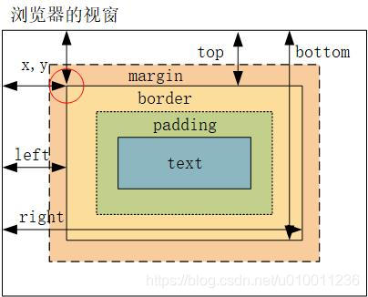
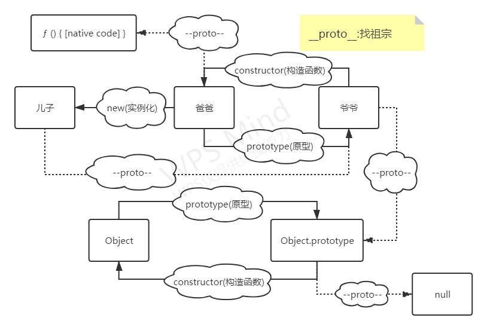

# JavaScript

## 1. ['1', '2', '3'].map(parseInt)

### 1.1 parseInt

`parseInt()` 函数解析一个字符串参数，并返回一个指定基数的整数 (数学系统的基础)。

```js
const intValue = parseInt(string[, radix]);
```

`string` 要被解析的值。如果参数不是一个字符串，则将其转换为字符串(使用 ToString 抽象操作)。字符串开头的空白符将会被忽略。

`radix` 一个介于 2 和 36 之间的整数(数学系统的基础)，表示上述字符串的基数。默认为 10。
`返回值` 返回一个整数或 NaN。

```js
parseInt(100); // 100
parseInt(100, 10); // 100
parseInt(100, 2); // 4 -> converts 100 in base 2 to base 10
```

**注意：**
在`radix`为 `undefined`，或者`radix`为 0 或者没有指定的情况下，`JavaScript`作如下处理：

- 如果字符串 `string` 以"0x"或者"0X"开头, 则基数是 16 (16 进制).
- 如果字符串 `string` 以"0"开头, 基数是 8（八进制）或者 10（十进制），那么具体是哪个基数由实现环境决定。ES5 规定使用 10，但是并不是所有的浏览器都遵循这个规定。因此，永远都要明确给出 `radix` 参数的值。
- 如果字符串 `string` 以其它任何值开头，则基数是 10 (十进制)。

### 1.2 map

`map()` 方法创建一个新数组，其结果是该数组中的每个元素都调用一个提供的函数后返回的结果。

```js
var new_array = arr.map(function callback(currentValue[,index[, array]]) {
 // Return element for new_array
 }[, thisArg])
```

可以看到`callback`回调函数需要三个参数, 我们通常只使用第一个参数 (其他两个参数是可选的)。
`currentValue` 是`callback` 数组中正在处理的当前元素。
`index`可选, 是`callback` 数组中正在处理的当前元素的索引。
`array`可选, 是`callback map` 方法被调用的数组。
另外还有`thisArg`可选, 执行 `callback` 函数时使用的`this` 值。

```js
const arr = [1, 2, 3];
arr.map((num) => num + 1); // [2, 3, 4]
```

## 2. 获得宽高的方式

### 2.1 dom 节点

- `dom.style.width/height`  这种方式只能取到 dom 元素内联样式所设置的宽高，也就是说如果该节点的样式是在 style 标签中或外联的 CSS 文件中设置的话，通过这种方法是获取不到 dom 的宽高的。
- `window.getComputedStyle(dom).width/height`  是一个可以获取当前元素所有最终使用的 CSS 属性值。返回的是一个 CSS 样式声明对象，只读 **有 px**
- `dom.getBoundingClientRect().width/height`   这种方式是根据元素在视窗中的绝对位置来获取宽高的
- `dom.offsetWidth/offsetHeight`   这个就没什么好说的了，最常用的，也是兼容最好的。

1. `dom.style.width/height`（仅取出内联样式的宽高，**有单位**） 既支持读也支持写
2. `dom.clientWidth/Height`（包括元素宽度、内边距，不包括边框和外边距）`context` + `padding`
3. `dom.scrollWidth/Height`（包括元素宽度、内边距和溢出尺寸，不包括边框和外边距）
4. `dom.offsetWidth/Height`（包括元素宽度、内边距和边框，不包括外边距）`context + padding + border`
5. `window.getComputedStyle(dom).width/height` 读取的样式是最终样式，包括了**内联样式**、**嵌入样式**和**外部样式**。
6. `dom.getBoundingClientRect().width/height` **有 px**



### 2.2 扩展

- 获取屏幕的高度和宽度（屏幕分辨率）： `window.screen.height/width`
- 获取屏幕工作区域的高度和宽度（去掉状态栏）： `window.screen.availHeight/availWidth`
- 网页全文的高度和宽度： `document.body.scrollHeight/Width`
- 滚动条卷上去的高度和向右卷的宽度：`document.body.scrollTop/scrollLeft`
- 网页可见区域的高度和宽度（不加边线）： `document.body.clientHeight/clientWidth`
- 网页可见区域的高度和宽度（加边线）： `document.body.offsetHeight/offsetWidth`

## 3. JS 的数据类型

最新的 ECMAScript 标准定义了 8 种数据类型:

- 6 种原始类型
  - `Boolean`
  - `Undefined`
  - `Number`
  - `BigInt` : 是一种内置对象，它提供了一种方法来表示大于 `253 - 1` 的整数。这原本是 Javascript 中可以用 [`Number`](https://developer.mozilla.org/zh-CN/docs/Web/JavaScript/Reference/Global_Objects/Number) 表示的最大数字。**`BigInt`** 可以表示任意大的整数。
  - `String`
  - `Symbol`
- `null`
- `Object`

```js
// 要创建一个 bigint，可以在一个整数的末尾添加字符n，或者调用函数 BigInt()。BigInt 函数使用字符串、数字等来创建一个BigInt
var x = 123456789n;
var y = 987654321n;
console.log(x * y); //121932631112635269n
console.log((x * y).toString()); //121932631112635269
```

## 4. ES6

### 4.1 Map 和 Set

#### 4.1.1 Map

- 一个 `Object` 的键只能是字符串或者 `Symbols`，但一个 `Map` 的键可以是任意值。
- `Map` 中的键值是有序的（`FIFO` 原则），而添加到对象中的键则不是。
- `Map` 的键值对个数可以从 `size` 属性获取，而 `Object` 的键值对个数只能手动计算。
- `Object` 都有自己的原型，原型链上的键名有可能和你自己在对象上的设置的键名产生冲突。

```js
var myMap = new Map();
var keyString = "a string";

myMap.set(keyString, "和键'a string'关联的值");

myMap.get(keyString); // "和键'a string'关联的值"
myMap.get("a string"); // "和键'a string'关联的值"，因为 keyString === 'a string'
// key 取值 => string object fun null undefined NAN
```

**Map 的迭代遍历:**

```js
for (var [key, value] of myMap) {
  console.log(key + " = " + value);
}

myMap.forEach(function (value, key) {
  console.log(key + " = " + value);
}, myMap);
```

**Map 与 Array 的转换:**

```js
var kvArray = [
  ["key1", "value1"],
  ["key2", "value2"],
];

// Map 构造函数可以将一个 二维 键值对数组转换成一个 Map 对象
var myMap = new Map(kvArray);

// 使用 Array.from 函数可以将一个 Map 对象转换成一个二维键值对数组
var outArray = Array.from(myMap);
```

**Map 的克隆:**

```js
var myMap1 = new Map([
  ["key1", "value1"],
  ["key2", "value2"],
]);
var myMap2 = new Map(myMap1);
myMap1 == myMap2; //false
```

**Map 的合并:**

```js
var first = new Map([
  [1, "one"],
  [2, "two"],
  [3, "three"],
]);
var second = new Map([
  [1, "uno"],
  [2, "dos"],
]);

// 合并两个 Map 对象时，如果有重复的键值，则后面的会覆盖前面的，对应值即 uno，dos， three
var merged = new Map([...first, ...second]);
```

**Object 和 Map 区别:**

1. 创建方式不同
   1. `Object` 是字面量创建
   2. `Map` 是构造函数创建
2. `key` 类型
3. `Object` 会从原型中继承属性
   1. `Object.create(null)` 可以创建无属性对象
4. `Map` 保留 `key` 的插入顺序，而 `Object` 不保留
5. `Map` 有自己的方法
6. 迭代 `Map` 是 `iterable` 的，所以可以直接被迭代遍历
7. `JSON` 序列化支持 `Object` 但不支持 `Map`
8. 性能 `Map` 在频繁增删键值对的场景下表现更好，速度更快，内存更小

[`Map.prototype.clear()`](https://developer.mozilla.org/zh-CN/docs/Web/JavaScript/Reference/Global_Objects/Map/clear)

移除 Map 对象的所有键/值对 。

[`Map.prototype.delete(key)`](https://developer.mozilla.org/zh-CN/docs/Web/JavaScript/Reference/Global_Objects/Map/delete)

如果 `Map` 对象中存在该元素，则移除它并返回 _`true`_；否则如果该元素不存在则返回 `false`。随后调用 `Map.prototype.has(key)` 将返回 `false` 。

[`Map.prototype.entries()`](https://developer.mozilla.org/zh-CN/docs/Web/JavaScript/Reference/Global_Objects/Map/entries)

返回一个新的 `Iterator` 对象，它按插入顺序包含了 Map 对象中每个元素的 **`[key, value]`** 数组。

[Map.prototype.forEach(callbackFn[, thisArg])](https://developer.mozilla.org/zh-CN/docs/Web/JavaScript/Reference/Global_Objects/Map/forEach)

按插入顺序，为 `Map`对象里的每一键值对调用一次 callbackFn 函数。如果为 forEach 提供了 thisArg，它将在每次回调中作为 this 值。

[`Map.prototype.get(key)`](https://developer.mozilla.org/zh-CN/docs/Web/JavaScript/Reference/Global_Objects/Map/get)

返回键对应的值，如果不存在，则返回 undefined。

[`Map.prototype.has(key)`](https://developer.mozilla.org/zh-CN/docs/Web/JavaScript/Reference/Global_Objects/Map/has)

返回一个布尔值，表示 Map 实例是否包含键对应的值。

[`Map.prototype.keys()`](https://developer.mozilla.org/zh-CN/docs/Web/JavaScript/Reference/Global_Objects/Map/keys)

返回一个新的 `Iterator`对象， 它按插入顺序包含了 Map 对象中每个元素的**键** 。

[`Map.prototype.set(key, value)`](https://developer.mozilla.org/zh-CN/docs/Web/JavaScript/Reference/Global_Objects/Map/set)

设置 Map 对象中键的值。返回该 Map 对象。

[`Map.prototype.values()`](https://developer.mozilla.org/zh-CN/docs/Web/JavaScript/Reference/Global_Objects/Map/values)

返回一个新的`Iterator`对象，它按插入顺序包含了 Map 对象中每个元素的**值** 。

#### 4.1.2 set

`Set` 对象允许你存储任何类型的唯一值，无论是原始值或者是对象引用。

`Set` 对象存储的值总是唯一的，所以需要判断两个值是否恒等。有几个特殊值需要特殊对待：

- +0 与 -0 在存储判断唯一性的时候是恒等的，所以不重复；
- `undefined` 与 `undefined` 是恒等的，所以不重复；
- NaN 与 NaN 是不恒等的，但是在 `Set` 中只能存一个，不重复。

```js
let mySet = new Set();

mySet.add(1); // Set(1) {1}
mySet.add(5); // Set(2) {1, 5}
mySet.add(5); // Set(2) {1, 5} 这里体现了值的唯一性
mySet.add("some text");
// Set(3) {1, 5, "some text"} 这里体现了类型的多样性
var o = { a: 1, b: 2 };
mySet.add(o);
mySet.add({ a: 1, b: 2 });
// Set(5) {1, 5, "some text", {…}, {…}}
// 这里体现了对象之间引用不同不恒等，即使值相同，Set 也能存储
```

**Array 与 set:**

```js
// Array 转 Set
var mySet = new Set(["value1", "value2", "value3"]);
// 用...操作符，将 Set 转 Array
var myArray = [...mySet];

// String 转 Set
var mySet = new Set("hello"); // Set(4) {"h", "e", "l", "o"}
// 注：Set 中 toString 方法是不能将 Set 转换成 String
```

**Set 对象作用:**

```js
//数组去重
var mySet = new Set([1, 2, 3, 4, 4]);
[...mySet]; // [1, 2, 3, 4]

//并集
var a = new Set([1, 2, 3]);
var b = new Set([4, 3, 2]);
var union = new Set([...a, ...b]); // {1, 2, 3, 4}

//交集
var a = new Set([1, 2, 3]);
var b = new Set([4, 3, 2]);
var intersect = new Set([...a].filter((x) => b.has(x))); // {2, 3}

//差集
var a = new Set([1, 2, 3]);
var b = new Set([4, 3, 2]);
var difference = new Set([...a].filter((x) => !b.has(x))); // {1}
```

[`Set.prototype.add(*value*)`](https://developer.mozilla.org/zh-CN/docs/Web/JavaScript/Reference/Global_Objects/Set/add)

在`Set`对象尾部添加一个元素。返回该`Set`对象。

[`Set.prototype.clear()`](https://developer.mozilla.org/zh-CN/docs/Web/JavaScript/Reference/Global_Objects/Set/clear)

移除`Set`对象内的所有元素。

[`Set.prototype.delete(*value*)`](https://developer.mozilla.org/zh-CN/docs/Web/JavaScript/Reference/Global_Objects/Set/delete)

移除`Set`中与这个值相等的元素，返回`Set.prototype.has(value)`在这个操作前会返回的值（即如果该元素存在，返回`true`，否则返回`false`）。`Set.prototype.has(value)`在此后会返回`false`。

[`Set.prototype.entries()`](https://developer.mozilla.org/zh-CN/docs/Web/JavaScript/Reference/Global_Objects/Set/entries)

返回一个新的迭代器对象，该对象包含`Set`对象中的按插入顺序排列的所有元素的值的`[value, value]`数组。为了使这个方法和`Map`对象保持相似， 每个值的键和值相等。

[Set.prototype.forEach(callbackFn[, thisArg])](https://developer.mozilla.org/zh-CN/docs/Web/JavaScript/Reference/Global_Objects/Set/forEach)

按照插入顺序，为 Set 对象中的每一个值调用一次 callBackFn。如果提供了`thisArg`参数，回调中的`this`会是这个参数。

[`Set.prototype.has(*value*)`](https://developer.mozilla.org/zh-CN/docs/Web/JavaScript/Reference/Global_Objects/Set/has)

返回一个布尔值，表示该值在`Set`中存在与否。

[`Set.prototype.keys()`](https://developer.mozilla.org/zh-CN/docs/Web/JavaScript/Reference/Global_Objects/Set/keys)

与`values()`方法相同，返回一个新的迭代器对象，该对象包含`Set`对象中的按插入顺序排列的所有元素的值。

[`Set.prototype.values()`](https://developer.mozilla.org/zh-CN/docs/Web/JavaScript/Reference/Global_Objects/Set/values)

返回一个新的迭代器对象，该对象包含`Set`对象中的按插入顺序排列的所有元素的值。

`.size()`

### 4.2 Symbol

ES6 引入了一种新的原始数据类型 `Symbol`，表示独一无二的值，最大的用法是用来定义对象的唯一属性名。

`Symbol`函数栈不能用 new 命令，因为 `Symbol`是原始数据类型，不是对象。可以接受一个字符串作为参数，为新创建的 `Symbol`提供描述，用来显示在控制台或者作为字符串的时候使用，便于区分。

```js
let sy = Symbol("KK");
console.log(sy); // Symbol(KK)
typeof sy; // "symbol"

// 相同参数 Symbol() 返回的值不相等
let sy1 = Symbol("kk");
sy === sy1; // false
```

**使用场景：作为属性名:**

```js
let sy = Symbol("key1");

// 写法1
let syObject = {};
syObject[sy] = "kk";
console.log(syObject); // {Symbol(key1): "kk"}

// 写法2
let syObject = {
  [sy]: "kk",
};
console.log(syObject); // {Symbol(key1): "kk"}

// 写法3
let syObject = {};
Object.defineProperty(syObject, sy, { value: "kk" });
console.log(syObject); // {Symbol(key1): "kk"}
```

`Symbol` 作为对象属性名时不能用.运算符，要用方括号。因为.运算符后面是字符串，所以取到的是字符串 `sy` 属性，而不是 `Symbol` 值 `sy` 属性。

```js
let syObject = {};
syObject[sy] = "kk";

syObject[sy]; // "kk"
syObject.sy; // undefined
```

`Symbol`值作为属性名时，该属性是公有属性不是私有属性，可以在类的外部访问。但是不会出现在 `for...in 、 for...of`的循环中

**Symbol.for():**

```js
let yellow = Symbol("Yellow");
let yellow1 = Symbol.for("Yellow");
yellow === yellow1; // false
let yellow2 = Symbol.for("Yellow");
yellow1 === yellow2; // true
```

**Symbol.keyFor():**

`Symbol.keyFor()`返回一个已登记的 `Symbol`类型值的 `key`，用来检测该字符串参数作为名称的 `Symbol` 值是否已被登记。

```js
let yellow1 = Symbol.for("Yellow");
Symbol.keyFor(yellow1); // "Yellow"
```

### 4.3 Iterator

`Iterator`是 `ES6` 引入的一种新的遍历机制，迭代器有两个核心概念：

- 迭代器是一个统一的接口，它的作用是使各种数据结构可被便捷的访问，它是通过一个键为`Symbol.iterator` 的方法来实现。
- 迭代器是用于遍历数据结构元素的指针（如数据库中的游标）。

**迭代过程:**

迭代的过程如下：

- 通过 `Symbol.iterator` 创建一个迭代器，指向当前数据结构的起始位置
- 随后通过 `next` 方法进行向下迭代指向下一个位置， `next` 方法会返回当前位置的对象，对象包含了 `value` 和 `done` 两个属性， `value` 是当前属性的值，`done` 用于判断是否遍历结束
- 当 `done` 为 `true` 时则遍历结束

```js
const items = ["zero", "one", "two"];
const it = items[Symbol.iterator]();

it.next();
>{value: "zero", done: false}
it.next();
>{value: "one", done: false}
it.next();
>{value: "two", done: false}
it.next();
>{value: undefined, done: true}
```

简单实现一个迭代器：

```js
let iterator = {
  current: 0,
  last: 3,
  next: function () {
    if (this.current <= this.last) {
      return { value: this.current++, done: false };
    } else {
      return { value: undefined, done: true };
    }
  },
};
```

**扩展：对象解构成数组：**

```js
// 通过给对象添加属性来实现，同for of 遍历原理
Object.prototype[Symbol.iterator] = function(){
    return Object.values(this)[Symbol.iterator]()
}
let [a,b] = {a:1,b:2} // [1, 2]
```

参考链接：[对象解构成数组](https://juejin.cn/post/7374308419074146313#heading-4)

### 4.4 class

ES6 的类，完全可以看作构造函数的另一种写法。

```javascript
class Point {
  // ...
}

typeof Point; // "function"
Point === Point.prototype.constructor; // true
```

上面代码表明，类的数据类型就是函数，类本身就指向构造函数。

使用的时候，也是直接对类使用`new`命令，跟构造函数的用法完全一致。

```javascript
class Bar {
  doStuff() {
    console.log("stuff");
  }
}

const b = new Bar();
b.doStuff(); // "stuff"
```

在类的实例上面调用方法，其实就是调用原型上的方法。

```javascript
class B {}
const b = new B();

b.__proto__.constructor === B.prototype.constructor; // true
```

与 ES5 一样，实例的属性除非显式定义在其本身（即定义在`this`对象上），否则都是定义在原型上（即定义在`class`上）

```javascript
//定义类
class Point {
  constructor(x, y) {
    this.x = x;
    this.y = y;
  }
  toString() {
    return "(" + this.x + ", " + this.y + ")";
  }
}

var point = new Point(2, 3);

point.toString(); // (2, 3)

//hasOwnProperty() 方法会返回一个布尔值，指示对象自身属性中是否具有指定的属性
point.hasOwnProperty("x"); // true
point.hasOwnProperty("y"); // true
point.hasOwnProperty("toString"); // false
point.__proto__.hasOwnProperty("toString"); // true
```

#### 4.4.1 constructor( ) 方法

`constructor()`方法是类的默认方法，通过`new`命令生成对象实例时，自动调用该方法。一个类必须有`constructor()`方法，如果没有显式定义，一个空的`constructor()`方法会被默认添加。

#### 4.4.2 取值函数（getter）和存值函数（setter）

与 ES5 一样，在“类”的内部可以使用`get`和`set`关键字，对某个属性设置存值函数和取值函数，拦截该属性的存取行为。

```javascript
class MyClass {
  constructor() {
    // ...
  }
  get prop() {
    return "getter";
  }
  set prop(value) {
    console.log("setter: " + value);
  }
}

let inst = new MyClass();

inst.prop = 123;
// setter: 123

inst.prop;
// 'getter'
```

#### 4.4.3 属性表达式

类的属性名，可以采用表达式。

```javascript
let methodName = "getArea";

class Square {
  constructor(length) {
    // ...
  }

  [methodName]() {
    // ...
  }
}
```

上面代码中，`Square`类的方法名`getArea`，是从表达式得到的。

#### 4.4.4 立即执行的 Class

```javascript
let person = new (class {
  constructor(name) {
    this.name = name;
  }

  sayName() {
    console.log(this.name);
  }
})("张三");

person.sayName(); // "张三"
```

上面代码中，`person`是一个立即执行的类的实例。

#### 4.4.5 注意点

##### 4.4.5.1 严格模式

类和模块的内部，默认就是严格模式，所以不需要使用`use strict`指定运行模式。只要你的代码写在类或模块之中，就只有严格模式可用。考虑到未来所有的代码，其实都是运行在模块之中，所以 ES6 实际上把整个语言升级到了严格模式。

##### 4.4.5.2 不存在提升

类不存在变量提升（hoist），这一点与 ES5 完全不同。

```javascript
new Foo(); // ReferenceError
class Foo {}
```

上面代码中，`Foo`类使用在前，定义在后，这样会报错，因为 ES6 不会把类的声明提升到代码头部。这种规定的原因与下文要提到的继承有关，必须保证子类在父类之后定义。

```javascript
{
  let Foo = class {};
  class Bar extends Foo {}
}
```

上面的代码不会报错，因为`Bar`继承`Foo`的时候，`Foo`已经有定义了。但是，如果存在`class`的提升，上面代码就会报错，因为`class`会被提升到代码头部，而`let`命令是不提升的，所以导致`Bar`继承`Foo`的时候，`Foo`还没有定义。

##### 4.4.5.3 name 属性

由于本质上，ES6 的类只是 ES5 的构造函数的一层包装，所以函数的许多特性都被`Class`继承，包括`name`属性。

```javascript
class Point {}
Point.name; // "Point"
```

`name`属性总是返回紧跟在`class`关键字后面的类名。

##### 4.4.5.4 this 的指向

类的方法内部如果含有`this`，它默认指向类的实例。但是，必须非常小心，一旦单独使用该方法，很可能报错。

```javascript
class Logger {
  printName(name = "there") {
    this.print(`Hello ${name}`);
  }

  print(text) {
    console.log(text);
  }
}

const logger = new Logger();
const { printName } = logger;
printName(); // TypeError: Cannot read property 'print' of undefined
```

上面代码中，`printName`方法中的`this`，默认指向`Logger`类的实例。但是，如果将这个方法提取出来单独使用，`this`会指向该方法运行时所在的环境（由于 `class` 内部是严格模式，所以 `this` 实际指向的是`undefined`），从而导致找不到`print`方法而报错。

一个比较简单的解决方法是，在构造方法中绑定`this`，这样就不会找不到`print`方法了。

```javascript
class Logger {
  constructor() {
    this.printName = this.printName.bind(this);
  }

  // ...
}
```

另一种解决方法是使用箭头函数。

```javascript
class Obj {
  constructor() {
    this.getThis = () => this;
  }
}

const myObj = new Obj();
myObj.getThis() === myObj; // true
```

箭头函数内部的`this`总是指向定义时所在的对象。上面代码中，箭头函数位于构造函数内部，它的定义生效的时候，是在构造函数执行的时候。这时，箭头函数所在的运行环境，肯定是实例对象，所以`this`会总是指向实例对象。

还有一种解决方法是使用`Proxy`，获取方法的时候，自动绑定`this`。

```javascript
function selfish(target) {
  const cache = new WeakMap();
  const handler = {
    get(target, key) {
      const value = Reflect.get(target, key);
      if (typeof value !== "function") {
        return value;
      }
      if (!cache.has(value)) {
        cache.set(value, value.bind(target));
      }
      return cache.get(value);
    },
  };
  const proxy = new Proxy(target, handler);
  return proxy;
}

const logger = selfish(new Logger());
```

#### 4.4.6 静态方法

类相当于实例的原型，所有在类中定义的方法，都会被实例继承。如果在一个方法前，加上`static`关键字，就表示该方法不会被实例继承，而是直接通过类来调用，这就称为“静态方法”。

```javascript
class Foo {
  static classMethod() {
    return "hello";
  }
}

Foo.classMethod(); // 'hello'

var foo = new Foo();
foo.classMethod();
// TypeError: foo.classMethod is not a function
```

上面代码中，`Foo`类的`classMethod`方法前有`static`关键字，表明该方法是一个静态方法，可以直接在`Foo`类上调用（`Foo.classMethod()`），而不是在`Foo`类的实例上调用。如果在实例上调用静态方法，会抛出一个错误，表示不存在该方法。

注意，如果静态方法包含`this`关键字，这个`this`指的是类，而不是实例。

```javascript
class Foo {
  static bar() {
    this.baz();
  }
  static baz() {
    console.log("hello");
  }
  baz() {
    console.log("world");
  }
}

Foo.bar(); // hello
```

上面代码中，静态方法`bar`调用了`this.baz`，这里的`this`指的是`Foo`类，而不是`Foo`的实例，等同于调用`Foo.baz`。另外，从这个例子还可以看出，静态方法可以与非静态方法重名。

父类的静态方法，可以被子类继承。

```javascript
class Foo {
  static classMethod() {
    return "hello";
  }
}

class Bar extends Foo {}

Bar.classMethod(); // 'hello'
```

上面代码中，父类`Foo`有一个静态方法，子类`Bar`可以调用这个方法。

静态方法也是可以从`super`对象上调用的。

```javascript
class Foo {
  static classMethod() {
    return "hello";
  }
}

class Bar extends Foo {
  static classMethod() {
    return super.classMethod() + ", too";
  }
}

Bar.classMethod(); // "hello, too"
```

#### 4.4.7 静态属性

静态属性指的是 Class 本身的属性，即`Class.propName`，而不是定义在实例对象（`this`）上的属性。

```javascript
class Foo {}

Foo.prop = 1;
Foo.prop; // 1
```

上面的写法为`Foo`类定义了一个静态属性`prop`。

目前，只有这种写法可行，因为 ES6 明确规定，`Class` 内部只有静态方法，没有静态属性。现在有一个[提案](https://github.com/tc39/proposal-class-fields)提供了类的静态属性（已经支持），写法是在实例属性的前面，加上`static`关键字。

```javascript
class MyClass {
  static myStaticProp = 42;

  constructor() {
    console.log(MyClass.myStaticProp); // 42
  }
}
```

这个新写法大大方便了静态属性的表达。

```javascript
// 老写法
class Foo {
  // ...
}
Foo.prop = 1;

// 新写法
class Foo {
  static prop = 1;
}
```

上面代码中，老写法的静态属性定义在类的外部。整个类生成以后，再生成静态属性。这样让人很容易忽略这个静态属性，也不符合相关代码应该放在一起的代码组织原则。另外，新写法是显式声明（declarative），而不是赋值处理，语义更好。

静态属性也一样可以被继承

#### 4.4.8 extends 与 super

通过 `extends` 实现类的继承。

```js
class Child extends Father { ... }
```

子类 `constructor` 方法中必须有 `super` ，且必须出现在 `this` 之前。可以通过`this.xxx`来调用父类的属性和方法

`super` 是调用的父类的构造函数，可以进行传参

```js
class Father {
  test() {
    return 0;
  }
  static test1() {
    return 1;
  }
}

class Child extends Father {
  constructor() {
    super();
  }
}

class Child1 extends Father {
  test2() {
    super(); // Uncaught SyntaxError: 'super' keyword unexpected
    // here
  }
}
```

### 4.5 export 与 import

#### 4.5.1 概述

在 ES6 之前，社区制定了一些模块加载方案，最主要的有 `CommonJS` 和 `AMD` 两种。前者用于服务器，后者用于浏览器。

#### 4.5.2 特点

ES6 的模块自动开启严格模式，不管你有没有在模块头部加上 `use strict`。

模块中可以导入和导出各种类型的变量，如函数，对象，字符串，数字，布尔值，类等。

每个模块都有自己的上下文，每一个模块内声明的变量都是局部变量，不会污染全局作用域。

每一个模块只加载一次（是单例的）， 若再去加载同目录下同文件，直接从内存中读取。

#### 4.5.3 基本语法

模块导入导出各种类型的变量，如字符串，数值，函数，类。

- 导出的函数声明与类声明必须要有名称（`export default` 命令另外考虑）。
- 不仅能导出声明还能导出引用（例如函数）。
- `export`命令可以出现在模块的任何位置，但必需处于模块**顶层**。
- `import`命令会提升到整个模块的头部，首先执行。

```javascript
// CommonJS模块
let { stat, exists, readfile } = require("fs");

// 等同于
let _fs = require("fs");
let stat = _fs.stat;
let exists = _fs.exists;
let readfile = _fs.readfile;

// ES6模块
import { stat, exists, readFile } from "fs";
```

#### 4.5.4 as 的用法

```javascript
/*-----export [test.js]-----*/
let myName = "Tom";
export { myName as exportName }

/*-----import [xxx.js]-----*/
import { exportName } from "./test.js";
console.log(exportName);// Tom
使用 as 重新定义导出的接口名称，隐藏模块内部的变量
/*-----export [test1.js]-----*/
let myName = "Tom";
export { myName }
/*-----export [test2.js]-----*/
let myName = "Jerry";
export { myName }
/*-----import [xxx.js]-----*/
import { myName as name1 } from "./test1.js";
import { myName as name2 } from "./test2.js";
console.log(name1);// Tom
console.log(name2);// Jerry
```

#### 4.5.5 import 命令的特点

**只读属性**：不允许在加载模块的脚本里面，改写接口的引用指向，即可以改写 `import` 变量类型为对象的属性值，不能改写 `import` 变量类型为基本类型的值。

**单例模式**：多次重复执行同一句 `import` 语句，那么只会执行一次，而不会执行多次。`import` 同一模块，声明不同接口引用，会声明对应变量，但只执行一次 `import` 。

**还可以用 \* 代表全部:**

#### 4.5.6 export default

```javascript
// 第一组
export default function crc32() {
  // 输出
  // ...
}
import crc32 from "crc32"; // 输入

// 第二组
export function crc32() {
  // 输出
  // ...
}
import { crc32 } from "crc32"; // 输入
```

#### 4.5.7 复合写法

如果在一个模块之中，先输入后输出同一个模块，`import`语句可以与`export`语句写在一起。

```javascript
export { foo, bar } from "my_module";

// 可以简单理解为
import { foo, bar } from "my_module";
export { foo, bar };
```

#### 4.5.8 加载规则

浏览器加载 ES6 模块，也使用`<script>`标签，但是要加入`type="module"`属性。

```html
<script type="module" src="./foo.js"></script>
```

上面代码在网页中插入一个模块`foo.js`，由于`type`属性设为`module`，所以浏览器知道这是一个 ES6 模块。

浏览器对于带有`type="module"`的`<script>`，都是异步加载，不会造成堵塞浏览器，即等到整个页面渲染完，再执行模块脚本，等同于打开了`<script>`标签的`defer`属性。

```html
<script type="module" src="./foo.js"></script>
<!-- 等同于 -->
<script type="module" src="./foo.js" defer></script>
```

如果网页有多个`<script type="module">`，它们会按照在页面出现的顺序依次执行。

`script` 标签的 async 属性也可以打开，这时只要加载完成，渲染引擎就会中断渲染立即执行。执行完成后，再恢复渲染。

```html
<script type="module" src="./foo.js" async></script>
```

一旦使用了`async`属性，`<script type="module">`就不会按照在页面出现的顺序执行，而是只要该模块加载完成，就执行该模块。

ES6 模块也允许内嵌在网页中，语法行为与加载外部脚本完全一致。

```html
<script type="module">
  import utils from "./utils.js";

  // other code
</script>
```

#### 4.5.9 ES6 与 CommonJS

它们有三个重大差异

- `CommonJS` 模块输出的是一个值的拷贝，ES6 模块输出的是值的引用。存疑？？？

### commonjs

```js
// a.js
let a = 1;

module.exports = {
  a,
};

// b.js
const { a } = require("./a.js");

a = 2; // 报错: TypeError: Assignment to constant variable.
```

```js
// a.js
let obj = {
  a: 1,
};

module.exports = {
  obj,
};

// b.js
const { obj: obj1 } = require("./a.js");

module.exports = {
  add: function () {
    obj1.a = obj1.a + 1;
  },
};

// c.js
const { obj } = require("./a.js");
const { add } = require("./b.js");

add();
console.log(obj.a); // 2 证明 commonjs 是浅拷贝传递
```

### es6 module

```js
// a.js
let a = 1;

export { a };

// b.js
import { a } from "./a.js";

export function add() {
  a++; // 报错 TypeError: Assignment to constant variable.
}

// c.js
import { a } from "./a.js";
import { add } from "./b.js";

add();
console.log(a);
```

```js
// a.js
let obj = { a: 1 };

export default obj;

// b.js
import obj from "./a.js";

export function add() {
  obj.a++;
}

// c.js
import obj from "./a.js";
import { add } from "./b.js";

add();
console.log(obj); // { a: 2 }
```

- `CommonJS` 模块是运行时加载，ES6 模块是编译时输出接口。（因为 `CommonJS` 加载的是一个对象（即`module.exports`属性），该对象只有在脚本运行完才会生成。而 ES6 模块不是对象，它的对外接口只是一种静态定义，在代码静态解析阶段就会生成）
- `CommonJS` 模块的`require()`是同步加载模块，ES6 模块的`import`命令是异步加载，有一个独立的模块依赖的解析阶段。

### 4.6 Promise

#### 4.6.1 Promise 状态

**状态的特点:**

`Promise` 异步操作有三种状态：`pending`（进行中）、`fulfilled`（已成功）和 `rejected`（已失败）。除了异步操作的结果，任何其他操作都无法改变这个状态。

`Promise` 对象只有：从 `pending` 变为 `fulfilled` 和从 `pending` 变为 `rejected` 的状态改变。只要处于 `fulfilled` 和 `rejected` ，状态就不会再变了即 `resolved`（已定型）。

**状态的缺点:**

无法取消 `Promise` ，一旦新建它就会立即执行，无法中途取消。

如果不设置回调函数，`Promise` 内部抛出的错误，不会反应到外部。

当处于 pending 状态时，无法得知目前进展到哪一个阶段（刚刚开始还是即将完成）。

#### 4.6.2 then 方法

`then` 方法接收两个函数作为参数，第一个参数是 `Promise` 执行成功时的回调，第二个参数是 `Promise` 执行失败时的回调，两个函数只会有一个被调用。

```js
//resolve与reject只能有一个被调用
const p = new Promise(function (resolve, reject) {
  resolve("success");
});

p.then(function (value) {
  console.log(value);
});

console.log("first");
// first
// success

new Promise((resolve, reject) => {
  resolve();
  reject();
}).then(
  (_) => {
    console.log(3);
  },
  () => {
    console.log("rej");
  }
);
//"3"
```

通过 **.then** 形式添加的回调函数，不论什么时候，都会被调用。

#### 4.6.3 catch 与 finally

大多数浏览器中不能终止的 `Promise` 链里的`rejection`，建议后面都跟上 `.catch(error => console.log(error))`

`finally()`方法用于指定不管 `Promise` 对象最后状态如何，都会执行的操作。该方法是 ES2018 引入标准的。

```javascript
promise
.then(result => {···})
.catch(error => {···})
.finally(() => {···});
```

#### 4.6.4 Promise.all 与 Promise.race

`Promise.all()`方法用于将多个 `Promise` 实例，包装成一个新的 `Promise` 实例。

```javascript
const p = Promise.all([p1, p2, p3]);
```

`p`的状态由`p1`、`p2`、`p3`决定，分成两种情况。

（1）只有`p1`、`p2`、`p3`的状态都变成`fulfilled`，`p`的状态才会变成`fulfilled`，此时`p1`、`p2`、`p3`的返回值组成一个数组，传递给`p`的回调函数。

（2）只要`p1`、`p2`、`p3`之中有一个被`rejected`，`p`的状态就变成`rejected`，此时第一个被`reject`的实例的返回值，会传递给`p`的回调函数。

**Promise.race:**

顾名思义，`Promise.race`就是赛跑的意思，意思就是说，`Promise.race([p1, p2, p3])` 里面哪个结果获得的快，就返回那个结果，不管结果本身是成功状态还是失败状态。

```jsx
let p1 = new Promise((resolve, reject) => {
  setTimeout(() => {
    resolve("success");
  }, 1000);
});

let p2 = new Promise((resolve, reject) => {
  setTimeout(() => {
    reject("failed");
  }, 500);
});

Promise.race([p1, p2])
  .then((result) => {
    console.log(result);
  })
  .catch((error) => {
    console.log(error); // 打开的是 'failed'
  });
```

#### 4.6.5 Promise.resolve 与 Promise.reject

有时需要将现有对象转为 `Promise` 对象，`Promise.resolve()`方法就起到这个作用。

```javascript
const jsPromise = Promise.resolve($.ajax("/whatever.json"));
```

上面代码将 `jQuery` 生成的`deferred`对象，转为一个新的 `Promise` 对象。

`Promise.resolve()`等价于下面的写法。

```javascript
Promise.resolve("foo");
// 等价于
new Promise((resolve) => resolve("foo"));
```

`Promise.resolve()`方法的参数分成四种情况。

**（1）参数是一个 Promise 实例:**

如果参数是 `Promise` 实例，那么`Promise.resolve`将不做任何修改、原封不动地返回这个实例。

**（2）参数是一个`thenable`对象:**

`thenable`对象指的是具有`then`方法的对象，比如下面这个对象。

```javascript
let thenable = {
  then: function (resolve, reject) {
    resolve(42);
  },
};
```

`Promise.resolve()`方法会将这个对象转为 `Promise` 对象，然后就立即执行`thenable`对象的`then()`方法。

```javascript
let thenable = {
  then: function (resolve, reject) {
    resolve(42);
  },
};

let p1 = Promise.resolve(thenable);
p1.then(function (value) {
  console.log(value); // 42
});
```

上面代码中，`thenable`对象的`then()`方法执行后，对象`p1`的状态就变为`resolved`，从而立即执行最后那个`then()`方法指定的回调函数，输出 42。

**（3）参数不是具有`then()`方法的对象，或根本就不是对象**

如果参数是一个原始值，或者是一个不具有`then()`方法的对象，则`Promise.resolve()`方法返回一个新的 Promise 对象，状态为`resolved`。

```javascript
const p = Promise.resolve("Hello");

p.then(function (s) {
  console.log(s);
});
// Hello
```

上面代码生成一个新的 `Promise` 对象的实例`p`。由于字符串`Hello`不属于异步操作（判断方法是字符串对象不具有 `then` 方法），返回 `Promise` 实例的状态从一生成就是`resolved`，所以回调函数会立即执行。`Promise.resolve()`方法的参数，会同时传给回调函数。

**（4）不带有任何参数:**

`Promise.resolve()`方法允许调用时不带参数，直接返回一个`resolved`状态的 Promise 对象。

所以，如果希望得到一个 `Promise` 对象，比较方便的方法就是直接调用`Promise.resolve()`方法。

```javascript
const p = Promise.resolve();

p.then(function () {
  // ...
});
```

上面代码的变量`p`就是一个 `Promise` 对象。

需要注意的是，立即`resolve()`的 `Promise` 对象，是在本轮“事件循环”（`event loop`）的结束时执行，而不是在下一轮“事件循环”的开始时。

```javascript
setTimeout(function () {
  console.log("three");
}, 0);

Promise.resolve().then(function () {
  console.log("two");
});

console.log("one");

// one
// two
// three
```

上面代码中，`setTimeout(fn, 0)`在下一轮“事件循环”开始时执行，`Promise.resolve()`在本轮“事件循环”结束时执行，`console.log('one')`则是立即执行，因此最先输出。

`Promise.reject(reason)`方法也会返回一个新的 `Promise` 实例，该实例的状态为`rejected`。

```javascript
const p = Promise.reject("出错了");
// 等同于
const p = new Promise((resolve, reject) => reject("出错了"));

p.then(null, function (s) {
  console.log(s);
});
// 出错了
```

上面代码生成一个 `Promise` 对象的实例`p`，状态为`rejected`，回调函数会立即执行。

`Promise.reject()`方法的参数，会原封不动地作为`reject`的理由，变成后续方法的参数。

```javascript
Promise.reject("出错了").catch((e) => {
  console.log(e === "出错了");
});
// true
```

上面代码中，`Promise.reject()`方法的参数是一个字符串，后面`catch()`方法的参数`e`就是这个字符串。

#### 4.6.6 promise 原理

```js
//极简的实现
class Promise {
  callbacks = [];
  constructor(fn) {
    // 传入resolve
    fn(this._resolve.bind(this));
  }
  then(onFulfilled) {
    this.callbacks.push(onFulfilled);
  }
  _resolve(value) {
    this.callbacks.forEach((fn) => fn(value));
  }
}

//Promise应用
let p = new Promise((resolve) => {
  setTimeout(() => {
    console.log("done");
    resolve("5秒");
  }, 5000);
}).then((tip) => {
  console.log(tip);
});

function Promise(fn) {
  this.cbs = [];

  const resolve = (value) => {
    setTimeout(() => {
      this.data = value;
      this.cbs.forEach((cb) => cb(value));
    });
  };

  fn(resolve);
}

Promise.prototype.then = function (onResolved) {
  return new Promise((resolve) => {
    this.cbs.push(() => {
      const res = onResolved(this.data);
      if (res instanceof Promise) {
        res.then(resolve);
      } else {
        resolve(res);
      }
    });
  });
};
```

#### 4.6.7 链式调用

```js
Promise.resolve()
  .then(() => {
    console.log("then 1");
  })
  .finally(() => {
    console.log("finally");
    throw new Error("error");
  })
  .catch(() => {
    console.log("catch");
  })
  .then(() => {
    console.log("then 2");
  });

// then 1
// finally
// catch
// then 2
```

## 5. Common.JS、cmd、amd

### commonjs

- 所有代码都运行在模块作用域，不会污染全局作用域。
- 模块可以多次加载，但是只会在第一次加载时运行一次，然后运行结果就被缓存了，以后再加载，就直接读取缓存结果。要想让模块再次运行，必须清除缓存。
- 模块加载的顺序，按照其在代码中出现的顺序。

```js
//导入
const moduleA = require("./moduleA");
//导出
module.exports = moduleA.someFunc;
```

优点：服务器端模块重用，`NPM`中模块包多，有将近 20 万个。

缺点：加载模块是同步的，只有加载完成后才能执行后面的操作，也就是当要用到该模块了，现加载现用，不仅加载速度慢，而且还会导致性能、可用性、调试和跨域访问等问题。`Node.js`主要用于服务器编程，加载的模块文件一般都存在本地硬盘，加载起来比较快，不用考虑异步加载的方式，因此,`CommonJS`规范比较适用。然而，这并不适合在浏览器环境，同步意味着阻塞加载，浏览器资源是异步加载的，因此有了`AMD` `CMD`解决方案。

实现：

- 服务器端的 `Node.js`；
- `Browserify`，浏览器端的 `CommonJS` 实现，可以使用 `NPM` 的模块，但是编译打包后的 文件体积可能很大；
- `modules-webmake`，类似`Browserify`，还不如 `Browserify` 灵活；
- `wreq`，`Browserify` 的前身；

### AMD

鉴于浏览器的特殊情况，又出现了一个规范，这个规范呢可以实现异步加载依赖模块，并且会提前加载那就是`AMD`规范。

其核心接口是：`define(id?, dependencies?, factory)` ，它要在声明模块的时候指定所有的依赖 `dependencies` ，并且还要当做形参传到`factory` 中，对于依赖的模块提前执行，依赖前置。

```js
define("module", ["dep1", "dep2"], function (d1, d2) {
  return someExportedValue;
});
require(["module", "../file"], function (module, file) {
  /* ... */
});
```

优点：在浏览器环境中异步加载模块；并行加载多个模块；

缺点：开发成本高，代码的阅读和书写比较困难，模块定义方式的语义不顺畅；不符合通用的模块化思维方式，是一种妥协的实现；

实现：`RequireJS`； `curl`；

### CMD

`Common Module Definition` 规范和 `AMD` 很相似，尽量保持简单，并与 `CommonJS` 和 `Node.js` 的 `Modules` 规范保持了很大的兼容性。

```js
define(function(require, exports, module) {
  var $ = require('jquery');
  var Spinning = require('./spinning');
  exports.doSomething = ...
  module.exports = ...
})
```

优点：依赖就近，延迟执行 可以很容易在 `Node.js` 中运行；

缺点：依赖 `SPM` 打包，模块的加载逻辑偏重；

实现：`Sea.js` ；`coolie`

### 模块总结

- `CommonJS`规范主要用于服务端编程，加载模块是同步的，这并不适合在浏览器环境，因为同步意味着阻塞加载，浏览器资源是异步加载的，因此有了`AMD` `CMD`解决方案。
- `AMD`规范在浏览器环境中异步加载模块，而且可以并行加载多个模块。不过，`AMD`规范开发成本高，代码的阅读和书写比较困难，模块定义方式的语义不顺畅。
- `CMD`规范与`AMD`规范很相似，都用于浏览器编程，依赖就近，延迟执行，可以很容易在 Node.js 中运行。不过，依赖 SPM 打包，模块的加载逻辑偏重
- **ES6 在语言标准的层面上，实现了模块功能，而且实现得相当简单，完全可以取代 CommonJS 和 AMD 规范，成为浏览器和服务器通用的模块解决方案**

## 6. async 与 await

```js
function testAwait() {
  return new Promise((resolve) => {
    setTimeout(function () {
      console.log("testAwait");
      resolve();
    }, 1000);
  });
}

async function helloAsync() {
  await testAwait();
  console.log("helloAsync");
}
helloAsync();
// testAwait
// helloAsync

// 原理-相当于把后面的代码写入 then 中
function helloAsync() {
  return new Promise(() => {
    testAwait().then(() => {
      console.log("helloAsync");
    });
  });
}
```

## 7. this

参考链接：[先看这个](https://juejin.cn/post/7445090940279423027)

**在使用箭头函数的情况下：**

```js
function Fun() {
  this.say = () => {
    let a = 1;
    console.log(this); //指向实例化对象
  };
}

Fun.prototype.buy = () => {
  console.log(this, "buy"); //window （爷爷）
};

Fun.hi = () => {
  let a = 2;
  console.log(this); //window  （爸爸自带的实例化对象上）
};

let f = new Fun();

let a = {
  obj: "obj",
  ff: function () {
    return this; //a{}
  },
  bb: () => {
    return this; //window
  },
};
```

1. 在方法中，如果函数是箭头函数，`this === window`；否则，`this === {}`，且可以用`call()`改变。
2. 在对象的方法函数内部中定义函数`let obj={ff: function(){ (???)() }}`，如果函数是自执行的+箭头函数，`this === {}`，不可以用`call()`改变；如果函数是自执行的+`function`函数，`this === window`，不可以用 call()改变。
3. 在函数内部中定义函数，如果函数是自执行的+箭头函数`function(){(()=>{})()}`，`this === window`，但是这 this 可以用`call()`改变；如果函数是自执行的+`function`函数`function(){ (function(){})()}`，`this === window`，不可以用`call()`改变。

### this 总结

- 在方法中且不是使用箭头函数，`this` 表示该方法所属的对象，否则是 `window`
- 如果单独使用或在函数中，`this` 表示全局对象。
- 在函数中，在严格模式下，`this` 是未定义的( `undefined` )。
- 在 `HTML` 事件中，`this` 表示接收事件的元素。
- 类似 `call()` 和 `apply()` 方法可以将 `this` 引用到任何对象。
- 在`函数定义时（=> + fun )、fun.prototype.方法=function(){}、Fun.方法==function(){}`中使用 `this`，`New` 出来后 `this` 是指向实例化对象的。
- `fun.prototype.方法=()=>{}、Fun.方法==()=>{}`这个时候是 window

**记：** 箭头函数除了 `fun.prototype.方法=()=>{}、Fun.方法==()=>{}` 这个时候是 `window`，否则直接当它不存在。`function`内部的 `function`自执行函数是不可以 `call()` 的。在方法中且不是使用箭头函数，`this` 表示该方法所属的对象，否则是 `window`。要改变箭头函数 `this` ，要在外面套一层 `fun()` 。

## 8. 深拷贝

1. `JSON.parse(JSON.stringify())`

适用于对象和数组,但不能处理函数，不能复制原型链

`NaN`、`undefined`、地址引用会失效

```js
function copy(label) {
  var obj = {};
  for (var i in label) {
    if (typeof label[i] == "object") {
      obj[i] = copy(label[i]); //递归
    } else {
      obj[i] = label[i];
    }
  }
  return obj;
}
```

## 9. 事件冒泡和事件捕获

先捕获，再冒泡

js 默认绑定事件处理方式是冒泡

可以在使用 `addEventListener` 函数时第三个参数传 `true`

```js
document.getElementById("myBtn").addEventListener("click", () => {});
```

### 9.1 事件代理

在实际的开发当中，利用事件流的特性，我们可以使用一种叫做事件代理的方法。

```html
<ul class="color_list">
  <li>red</li>
  <li>orange</li>
  <li>yellow</li>
  <li>green</li>
  <li>blue</li>
  <li>purple</li>
</ul>
<div class="box"></div>
```

```css
.color_list {
  display: flex;
  display: -webkit-flex;
}
.color_list li {
  width: 100px;
  height: 100px;
  list-style: none;
  text-align: center;
  line-height: 100px;
}
//每个li加上对应的颜色，此处省略
.box {
  width: 600px;
  height: 150px;
  background-color: #cccccc;
  line-height: 150px;
  text-align: center;
}
```


我们想要在点击每个 `li` 标签时，输出 `li` 当中的颜色 `innerHTML` 。常规做法是遍历每个 `li` ,然后在每个 `li` 上绑定一个点击事件：

```js
var color_list = document.querySelector(".color_list");
var colors = color_list.getElementsByTagName("li");
var box = document.querySelector(".box");
for (var n = 0; n < colors.length; n++) {
  colors[n].addEventListener("click", function () {
    console.log(this.innerHTML);
    box.innerHTML = "该颜色为 " + this.innerHTML;
  });
}
```

这种做法在 `li` 较少的时候可以使用，但如果有一万个 `li` ，那就会导致性能降低（少了遍历所有 `li` 节点的操作，性能上肯定更加优化）。

这时就需要事件代理出场了，利用事件流的特性，我们只绑定一个事件处理函数也可以完成：

```js
function colorChange(e) {
  var e = e || window.event; //兼容性的处理
  if (e.target.nodeName.toLowerCase() === "li") {
    box.innerHTML = "该颜色为 " + e.target.innerHTML;
  }
}
color_list.addEventListener("click", colorChange, false);
```

由于事件冒泡机制，点击了 `li` 后会冒泡到 `ul` ，此时就会触发绑定在 `ul` 上的点击事件，再利用 `target` 找到事件实际发生的元素，就可以达到预期的效果。

使用事件代理的好处不仅在于将多个事件处理函数减为一个，而且对于不同的元素可以有不同的处理方法。假如上述列表元素当中添加了其他的元素节点（如：a、span 等），我们不必再一次循环给每一个元素绑定事件，直接修改事件代理的事件处理函数即可。

1. `toLowerCase()` 方法用于把字符串转换为小写。语法：`stringObject.toLowerCase()` 返回值：一个新的字符串，在其中 `stringObject`的所有大写字符全部被转换为了小写字符。
2. `nodeName`属性指定节点的节点名称。如果节点是元素节点，则 `nodeName`属性返回标签名。如果节点是属性节点，则 `nodeName`属性返回属性的名称。对于其他节点类型，`nodeName`属性返回不同节点类型的不同名称。

> 所有主流浏览器均支持 `nodeName`属性。

### 9.2 阻止事件冒泡

1.给子级加 `event.stopPropagation()`

```js
$("#div1").mousedown(function (e) {
  var e = event || window.event;
  event.stopPropagation();
});
```

2.在事件处理函数中返回 false

```js
$("#div1").mousedown(function (event) {
  var e = e || window.event;
  return false;
});
```

但是这两种方式是有区别的。`return false` 不仅阻止了事件往上冒泡，而且阻止了事件本身(默认事件)。`event.stopPropagation()`则只阻止事件往上冒泡，不阻止事件本身。

3.`event.target == event.currentTarget`，让触发事件的元素等于绑定事件的元素，也可以阻止事件冒泡

## 10. 宏任务和微任务

**操作 `DOM` 是同步代码，非宏微任务**

我们可以使用`Promise`添加异步任务！

我们看到`Promise`在微任务列表中！ 当一个`Promise`解决`resolve`并且调用它的`then()`、`catch()`或 `finally()`方法的时候，这些方法里的回调函数被添加到微任务队列！

这意味着`then()，catch() 或 finally()`方法内的回调函数不是立即被执行，本质上是为我们的 `JavaScript` 代码添加了一些异步行为！

**事件循环与任务不同的优先级：**

1. 当前在调用栈 (call stack) 内的所有函数(宏)会被执行。当它们返回值的时候，会被从栈内弹出。
2. 当调用栈是空的时，所有排队的微任务会一个接一个从微任务任务队列中弹出进入调用栈中，然后在调用栈中被执行！(微任务自己也能返回一个新的微任务，有效地创建无限的微任务循环，新的微任务会在当前队列中完成，不会等到下一次循环)
3. 如果调用栈和微任务队列**都是空的**，事件循环会检查宏任务队列里是否还有任务。如果宏任务中还有任务，会从宏任务队列中弹出进入调用栈，被执行后会从调用栈中弹出！

| 名称                      | 值                       |                    |                  |
| ------------------------- | ------------------------ | ------------------ | ---------------- |
| `(Macro)task`: **宏任务** | `setTimeout`             | `setInterval`      | `setImmediate`   |
| `Microtask`:  **微任务**  | `process.nextTick(node)` | `Promise callback` | `queueMicrotask` |

| 宏任务                  | 微任务             |
| ----------------------- | ------------------ |
| `setTimeout`            | `process.nextTick` |
| `setInterval`           | `MutationObserver` |
| `setImmediate`          | `Promise.then`     |
| `requestAnimationFrame` |                    |
| `MessageChannel`        |                    |

`await`关键字暂停了`async`函数，然而如果我们使用`then`的话，`Promise`的主体将会继续被执行！

**queueMicrotask**

`queueMicrotask` 是可以将函数转换成微任务

```js
queueMicrotask(() => {
  /* 微任务中将运行的代码 */
});
```

```js
console.log("start");

setTimeout(() => {
  console.log("setTimeout");
}, 0);

new Promise((resolve) => {
  console.log("promise");
  resolve();
})
  .then(() => {
    console.log("then1");
  })
  .then(() => {
    console.log("then2");
  });

console.log("end");

/*
start 
promise
end
then1
then2
setTimeout
*/
```

> 总结：

先执行同步代码，再执行`.then()`回调，最后执行`setTimeout()`

补：

> 任务队列( Event Queue )

- 所有的任务可以分为同步任务和异步任务，
- 同步任务，顾名思义，就是立即执行的任务，同步任务一般会直接进入到主线程中执行；
- 而异步任务，就是异步执行的任务，比如 `ajax` 网络请求，`setTimeout` 定时函数等都属于异步任务，异步任务会通过任务队列的机制(先进先出的机制)来进行协调。

具体的可以用下面的图来大致说明一下：


```javascript
setTimeout(function () {
  console.log("setTimeout");
});

new Promise(function (resolve) {
  console.log("promise");
}).then(function () {
  console.log("then");
});

console.log("console");
```

- 这段代码作为宏任务，进入主线程。
- 先遇到`setTimeout`，那么将其回调函数注册后分发到宏任务`Event Queue`。(注册过程与上同，下文不再描述)
- 接下来遇到了`Promise`，`new Promise`立即执行，`then`函数分发到微任务`Event Queue`。
- 遇到`console.log()`，立即执行。
- 好啦，整体代码`script`作为第一个宏任务执行结束，看看有哪些微任务？我们发现了`then`在微任务`Event Queue`里面，执行。
- ok，第一轮事件循环结束了，我们开始第二轮循环，当然要从宏任务`Event Queue`开始。我们发现了宏任务`Event Queue`中`setTimeout`对应的回调函数，立即执行。
- 结束。

## 11. 继承

### 11.1 原型链继承

- 重点：让新实例的原型等于父类的实例。
- 特点：实例可继承的属性有：实例的构造函数的属性，父类构造函数属性，父类原型的属性。（新实例不会继承父类实例的属性！）
- 缺点：
  1. 新实例无法向父类构造函数传参。
  2. 继承单一。
  3. 所有新实例都会共享父类实例的引用属性。（**原型上的属性是共享的，一个实例修改了原型属性，另一个实例的原型属性也会被修改！**）

```js
//原型
function fun() {
  this.name = "fun";
  this.arr = [1, 2, 3];
}
fun.prototype.myLog = function () {
  console.log(1);
};

//构造函数
function obj(type) {
  this.type = type;
}
obj.prototype = new fun();

var O1 = new obj("o1"); //新实例无法向父类构造函数传参,只能向obj传
var O2 = new obj("o2");

O1.name = "is O1";
O1.arr.push("123");

console.log(O1.myLog); // 可以继承原型上的属性和方法
console.log(O2.name); // fun
console.log(O2.arr); // [1, 2, 3, '123']  所有新实例都会共享父类实例的引用属性
```

### 11.2 构造函数继承

- 重点：用`.call()`和`.apply()`将父类构造函数引入子类函数（在子类函数中做了父类函数的自执行（复制））
- 特点：
  1. 只继承了父类构造函数的属性，没有继承父类原型的属性。
  2. 解决了原型链继承缺点 1、2、3。
  3. 可以继承多个构造函数属性（`call`多个）。
  4. 在子实例中可向父实例传参。
- 缺点：
  1. 只能继承父类构造函数的属性。
  2. 无法实现构造函数的复用。（每次用每次都要重新调用）
  3. 每个新实例都有父类构造函数的副本，臃肿。

```js
function fun(e) {
  this.name = e;
}
fun.prototype.myLog = function () {
  console.log(1);
};

function obj() {
  fun.call(this, "fun"); //在子实例中可向父实例传参
  this.type = "child";
}
var O = new obj();
console.log(O.myLog); // undefined 没有继承父类原型的属性
```

### 11.3 组合继承

组合继承（组合原型链继承和借用构造函数继承）

- 重点：结合了两种模式的优点，传参和复用
- 特点：
  1. 可以继承父类原型上的属性，可以传参，可复用。
  2. 每个新实例引入的构造函数属性是私有的。
- 缺点：调用了两次父类构造函数（耗内存），一次是在创建子类型原型的时候，另一次是在子类型构造函数内部。

```js
function fun() {
  this.name = "fun";
  this.arr = [1, 2, 3];
}
fun.prototype.myLog = function () {
  console.log(1);
};

function obj() {
  fun.call(this); //构造函数
  this.type = "obj";
}
obj.prototype = new fun(); //原型链

var O1 = new obj();
var O2 = new obj();
O1.arr.push("123");

console.log(O1.arr); // [1, 2, 3, '123']
console.log(O2.arr); // [1, 2, 3]
```

### 11.4 原型式继承

- 重点：用一个函数包装一个对象，然后返回这个函数的调用，这个函数就变成了个可以随意增添属性的实例或对象。`object.create()`就是这个原理。
- 特点：类似于复制一个对象，用函数来包装。
- 缺点：
  1. 所有实例都会继承原型上的属性。
  2. 无法实现复用。（新实例属性都是后面添加的）

```js
//object.create()的实现原理
function create(obj) {
    function F() {}
    F.prototype = obj
    return new F()
}

var person = {
    name: 'bob'
    arr: [1,2,3]
}
var per = Object.create(person) //也可以是var per = create(person)
per.name = 'tom'    //无法实现复用。（新实例属性都是后面添加的）
per.arr.push(5)
console.log(per.name) //tom
console.log(per.arr) //[1,2,3,5]
```

### 11.5 寄生式继承

- 重点：就是给原型式继承外面套了个壳子。
- 优点：没有创建自定义类型，因为只是套了个壳子返回对象（这个），这个函数顺理成章就成了创建的新对象。
- 缺点：没用到原型，无法复用。

```js
let parent = {
  name: "parent",
  share: [1, 2, 3],
  log: function () {
    return this.name;
  },
};

function create(obj) {
  let clone = Object.create(obj); // 本质上还是 Object.create
  clone.print = function () {
    // 增加一些属性或方法
    console.log(this.name);
  };
  return clone;
}

let child = create(parent);
```

### 11.6 寄生组合式继承

- 寄生：在函数内返回对象然后调用
- 组合：1、函数的原型等于另一个实例。2、在函数中用`apply`或者`call`引入另一个构造函数，可传参

```js
function Cat(name) {
  Animal.call(this); //构造函数
  this.name = name || "Tom";
}

Cat.prototype.constructor = Cat; // 需要修复下构造函数

(function () {
  //寄生  object.create()
  // 创建一个没有实例方法的类
  var Super = function () {};
  Super.prototype = Animal.prototype;
  //将实例作为子类的原型
  Cat.prototype = new Super();
})();

// Test Code
var cat = new Cat();
console.log(cat.name);
console.log(cat.sleep());
console.log(cat instanceof Animal); // true
console.log(cat instanceof Cat); //true
```

### 11.7 总结

- 原型链：
  - 优点：既能继承父类构造函数上的属性，也能继承父类原型上的属性；
  - 缺点：所有新实例都会共享父类实例的引用属性；继承单一；
- 构造函数（`call` 方法）：
  - 优点：在子实例中可向父实例传参；可以继承多个构造函数属性；新实例不会共享父类实例的引用属性
  - 缺点：只继承了父类构造函数的属性，没有继承父类原型的属性；每个新实例都有父类构造函数的副本；
- `object.create()`：
  - 优点：实现了继承，实现了父子类隔离（隔离父类原型的引用属性）；
  - 缺点：无法实现复用。（新实例属性都是后面添加的）

```js
function Fa(e) {
  this.name = "fa";
  this.sex = e;
}

Fa.prototype.hi = function () {
  console.log("我是原型链加进来的方法");
};

function Son(e) {
  Fa.call(this, e); //子实例中可向父实例传参
  this.say = () => {
    //可以自定义方法
    console.log("我是Son");
  };
}

Son.prototype = Object.create(Fa.prototype); //一定要是Fa.prototype，否则不能继承原型的方法
Son.prototype.constructor = Son; //对原型链进行修复

let s = new Son("男");
let f = new Fa();

s.say(); //我是Son
s.hi(); //我是原型链加进来的方法
console.log(s.name); //fa
```

## 12. hasOwnProperty

既然实例可以共享原型上的属性和方法，那该怎么确定某个属性或者方法到底是实例自身的还是原型上面的呢？js 在`Object.prototype` 上实现了一个内置方法`hasOwnProperty`，功能就是区别属性是否来自原型。

```js
Object.prototype.a = "a";
var obj = { b: "b" };
obj.hasOwnProperty("a"); // false
obj.hasOwnProperty("b"); // true
```

## 13. 节流和防抖

### 13.1 防抖

比如，你点一个按钮。

你不停地点点点点点点点，它只会在第一次触发（想要的话），第二次是：最后一次触发+规定时间触发。

在规定时间内，你每次点按钮，都会重新计时，因为不断地刷新最后一次触发。

就好像，你用 2G 网络上网时，网页加载的进度条很慢，然后你不断地刷新，进度条就不断地从 0 开始加载，直到你不刷新。

```js
function debounce(fn, time) {
  var timeOut = null;
  return () => {
    if (timeOut) clearTimeout(timeOut);
    timeOut = setTimeout(fn, time);
  };
}
document.getElementsByClassName("div")[0].onclick = debounce(() => {
  console.log(1);
}, 1000);
```

本质是不断地重置定时器

用途：

1. 搜索框联想
2. 某些避免重复点击的场景
3. 文本编译器实时保存
4. 登陆发送短信验证码等按钮避免用户点击太快
5. 调整浏览器窗口大小

### 13.2 节流

比如，你点一个按钮。

你不停地点点点点点点点，它只会在每隔一个规定的时间触发一次。

在这个时间内，无论点多少次，都只会触发一次。

```js
function throttle(fn, time) {
  let timeOut = null;
  return () => {
    if (timeOut == null)
      timeOut = setTimeout(() => {
        fn();
        timeOut = null;
      }, time);
  };
}

document.getElementsByClassName("div")[0].onclick = throttle(() => {
  console.log("go");
}, 1000);
```

每次触发时判断定时器是否存在，只有不存在才能设置

只有触发后才能重置定时器

用途：

比如一个表单提交，由于`DNS`解析、`TCP`链接等响应时间较长的时候，使用者在不知情的情况下在短时间内多次点击提交按钮，这样就会发起多个请求，这就对性能产生了极大的消耗

滚动加载、搜索[联想](https://www.nowcoder.com/jump/super-jump/word?word=联想)功能、浏览器播放事件

## 14. 有几种让元素在页面上消失的办法

1. `display: none`（将整个元素隐藏，并且不会占据任何的空间）
2. `visibility: hidden`（元素的内容不可见，但是元素仍然保持原来的位置和大小）
3. 设定它的位置,让其消失不见：`position: absolute 或 fixed`，用`z-index`遮盖。
4. `overflow: hidden`将要隐藏的元素移除父元素的范围。
5. 设置元素为透明：即`opacity: 0`
6. 设置元素的 clip（在新的 css 中使用`clip-path`来代替 clip ） 要让其生效，必须给元素的 `position` 的值设置为 `absolute` 或者 `fixed`
7. 将元素的`font-size, line-height, width, height`设置为 0；（虽然这些方法很赖皮。）
8. 设置元素的`transform`的`translateX(Y)`的值为`-100%`

## 15. 图片懒加载

```js
document.documentElement.clientHeight; //获取屏幕可视区域的高度
element.offsetTop; //获取元素相对于文档顶部的高度
document.documentElement.scrollTop; //获取浏览器窗口顶部与文档顶部之间的距离，也就是滚动条滚动的距离
```

```html
<!DOCTYPE html>
<html lang="en">
  <head>
    <meta charset="UTF-8" />
    <meta name="viewport" content="width=device-width, initial-scale=1.0" />
    <meta http-equiv="X-UA-Compatible" content="ie=edge" />
    <title>图片懒加载</title>
    <style>
      img {
        display: block;
        width: 100%;
        height: 300px;
        margin-bottom: 20px;
      }
    </style>
  </head>
  <body>
    
    
    
    
    
    
    
    
    
    
    
    
  </body>
  <script>
    var imgDoms = document.querySelectorAll("img");

    //offsetTop是元素与offsetParent的距离，循环获取直到页面顶部
    function getTop(e) {
      var T = e.offsetTop;
      while ((e = e.offsetParent)) {
        T += e.offsetTop;
      }
      return T;
    }

    function lazyLoad(imgDoms) {
      var H = document.documentElement.clientHeight; //获取可视区域高度
      var S = document.documentElement.scrollTop || document.body.scrollTop;
      for (var i = 0; i < imgDoms.length; i++) {
        if (H + S > getTop(imgDoms[i])) {
          imgDoms[i].src = imgDoms[i].getAttribute("data-src");
        }
      }
    }

    //onscroll()在滚动条滚动的时候触发
    window.onload = window.onscroll = function () {
      lazyLoad(imgDoms);
    };
  </script>
</html>
```

## 16. javascript 作用域有几种类型

`javascript` 作用域有两种类型：局部作用域、全局作用域。

## 17. call()、apply()、bind()

**1，call()、apply()、bind() 都是用来重定义 this 这个对象的！**

如：


```js
obj.myFun.call(db)；　　　　// 德玛年龄 99
obj.myFun.apply(db);　　　 // 德玛年龄 99
obj.myFun.bind(db)();　　　// 德玛年龄 99
```

以上出了 `bind` 方法后面多了个 `( )` 外 ，结果返回都一致！

由此得出结论，`bind` 返回的是一个新的函数，你必须调用它才会被执行。

**2，对比 call 、bind 、 apply 传参情况下:**


```js
obj.myFun.call(db, "成都", "上海"); // 德玛 年龄 99  来自 成都去往上海
obj.myFun.apply(db, ["成都", "上海"]); // 德玛 年龄 99  来自 成都去往上海
obj.myFun.bind(db, "成都", "上海")(); // 德玛 年龄 99  来自 成都去往上海
obj.myFun.bind(db, ["成都", "上海"])(); // 德玛 年龄 99  来自 成都, 上海去往 undefined
```

微妙的差距！

从上面四个结果不难看出:

`call` 、`bind` 、 `apply` 这三个函数的第一个参数都是 this 的指向对象，第二个参数差别就来了：

`call` 的参数是直接放进去的，第二第三第 n 个参数全都用逗号分隔，直接放到后面 **obj.myFun.call(db,'成都', ... ,'string' )**。

`apply` 的所有参数都必须放在一个数组里面传进去 **obj.myFun.apply(db,['成都', ..., 'string' ])**。

`bind` 除了返回是函数以外，它 的参数和 `call` 一样。

当然，三者的参数不限定是 `string` 类型，允许是各种类型，包括函数 、 `object` 等等！

注：`call`、`apply`是绑定之后是立即调用的，`bind` 会创建一个新函数，即函数副本，绑定函数运行时本身的参数按照顺序作为原函数的参数来调用原函数。

## 18. Cookie 如何防范 XSS 攻击

`HTTP-only Cookie`：禁止 `JavaScript` 读取某些敏感 `Cookie`，攻击者完成 `XSS` 注入后也无法窃取此 `Cookie`

## 19. js 阻止事件

- 阻止默认事件：
  - `e.preventDefault()`
  - `e.returnValue = false` ( IE )
- 阻止冒泡：
- `e.stopPropagation()`
- `e.cancelBubble = true` ( IE )
- `return false` 不仅阻止了事件往上冒泡，而且阻止了事件本身(默认事件)

`stopImmediatePropagation()`和 `stopPropagation()`的区别在哪儿呢？后者只会阻止冒泡或者是捕获。 但是前者除此之外还会阻止该元素的其他事件发生，但是后者就不会阻止其他事件的发生。

`stopPropagation()`方法既可以阻止事件冒泡，也可以阻止事件捕获，也可以阻止处于目标阶段

### 阻止默认事件

**给 a 标签中 href 属性添加:**

```html
<a href="javascript:;">链接</a>

<a href="javascript:void(0);">链接</a>
```

**给绑定的事件添加 return false:**

```html
<a href="" id="link">链接</a>

<script>
  document.getElementById("link").onclick = function () {
    console.log("666");
    return false;
  };
</script>
```

**使用 event 事件里的方法:**

```html
<a href="" id="link">链接</a>

<script>
  document.getElementById("link").onclick = function (e) {
    console.log("666");
    e.preventDefault();
  };
</script>
```

### 阻止事件冒泡

```js
event.stopPropagation();
```

## 20. 变量提升面试题

```js
var a = 10;
(function () {
  console.log(a); //10
})();

var a = 10;
(function () {
  console.log(a); //undefined
  var a = 20;
})();

//等价于
var a = 10;
(function () {
  var a = undefined;
  console.log(a); //undefined
  a = 20;
})();

/*
解：
var 有变量提升功能且可以重复声明，导致第二次声明时重置了第一次声明，所以值为undefined
*/
```

## 21. objet 中使用 push\splice 方法

`push` 可以对数组类似物使用，根据 `length` 的值进行修改

```js
const obj = {
  2: 3,
  3: 4,
  length: 0,
  splice: Array.prototype.splice,
  push: Array.prototype.push,
};
obj.push(1);
console.log(obj);
/*
{
  '0': 1,
  '2': 3,
  '3': 4,
  length: 1,
  splice: [Function: splice],
  push: [Function: push]
}
*/
// length: 2;
/*
{
  '2': 1,
  '3': 4,
  length: 3,
  splice: [Function: splice],
  push: [Function: push]
}
*/
```

```js
const obj = {
  2: 3,
  3: 4,
  length: 1,
  splice: Array.prototype.splice,
  push: Array.prototype.push,
};
obj.splice(2, 1);
/*
{
  '2': 3,
  '3': 4,
  length: 1,   //length长度限制了splice方法访问下标0以后的数据，所以不能进行修改
  splice: [Function: splice],
  push: [Function: push]
}
*/
obj.splice(0, 1); //没有变化
/*
splice方法也是根据length进行操作的
obj=[undefined,undefined,3,4]
*/
```

## 22. NAN

```js
NAN === NAN; //false 用于判断NAN
```

## 23. 数据类型判断

在`JavaScript`里使用`typeof`判断数据类型，只能区分**基本类型**，即：`number`、`string`、`undefined`、`boolean`、`object`。`function`也可以
对于`null`、`array`、`object`来说，使用`typeof`都会统一返回`object`字符串。
要想区分对象、数组、函数、单纯使用`typeof`是不行的。在 JS 中，可以通过`Object.prototype.toString`方法，判断某个对象之属于哪种内置类型。
分为`null`、`string`、`boolean`、`number`、`undefined`、`array`、`function`、`object`、`date`、`math`。

**1. 判断基本类型:**

```js
Object.prototype.toString.call(null); // "[object Null]"
Object.prototype.toString.call(undefined); // "[object Undefined]"
Object.prototype.toString.call(“abc”);// "[object String]"
Object.prototype.toString.call(123);// "[object Number]"
Object.prototype.toString.call(true);// "[object Boolean]"
```

**2. 判断原生引用类型:**

```js
//函数类型
Function fn(){
  console.log(“test”);
}
Object.prototype.toString.call(fn); // "[object Function]"
//日期类型
var date = new Date();
Object.prototype.toString.call(date); // "[object Date]"
//数组类型
var arr = [1,2,3];
Object.prototype.toString.call(arr); // "[object Array]"
//正则表达式
var reg = /[hbc]at/gi;
Object.prototype.toString.call(reg); // "[object RegExp]"
//自定义类型
function Person(name, age) {
  this.name = name;
  this.age = age;
}
var person = new Person("Rose", 18);
Object.prototype.toString.call(arr); // "[object Object]"
```

很明显这种方法不能准确判断`person`是`Person`类的实例，而只能用`instanceof` 操作符来进行判断，如下所示：

```js
console.log(person instanceof Person); // true
```

**3. 判断原生 JSON 对象:**

```js
var isNativeJSON = window.JSON && Object.prototype.toString.call(JSON);
console.log(isNativeJSON); // 输出结果为”[object JSON]”说明JSON是原生的，否则不是；
```

注意：`Object.prototype.toString()`本身是允许被修改的，而我们目前所讨论的关于`Object.prototype.toString()`这个方法的应用都是假设`toString()`方法未被修改为前提的。

> 判断数据类型

1. `typeof`适用于基本数据类型

2. `instanceof`：`instanceof` 是用来判断 A 是否为 B 的实例，表达式为：`A instanceof B`，如果 A 是 B 的实例，则返回 `true`,否则返回 `false`。 在这里需要特别注意的是：**instanceof 检测的是原型**

   ```js
   [] instanceof Array
   >true
   [] instanceof Object
   >true

   let a =new String()
   >undefined
   a
   >String {''}
   a instanceof String
   >true
   ```

3. `constructor`：

   1. `null` 和 `undefined`无 `constructor`
   2. 还有，如果自定义对象，开发者重写`prototype`之后，原有的`constructor`会丢失，因此，为了规范开发，在重写对象原型时一般都需要重新给 `constructor`赋值，以保证对象实例的类型不被篡改

   ```js
   "".constructor == String;
   document.constructor == HTMLDocument;
   ```

4. `Object.prototype.toString.call()` 适用于所有

   ```js
   Object.prototype.toString.call(document) == "[object HTMLDocument]";
   ```

## 24. setTimeout 模拟实现 setInterval

```html
<body>
  <button onclick="clear1()">clear</button>
</body>

<script>
  let list = new Map();
  let jud;

  function set(fn, time) {
    if (typeof fn !== "function") return console.error("请传入函数作为参数");
    //保存唯一标识
    list.set(
      list.size,
      setTimeout(() => {
        fn();
        (function xh(fn, time, ind) {
          //存在唯一标识
          if (list.has(ind))
            list.set(
              ind,
              setTimeout(() => {
                //更新标识符
                fn();
                xh(fn, time, ind); //循环实现setInterval
              }, time)
            );
        })(fn, time, list.size - 1);
      }, time)
    );
    return list.size - 1; //返回伪唯一标识
  }

  function cle(ind) {
    if (!list.has(ind)) return console.error(`找不到${ind}对应的唯一标识符`);
    clearTimeout(list.get(ind));
    list.delete(ind);
  }

  function clear1() {
    cle(jud);
  }

  window.onload = () => {
    jud = set(() => {
      console.log(1);
    }, 1000);
  };
</script>
```

## 25. 变量提升

1. 变量声明、函数声明都会被提升到作用域顶处；
2. 当出现相同名称时，优先级为：变量声明(foo#1) < 函数声明(foo#2) < 变量赋值(foo#3)

```js
var foo = function (x, y) {
  return x - y;
};
function foo(x, y) {
  return x + y;
}
var num = foo(1, 2); //-1
```

```js
//变量提升
var foo; //foo#1
var num;

//函数声明提升
function foo(x, y) {
  //foo#2
  return x + y;
}

//函数表达式不会被提升
foo = function (x, y) {
  //foo#3
  return x - y;
};

num = foo(1, 2); //这里使用foo#3
```

## 26. let const

`let const` 对象不会挂载在 `window` 上

`const` 的对象属性可以被改变

因为 ES6 是使用严格模式，`this` 默认是 `undefined`

## 27. forEach

不要在 `foreach` 中处理异步函数，他里面东西是同步执行的，下一个函数并不会等到上一个执行完才执行

## 28. Object.keys

`Object.keys(obj)`

- 参数：要返回其枚举自身属性的对象
- 返回值：一个表示给定对象的所有可枚举属性的字符串数组

## 29. ?? 和 ?. 操作符

**空值合并操作符**（**`??`**）

1. 只有当左侧为`null/undefined`时，才会返回右侧的数

2. 空值合并操作符（`??`）是一个逻辑操作符，当左侧的操作数为 [`null`](https://developer.mozilla.org/zh-CN/docs/Web/JavaScript/Reference/Global_Objects/null) 或者 [`undefined`](https://developer.mozilla.org/zh-CN/docs/Web/JavaScript/Reference/Global_Objects/undefined) 时，返回其右侧操作数，否则返回左侧操作数。

3. 与[逻辑或操作符（`||`）](https://developer.mozilla.org/en-US/docs/Web/JavaScript/Reference/Operators/Logical_Operators#Logical_OR_2)不同，逻辑或操作符会在左侧操作数为[假值](https://developer.mozilla.org/zh-CN/docs/Glossary/Falsy)时返回右侧操作数。也就是说，如果使用 `||` 来为某些变量设置默认值，可能会遇到意料之外的行为。比如为假值（例如，`''` 或 `0`）时。见下面的例子。

```javascript
const foo = null ?? "default string";
console.log(foo);
// expected output: "default string"

const baz = 0 ?? 42;
console.log(baz);
// expected output: 0
const nullValue = null;
const emptyText = ""; // 空字符串，是一个假值，Boolean("") === false
const someNumber = 42;

const valA = nullValue ?? "valA 的默认值";
const valB = emptyText ?? "valB 的默认值";
const valC = someNumber ?? 0;

console.log(valA); // "valA 的默认值"
console.log(valB); // ""（空字符串虽然是假值，但不是 null 或者 undefined）
console.log(valC); // 42
```

**可选链**操作符( **`?.`** )

可选链操作符( **`?.`** )允许读取位于连接对象链深处的属性的值，而不必明确验证链中的每个引用是否有效。

`?.` 操作符的功能类似于 `.` 链式操作符，不同之处在于，在引用为空([nullish](https://wiki.developer.mozilla.org/en-US/docs/Glossary/nullish) ) ([`null`](https://developer.mozilla.org/zh-CN/docs/Web/JavaScript/Reference/Global_Objects/null) 或者 [`undefined`](https://developer.mozilla.org/zh-CN/docs/Web/JavaScript/Reference/Global_Objects/undefined)) 的情况下不会引起错误，该表达式短路返回值

```js
const adventurer = {
  name: "Alice",
  cat: {
    name: "Dinah",
  },
};

const dogName = adventurer.dog?.name;
console.log(dogName);
// expected output: undefined
```

## 30. 进制表示

1. 二进制 0b 开头
2. 八进制 0o 开头
3. 十六进制 0x 开头
4. 7e2 == 700

```js
//十进制转二进制
var num = 10；
num.toString("2"); //转2进制: "1010"
num.toString("8");//转8进制: "12"
num.toString("16");//转16进制: "a"

//其它进制转十进制
parseInt(num2, 2); //2转10进制输出: 100
parseInt(num8, 8); //8转10进制: 100
parseInt(num16, 16); //16转10进制: 100
```

## 31. null 与 undefined

`null`表示 “没有对象”，即该处不应该有值。

1. 作为函数的参数，表示该函数的参数不是对象。
2. 作为对象原型链的终点。

`undefined`表示“缺少值”，就是此处应该有一个值，但是还没有定义。

1. 变量被声明了，但没有赋值时，就等于`undefined`。
2. 调用函数时，应该提供的参数没有提供，该参数就等于`undefined`。
3. 对象没有赋值的属性，该属性的值为`undefined`。
4. 函数没有返回值时，默认返回`undefined`。

> tips `null == undefined` true

## 32. 原型链

`prototype`: 原型

`constructor`：构造器 构造函数

```js
function 爸爸(){};

var 儿子=new 爸爸();

爷爷：爸爸.prototype = 儿子.__proto__ //爷爷是爸爸的原型，是儿子的隐藏原型
爸爸：爷爷.constructor = function 爸爸(){} //爸爸是爷爷的构造函数
儿子：儿子 = new 爸爸() //儿子是爸爸实例化
//爸爸.__proto__ --> ƒ () { [native code] }

//给爸爸加一个"说"属性
爸爸.说 = "1";    //是加在爸爸的自带实例化对象上
function 爸爸(){
  this.说 = "2";
};
/*
爸爸.prototype.说=()=>{}  //是加在爷爷身上的
*/
console.log(儿子);
/*
  "爸爸" = {      //儿子实例化爸爸
    "说": "2",    //里面加的属性
    "__proto__": {   //指向爷爷(爸爸的原型)，是儿子的隐藏原型
      "constructor": 爸爸 = {   //指向爸爸(爷爷的构造函数)
        "说": "1",      //外面加的属性
      },
      "__proto__": Object      //指向爷爷的祖先--Object.prototype,是爷爷的隐藏原型
    }
  }
*/
console.log(儿子.说);     //2
console.log(爸爸.说);  //1   --类似es6中class的static属性
console.log(儿子.__proto__.constructor.说); //1

/*
结论：
1.只有在爸爸函数里面加的属性，才可以new(实例化)出来调用.
2.爸爸.说，这样子加的不是在爸爸函数里面，由于js函数可以不用实例化就可以调用(函数.属性)，这样子加的在类似爸爸函数的实例化函数上，而不是new产生的函数(我理解是爸爸函数创建时，自己会有一个实例化函数，就是加在上面).
3.在外面，可以用--爸爸.prototype.说 = "2" 形式实现.
4.直接用爸爸.属性调用，这里的爸爸是自带的实例化函数；直接打印log(爸爸)，打印的是创建的爸爸函数。同理，儿子.__proto__.constructor == 爸爸函数 --> f(){this.说="2"}，如果是儿子.__proto__.constructor.说 == "1" ,(用.形式就是使用-->爸爸.属性)
*/
```



## 33. 毛玻璃效果

```css
.changeBg .selected::after {
  position: absolute;
  top: 80px;
  width: 30vw;
  height: 30vh;
  content: "";
  background-color: #f8f8f8;
  opacity: 0.5;
}

若 `absolute` 换成 `relative`，不能控制用 `width` 大小，可以用内容撑大（行内元素）
```

## 34. 手写 new

> new 做了哪些事情

new 的作用是通过构造函数来创建一个实例对象

1. 执行构造函数
2. 当函数返回值类型为对象时，则返回该对象
3. 当函数返回值类型不为对象时，返回该构造函数的实例化对象

```js
let a=function(){return {}}
>undefined
new a()
>{}
let b=function(){}
>undefined
new b()
>b {}
```

> 开始手写代码

```js
function _new(fn, ...args) {
  // ...args为ES6展开符,也可以使用arguments
  //基于fn的prototype构建对象的原型
  const obj = Object.create(fn.prototype);
  //将thisObj作为fn的this，继承其属性，并获取返回结果为result
  const result = fn.apply(obj, args);
  //根据result对象的类型决定返回结果
  //正常规定,如何fn返回的是undefined(也就是不返回内容),我们返回的是obj,否则返回rel
  return typeof result === "object" ? result : obj;
}
```

## 35. 闭包

**闭包函数：**声明在一个函数中的函数，叫做闭包函数。

**闭包：**内部函数总是可以访问其所在的外部函数中声明的参数和变量，即使在其外部函数被返回（寿命终结）了之后

```js
function m1() {
  var x = 1;
  return function () {
    console.log(++x);
  };
}

// 每次执行完就销毁了，每次都是新的开始
m1()(); //2
m1()(); //2
m1()(); //2

// 使用变量传参返回的函数，函数会保持对变量的引用，x就不会被销毁
var m2 = m1();
m2(); //2
m2(); //3
m2(); //4
```

**使用闭包的注意点**
（1）由于闭包会使得函数中的变量都被保存在内存中，内存消耗很大，所以不能滥用闭包，否则会造成网页的性能问题，在 IE 中可能导致内存泄露。解决方法是，在退出函数之前，将不使用的局部变量全部删除。
（2）闭包会在父函数外部，改变父函数内部变量的值。所以，如果你把父函数当作对象（object）使用，把闭包当作它的公用方法（Public Method），把内部变量当作它的私有属性（private value），这时一定要小心，不要随便改变父函数内部变量的值。

## 36. 原型链面试题

```js
function Fn() {
  say = function () {
    console.log(1);
  };
  return this;
}
Fn.say = () => {
  console.log(2);
};
Fn.prototype.say = () => {
  console.log(3);
};
var say = () => {
  console.log(5);
};
function say(paras) {
  console.log(4);
}
new Fn().say(); //new访问原型链 3（为什么不是1，因为1根本不在原型链上）
Fn.say(); //直接访问静态方法 2无疑
say();
/*
1 --要有Fn()才行：因为在默认情况下say是挂载在window下的，当执行Fn()时，赋值操作执行，进行了挂载，所以可以进行访问。还因为Fn()在var赋值操作后面，被覆盖了，故显示1，如Fn()在var前，则显示5
5 --无Fn():不执行Fn()，相当于没有了赋值操作，所以打印的时后面赋值的5
附：当出现相同名称时，优先级为：变量声明< 函数声明 < 变量赋值(NO.1)
*/
Fn().say(); //因为返回了this，相当于this.say() //1

//加上this.
function Fn() {
  this.say = function () {
    console.log(1);
  };
  return this;
}
new Fn().say();
//1 加上this后，say是挂载在Fn()的构造器上的，根据new的寻找规则，先构造器后原型，在原型链
Fn.say(); //2
say(); //5 因为没有在全局上挂载了，所以显示后面赋值的5
Fn().say(); //1
```

> tips `node` 的全局对象是 `global` 不是 `window`

## 37. 函数中变量声明

```js
function Fn() {
  var a = 1; //这样子声明，a不是挂载在全局下的，而是一个局部变量，随函数消失而消失
  a = 1; //挂在全局下 相当于 window.a
  this.a = 1; //挂载在Fn()
}
```

## 38. for in / for of

for in 是对可枚举对象遍历

```js
const obj = { a: 1, b: 2 };
Object.defineProperty(obj, "a", {
  enumerable: false,
});
for (let val in obj) {
  console.log(val);
}
// b 只会显示b，因为a变成了不可枚举
```

`for of` 作用于可迭代对象（`array，map，set，string`）

注：不能对 `object` 迭代

可迭代对象：实现了 `iterator`、`next`

## 39. 面向对象

面向对象编程的模式。面向对象的概念是程序以对象为主，任何属性和方法都是由对象发起。对象之间可以有继承关系。

基本要素：对象、类(对象的模板)。

面向对象的核心特征：封装、继承、多态(子类继承父类之后，对父类的属性或方法做了改写)。

js 万事万物皆对象，但是 js 不是一个真正的面向对象语言，因此，对象的模板不是类，而是（构造函数）。

- 封装：我们把与对象有关的数据(原始数据、函数等)打包到一个作用域中，打包的过程就是封装。

- 继承：对象之间可以有上下级关系。

- 多态：父亲的音乐天赋非常好，儿子继承了父亲的音乐天赋。父亲对古典音乐比较擅长，儿子流行音乐比较擅长。多个儿子继承来的都会不同。

js 实现上是用函数实现的，或者是 ES6 的语法糖 class

其中继承是利用原型链实现
