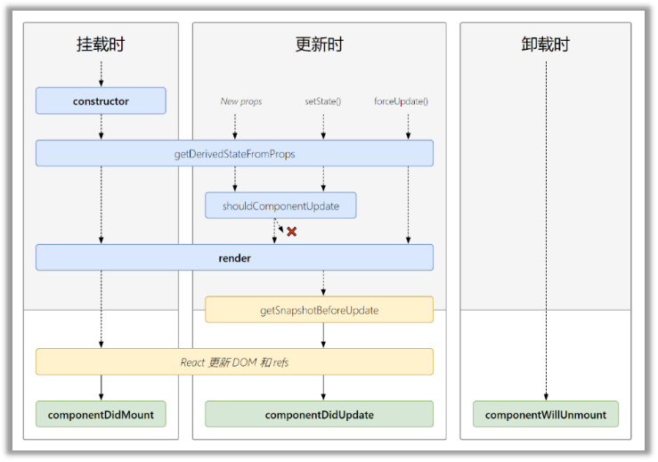
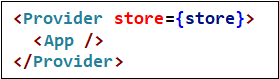
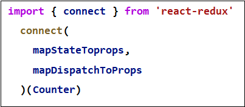

# React

## 1. React脚手架

```npm
create-react-app hello-react
cd hello-react
npm start
```

目录结构：

- public ---- 静态资源文件夹
  - favicon.icon ------ 网站页签图标
  - index.htm -------- 主页面
  - logo192.png ------- logo 图
  - logo512.png ------- logo 图
  - manifest.json ----- 应用加壳的配置文件
  - robots.txt -------- 爬虫协议文件

- src ---- 源码文件夹
  - App.css -------- App 组件的样式
  - App.js --------- App 组件
  - App.test.js ---- 用于给 App 做测试
  - index.css ------ 样式
  - index.js ------ 入口文件
  - logo.svg ------- logo 图
  - reportWebVitals.js --- 页面性能分析文件 (需要 web-vitals 库的支持)
  - setupTests.js ---- 组件单元测试的文件 (需要 jest-dom 库的支持)

## 2. 三大属性

### 2.1 state

```jsx
import React, { Component } from "react";

export default class index extends Component {
  state = { text: "Hello", name: "test" };
  click = () => {
    this.setState({ text: "world" });
  };
  render() {
    return <div onClick={this.click}>{this.state.text}</div>;
  }
}
// 必须用 this.setState 对 state 进行更新，不会影响其它数据
// 书写方法时必须用箭头函数或者 bind，否则 this 为 undefined
// 方法名时用 onClick 形式
```

### 2.2 props

```jsx
//<Copy d="1" {...{ b: 2, c: 3 }} />

import React, { Component } from "react";
import PropTypes from "prop-types";

export default class index extends Component {
  static propTypes = {
    a: PropTypes.string.isRequired, // 用来约束props
  };

  static defaultProps = { // 设置默认值
    a: "18",
  };

  render() {
    return <div>{this.props.a}</div>;
  }
}

```

### 2.3 ref

1. 字符串形式 `<input ref="input1" />`
2. 回调形式 `<input ref={(c)=>{this.input1 = c}} />`
3. `createRef`创建`ref`容器

    ```html
    <script>
      myRef = React.createRef()  // 获取 this.myRef
    </script>
    <input ref={this.myRef} />
    ```

## 3. 生命周期

### 3.1 旧


> 生命周期的三个阶段（旧）

1. 初始化阶段: 由 `ReactDOM.render` 触发---初次渲染
    1. `constructor`
    2. `componentWillMount`
    3. `render`
    4. `componentDidMount`

2. 更新阶段: 由组件内部 this.setSate 或父组件重新 `render` 触发
    1. `shouldComponentUpdate`
    2. `componentWillUpdate`
    3. `render`
    4. `componentDidUpdate`

3. 卸载组件: 由 `ReactDOM.unmountComponentAtNode` 触发
    1. `componentWillUnmount`

### 3.2 新



- `static getDerivedStateFromProps(props, state)`
  - `getDerivedStateFromProps` 会在调用 render 方法之前调用，并且在初始挂载及后续更新时都会被调用。它应返回一个对象来更新 state，如果返回 `null` 则不更新任何内容。
  - 此方法适用于[罕见的用例](https://zh-hans.reactjs.org/blog/2018/06/07/you-probably-dont-need-derived-state.html#when-to-use-derived-state)，即 state 的值在任何时候都取决于 props
- `getSnapshotBeforeUpdate(prevProps, prevState)`
  - `getSnapshotBeforeUpdate()` 在最近一次渲染输出（提交到 DOM 节点）之前调用。它使得组件能在发生更改之前从 DOM 中捕获一些信息（例如，滚动位置）。
  - 此生命周期方法的任何返回值将作为参数传递给 `componentDidUpdate()`。
  - 此用法并不常见，但它可能出现在 UI 处理中，如需要以特殊方式处理滚动位置的聊天线程等。应返回 snapshot 的值（或 `null`）
- `shouldComponentUpdate(nextProps, nextState)`
  - 根据 `shouldComponentUpdate()` 的返回值，判断 React 组件的输出是否受当前 state 或 props 更改的影响。默认行为是 state 每次发生变化组件都会重新渲染。大部分情况下，你应该遵循默认行为。
  - 当 props 或 state 发生变化时，`shouldComponentUpdate()` 会在渲染执行之前被调用。返回值默认为 true。首次渲染或使用 `forceUpdate()` 时不会调用该方法。
- `componentDidUpdate(prevProps, prevState, snapshot)`
  - `componentDidUpdate()` 会在更新后会被立即调用。首次渲染不会执行此方法。
  - 当组件更新后，可以在此处对 DOM 进行操作。如果你对更新前后的 props 进行了比较，也可以选择在此处进行网络请求
- `componentDidMount()`
  - `componentDidMount()` 会在组件挂载后（插入 DOM 树中）立即调用。依赖于 DOM 节点的初始化应该放在这里。如需通过网络请求获取数据，此处是实例化请求的好地方
- `componentWillUnmount()`
  - `componentWillUnmount()` 会在组件卸载及销毁之前直接调用。在此方法中执行必要的清理操作，例如，清除 timer，取消网络请求或清除在 `componentDidMount()` 中创建的订阅等。
  - `componentWillUnmount()` 中**不应调用 `setState()`**，因为该组件将永远不会重新渲染。组件实例卸载后，将永远不会再挂载它。

## 4. router(v5)

### 4.1 基本标签

```jsx
// Link 用to进行改进跳转
<Link to="/Hello">Hello</Link>
<Link to="/Copy/1">Copy</Link>

// NavLink 可以用activeClassName指定选中样式名称，默认是active
<NavLink to="/Hello" activeClassName="aa">
   Hello
</NavLink>
<NavLink to="/Copy/1" activeClassName="aa">
   Copy
</NavLink>

// Route必须包裹Switch标签，path指定匹配路径
// 默认是模糊匹配，/Copy/1可以匹配 /Copy，即可匹配二级路由
// 可以使用 exact 开启严格匹配
<Switch>
 <Route path="/Hello" component={Hello} exact />
 <Route path="/Copy" component={Copy} exact />
</Switch>

// 注意：不用exact
// 在Copy下，设置路径/XXX/XX即可
<Switch>
  <Route path="/Copy/1">1</Route>
  <Route path="/Copy/2">2</Route>
</Switch>

// 重定向，要放在最后
<Redirect to="/Hello" />

/*
1.底层原理不一样：
  BrowserRouter使用的是H5的history API，不兼容IE9及以下版本。
  HashRouter使用的是URL的哈希值。
2.path表现形式不一样
  BrowserRouter的路径中没有#,例如：localhost:3000/demo/test
  HashRouter的路径包含#,例如：localhost:3000/#/demo/test
3.刷新后对路由state参数的影响
  1.BrowserRouter没有任何影响，因为state保存在history对象中。
  2.HashRouter刷新后会导致路由state参数的丢失！！！
4.备注：HashRouter可以用于解决一些路径错误相关的问题。
*/
<BrowserRouter>
<HashRouter>
```

### 4.2 路由传参

- `params` 参数
  - 路由链接：`<Link to='/test/tom/18'}>详情</Link>`
  - 注册路由：`<Route path="/test/:name/:age" component={Test}/>`
  - 接收参数：`this.props.match.params`
- `search` 参数
  - 路由链接：`<Link to='/test?name=tom&age=18'}>详情</Link>`
  - 注册路由：`<Route path="/test" component={Test}/>`
  - 接收参数：`this.props.location.search`
  - 备注：获取到的 `search` 是 `urlencoded` 编码字符串，可以借助[URLSearchParams](https://segmentfault.com/a/1190000019099536)解析
- `state` 参数
  - 路由链接：`<Link to=\{\{pathname:'/test',state:{name:'tom',age:18}}}>详情</Link>`
  - 注册路由：`<Route path="/test" component={Test}/>`
  - 接收参数：`this.props.location.state`
  - 备注：刷新也可以保留住参数

### 4.3 编程式路由

借助`this.props.history`对象上的`API`对操作路由跳转、前进、后退

- `this.props.history.push(path, [state])`

    ```jsx
    this.props.history.push({
      pathname: "/Copy",
      state: { fromDashboard: true },
    });
    this.props.history.push("/Copy");
    ```

- `this.props.history.replace(path, [state])` 用法同上
- `this.props.history.goBack()` 页面栈回退
- `this.props.history.goForward()` 页面栈前进
- `this.props.history.go(n)` 页面栈指针移动

### 4.4 补充

- `withRouter`

您可以通过 `withRouter` 高阶组件访问历史对象的属性和最接近的`<Route>`的匹配。`withRouter` 将在包装组件呈现时传递更新后的匹配、位置和历史道具。

就是把它变成路由组件

## 5. react-redux


`container` 容器组件接受 `state` 和 `action` 方法，组件通过调用方法处理数据，`return` 提交 `dispatch` 让 `reducer` 进行数据更新

## 5.1 代码书写

目录结构：

- ​ containers：容器组件
- ​ redux
  - store.js：配置相关设置
  - action：处理方法
  - reducers：状态处理器
    - index.js：集中暴露
- index.js

```jsx
// ./index.js
// 此处需要用Provider包裹App，目的是让App所有的后代容器组件都能接收到store 
<Provider store={store}>
 <App />
</Provider>

// ./redux/store.js
import { createStore, applyMiddleware } from "redux"; // applyMiddleware处理中间件 
import reducer from "./reducers/index";
import thunk from "redux-thunk"; // 异步中间件
import { composeWithDevTools } from "redux-devtools-extension"; // redux工具
export default createStore(
  reducer,
  composeWithDevTools(applyMiddleware(thunk))
);

// ./redux/reducers/index.js
//引入combineReducers，用于汇总多个reducer
import { combineReducers } from "redux";
import test from "./test";
export default combineReducers({ test });

// ./redux/reducers/test.js
// 根据传入的数据进行更新
// 这里是要自己用if进行判断的；数据变动，所有的reducer都会执行
export default function testReducer(preState = { num: 1 }, action) {
  if (action.type === "TEST") return { num: action.data };
  return preState;
}

// ./redux/action/testAction.js
// 同步操作，返回数据给reducer进行更新
export const testAct = (data) => ({ type: "TEST", data })
// 异步操作，要返回函数手动dispatch（提交）数据
export const testAsyncAct = (data) => {
  return (dispatch) => {
    setTimeout(() => {
      dispatch(testAct(data));
    }, 1000);
  };
};

// ./redux/containers/Test.js
import React, { Component } from "react";
import { connect } from "react-redux";
import { testAct, testAsyncAct } from "../redux/actions/testAction";

class Test extends Component {
  render() {
    return (
      <div onClick={() => this.props.testAct(this.props.num + 1)}>
        {this.props.num}
      </div>
    );
  }
}

export default connect(
  (state) => ({ num: state.test.num }),
  {
    testAct,
    testAsyncAct,
  }
)(Test);
```

## 5.2 相关API

1. Provider：包裹的容器组件都能接收到 store

    

2. connect：用于包装 UI 组件生成容器组件

3. mapStateToProps：将外部的数据（即 state 对象）转换为 UI 组件的标签属性

4. mapDispatchToProps：将分发 action 的函数转换为 UI 组件的标签属性

    

## 5.3 redux调试工具

1. 安装 chrome 浏览器插件 `redux-devtools`
2. 下载工具依赖包 `npm install --save-dev redux-devtools-extension`

## 6. ts

```tsx
import React from 'react';

interface AppProps { a: string; b?: number; }

export default class App extends React.Component<AppProps, { cc: number }> {
  state = { cc: 1 }
  render() {
    return <div>{this.state.cc}</div>
  }
};
```

`React.Component(Props, State)`：其中 `Props` 要进行声明，否则报错；`State` 可以忽略

## 7. 补充

### 7.1 setState

```jsx
this.setState({ deepSize: 1 }, () => {});
this.setState(
  (state, props) => ({ deepSize: 1 }),
  () => {}
);
```

1. `setState(stateChange, [callback])`：对象式的 `setState`
    1. stateChange 为状态改变对象(该对象可以体现出状态的更改)
    2. callback 是可选的回调函数, 它在状态更新完毕、界面也更新后( render 调用后)才被调用
2. `setState(updater, [callback])`：函数式的 `setState`
    1. updater 为返回 stateChange 对象的函数。
    2. updater 可以接收到 state 和 props。
    3. callback 是可选的回调函数, 它在状态更新、界面也更新后( render 调用后)才被调用。

总结:

1. 对象式的 setState 是函数式的 setState 的简写方式(语法糖)
2. 使用原则：
    (1).如果新状态不依赖于原状态 ===> 使用对象方式
    (2).如果新状态依赖于原状态 ===> 使用函数方式
    (3).如果需要在 setState() 执行后获取最新的状态数据，要在第二个 callback 函数中读取

### 7.2 lazyLoad

```jsx
// 通过React的lazy函数配合import()函数动态加载路由组件
const Login = lazy(()=>import('@/pages/Login'))

// 通过<Suspense>指定在加载得到路由打包文件前显示一个自定义loading界面(组件还没有加载完成时显示)
return {
  <Suspense fallback={<h1>loading.....</h1>}>
    <Switch>
      <Route path="/xxx" component={Xxxx}/>
      <Redirect to="/login"/>
    </Switch>
  </Suspense>
}
```

### 7.3 Context

一种组件间通信方式, 常用于【祖组件】与【后代组件】间通信

```jsx
//1.创建 Context 容器对象：这里要传默认值，只有当组件所处的树中没有匹配到 Provider 时，其 defaultValue 参数才会生效
const XxxContext = React.createContext(defaultValue)  

//2.渲染子组时，外面包裹 xxxContext.Provider, 通过 value 属性给后代组件传递数据：
<XxxContext.Provider value={数据}>
  子组件
</XxxContext.Provider>

//3.后代组件读取数据：
//3.1:仅适用于类组件 
static contextType = XxxContext  //声明接收context
this.context //读取context中的value数据
//3.2: 函数组件与类组件都可以
<XxxContext.Consumer>
  {
    value => ( // value就是context中的value数据
      要显示的内容
    )
  }
</XxxContext.Consumer>
//3.3 useContext(XxxContext)只是让你能够读取context的值以及订阅context的变化
const theme = useContext(XxxContext);
return (
    <button style={{ background: theme.background }}>
      I am styled by theme context!
    </button>
);

```

### 7.4 组件优化

- Component 的2个问题
  - 只要执行 `setState()`,即使不改变状态数据, 组件也会重新 render() ==> 效率低
  - 只当前组件重新 render() , 就会自动重新 render 子组件，纵使子组件没有用到父组件的任何数据 ==> 效率低
- 效率高的做法
  - 只有当组件的 state 或 props 数据发生改变时才重新`render()`
- 原因
  - Component 中的 `shouldComponentUpdate()` 总是返回 true

办法:

1. 重写 `shouldComponentUpdate()` 方法
    比较新旧 state 或 props 数据, 如果有变化才返回 true , 如果没有返回 false
2. 使用 `PureComponent`，`PureComponent`重写了 `shouldComponentUpdate()` , 只有 state 或 props 数据有变化才返回 true
    注意:
    1. 只是进行 state 和 props 数据的浅比较, 如果只是数据对象内部数据变了, 返回 false
    2. 不要直接修改 state 数据, 而是要产生新数据
    3. 项目中一般使用 PureComponent 来优化

### 7.5 render props

类似VUE插槽

**children props:**

```jsx
<A>
  <B>xxxx</B>
</A>
{this.props.children}
//问题: 如果B组件需要A组件内的数据, ==> 做不到 
```

**render props:**

```jsx
<A render={(data) => <C data={data}></C>}></A>
//A组件: {this.props.render(内部state数据)}
//C组件: 读取A组件传入的数据显示 {this.props.data} 
```

### 7.6 错误边界

理解：

​错误边界(Error boundary)：用来捕获后代组件错误，渲染出备用页面

特点：

​只能捕获后代组件生命周期产生的错误，不能捕获自己组件产生的错误和其他组件在合成事件、定时器中产生的错误

使用方式：

​`getDerivedStateFromError`配合 `componentDidCatch`

```jsx
// 生命周期函数，一旦后台组件报错，就会触发
static getDerivedStateFromError(error) {
  console.log(error);
  // 在render之前触发
  // 返回新的state
  return {
    hasError: true,
  };
}

componentDidCatch(error, info) {
  // 统计页面的错误。发送请求发送到后台去
  console.log(error, info);
}

{
  <div>{this.props.hasError ? "error" : <Son/>}</div>
}
```

### 7.7 子组件事件处理

```jsx
import React from "react";

const Test = React.forwardRef((props: { onClick: () => void }, ref) => {
  React.useImperativeHandle(ref, () => ({
    open() {
      console.log("open");
    },
  }));
  return <div onClick={props.onClick}>test</div>;
});

export default function App() {
  const appRef = React.useRef(null);
  return (
    <div>
      <Test
        ref={appRef}
        onClick={() => {
          console.log(appRef);
        }}
      />
    </div>
  );
}
```

```js
useImperativeHandle(ref, createHandle, [deps])
```

`useImperativeHandle` 可以让你在使用 `ref` 时自定义暴露给父组件的实例值。在大多数情况下，应当避免使用 ref 这样的命令式代码。`useImperativeHandle` 应当与 [`forwardRef`](https://zh-hans.reactjs.org/docs/react-api.html#reactforwardref) 一起使用：

## 8. hooks

### 8.1 useState

`State Hook` 让函数组件也可以有 `state` 状态， 并进行状态数据的读写操作

```jsx
function Test(props) {
  const [name, setName] = React.useState("hooks-state");
  return (
    <div
      onClick={() => {
        setName("upDate" + new Date().getTime());
        setName((state) => "upDate" + new Date().getTime());
      }}
    >
      {name}
    </div>
  );
}
```

> 语法

```jsx
const [xxx, setXxx] = React.useState(initValue)
```

`useState()`说明：

- 参数: 第一次初始化指定的值在内部作缓存
- 返回值: 包含2个元素的数组, 第1个为内部当前状态值, 第2个为更新状态值的函数

`setXxx()`的写法：

- `setXxx(newValue)`: 参数为非函数值, 直接指定新的状态值, 内部用其覆盖原来的状态值
- `setXxx(value => newValue)`: 参数为函数, 接收原本的状态值, 返回新的状态值, 内部用其覆盖原来的状态值

### 8.2 useEffect

Effect Hook 可以让你在函数组件中执行副作用操作（用于模拟类组件中的生命周期钩子）

```jsx
React.useEffect(() => {
  console.log("@");
}, [name]);
```

> 语法

1. 当第二个参数不传入时，会在渲染和更新时执行
2. 当第二个参数为`[]`时，只在渲染时执行
3. 当第二个参数可以设置任何 state 进行监听，类似 vue 的 Watch
4. 当 return 返回一个函数时，函数会在组件销毁前执行

### 8.3 useRef

Ref Hook 可以在函数组件中存储/查找组件内的标签或任意其它数据

语法: `const refContainer = useRef()`
作用:保存标签对象,功能与 `React.createRef()` 一样

```jsx
const refContainer = useRef()
<input ref={refContainer} />
```

`useRef` 返回一个可变的 ref 对象，其 `.current` 属性被初始化为传入的参数（`initialValue`）

### 8.4 useContext

上面有

### 8.5 useReducer

```jsx
const [state, dispatch] = useReducer(reducer, initialArg, init);
```

​useState 的替代方案。它接收一个形如`(state, action) => newState` 的 reducer，并返回当前的 state 以及与其配套的 dispatch 方法。

​在某些场景下，useReducer 会比 useState 更适用，例如 state 逻辑较复杂且包含多个子值，或者下一个 state 依赖于之前的 state 等。并且，使用 useReducer 还能给那些会触发深更新的组件做性能优化，因为你可以向子组件传递 dispatch 而不是回调函数 。

```jsx
const initialState = {count: 0};

function reducer(state, action) {
  switch (action.type) {
    case 'increment':
      return {count: state.count + 1};
    case 'decrement':
      return {count: state.count - 1};
    default:
      throw new Error();
  }
}

function Counter() {
  const [state, dispatch] = useReducer(reducer, initialState);
  return (
    <div>
      Count: {state.count}
      <button onClick={() => dispatch({type: 'decrement'})}>-</button>
      <button onClick={() => dispatch({type: 'increment'})}>+</button>
    <div/>
  );
}
```

> 惰性初始化

你可以选择惰性地创建初始 state。为此，需要将 `init` 函数作为 `useReducer` 的第三个参数传入，这样初始 state 将被设置为 `init(initialArg)`。

这么做可以将用于计算 state 的逻辑提取到 `reducer` 外部，这也为将来对重置 `state` 的 `action` 做处理提供了便利：

```jsx
function init(initialCount) {  return {count: initialCount};}
function reducer(state, action) {
  switch (action.type) {
    case 'increment':
      return {count: state.count + 1};
    case 'decrement':
      return {count: state.count - 1};
    case 'reset':      return init(action.payload);    default:
      throw new Error();
  }
}

function Counter({initialCount}) {
  const [state, dispatch] = useReducer(reducer, initialCount, init);  return (
    <div>
      Count: {state.count}
      <button
        onClick={() => dispatch({type: 'reset', payload: initialCount})}>        Reset
      </button>
      <button onClick={() => dispatch({type: 'decrement'})}>-</button>
      <button onClick={() => dispatch({type: 'increment'})}>+</button>
    <div/>
  );
}
```

### 8.6 useCallback

```jsx
const memoizedCallback = useCallback(
  () => {
    doSomething(a, b);
  },
  [a, b],
);
//参数一：要被缓存的函数
//参数二：要监听的变量，只有当监听的变量变化时，被缓存的函数才会重新更新
//useCallback(fn, deps) 相当于 useMemo(() => fn, deps)
```

```tsx
import React from "react";
const Son = function ({ change }: { change: Function }) {
  // 监听change是否发生变化
  React.useEffect(() => {
    console.log("@change");
  }, [change]);
  return (
    <div>
      {/* 触发change函数时会触发useEffect，因为他是监听change的 */}
      <div
        onClick={() => {
          change(new Date().getTime().toString());
        }}
      >
        changeName
      </div>
    </div>
  );
};

export default function App() {
  const [name, setName] = React.useState("name1");
  const [name2, setName2] = React.useState("name2");
  /*
  当监听测试设置为name时，点击更改name值时，
  <Son>组件的useEffect不会触发，证明传入的change函数被缓存了，没有重新创建。
  相反当设置name2时，change函数会重新创建
  */
  const change = React.useCallback(
    function (str: string) {
      setName(str);
    },
    [name]
  );
  return (
    <div>
      <div onClick={() => setName2("change")}>name:{name}</div>
      <div>name2:{name2}</div>
      <Son change={change} />
      {/* 
        如果不用useCallback对函数进行缓存，如：
        <Son change={function (str: string) { setName(str); }} /> 
        则当state改变时，函数一直会重新创建
      */}
    </div>
  );
}
```

#### 与 useMemo 区别

|          | `useCallBack`                                                                                                        | `useMemo`                                                                                             | `memo`                                                                                |
| -------- | -------------------------------------------------------------------------------------------------------------------- | ----------------------------------------------------------------------------------------------------- | ------------------------------------------------------------------------------------- |
| 返回值   | 一个缓存的回调函数                                                                                                   | 一个缓存的值                                                                                          | 一个缓存的函数组件                                                                    |
| 参数     | 需要缓存的函数，依赖项                                                                                               | 需要缓存的值(也可以是个计算然后再返回值的函数) ，依赖项                                               | 函数组件，监听函数`Watch`                                                             |
| 使用场景 | 父组件更新时，通过 props 传递给子组件的函数也会重新创建，然后这个时候使用 `useCallBack` 就可以缓存函数不使它重新创建 | 组件更新时，一些计算量很大的值也有可能被重新计算，这个时候就可以使用 `useMemo` 直接使用上一次缓存的值 | 用于对一个组件进行缓存，避免非关联状态更新导致的更新；还可配合 `useCallBack` 的使用。 |

### 8.7 useMemo

```jsx
const memoizedValue = useMemo(() => computeExpensiveValue(a, b), [a, b]);
```

一般情况下，父组件更新会带动子组件的更新，但在更新状态与子组件无联系时，会让性能下降，故使用 useMemo 进行限制，可以在第二参数中选择要绑定的状态，只有当绑定的状态更新时，方法才会执行

```tsx
import React from "react";

function Son({ name }: { name: string }) {
  // 对sonName进行缓存
  let sonName: string = React.useMemo(() => {
    console.log("sonNameChange:", "son" + name);
    return "son" + name;
  }, [name]);
  /*
    如果sonName不用useMemo进行缓存，当name更新时，函数会再执行一次
    let sonName = (() => {
      console.log("sonNameChange:", "son" + name);
      return "son" + name;
    })();
  */
  return <div>son:{sonName}</div>;
}

export default function App() {
  const [name, setName] = React.useState("name");
  const [name2, setName2] = React.useState("name2");
  return (
    <div>
      <div onClick={() => setName("change")}>name:{name}</div>
      <div onClick={() => setName2("change")}>name2:{name2}</div>
      <Son name={name} />
    </div>
  );
}
```

#### React.memo

就是一个大的 useMemo ，包裹组件，避免非关联状态更新导致的更新。第二个参数类似 VUE 中的 Watch，要返回 false 才进行渲染。

```jsx
const MyComponent = React.memo(function MyComponent(props) {
  /* 使用 props 渲染 */
});
```

```tsx
import React, { memo } from "react";
const Son = memo(function ({ name }: { name: string }) {
  // 不使用memo进行包裹时，改变name2，Son组件会重新渲染
  // 使用memo即可避免
  console.log("@son");
  return (
    <div>
      <div>Son:{name}</div>
    </div>
  );
});

export default function App() {
  const [name, setName] = React.useState("name1");
  const [name2, setName2] = React.useState("name2");
  return (
    <div>
      <div onClick={() => setName("change")}>name:{name}</div>
      <div onClick={() => setName2("change")}>name2:{name2}</div>
      <Son name={name} />
    </div>
  );
}
```

### 8.8 useImperativeHandle

函数组件是不能直接通过 ref 获取组件的，要通过 useImperativeHandle 进行暴露。

```jsx
useImperativeHandle(ref, createHandle, [deps])
```

`useImperativeHandle` 可以让你在使用 `ref` 时自定义暴露给父组件的实例值。在大多数情况下，应当避免使用 ref 这样的命令式代码。`useImperativeHandle` 应当与 [`forwardRef`](https://react.docschina.org/docs/react-api.html#reactforwardref) 一起使用：

```jsx
//React.forwardRef 会创建一个React组件，这个组件能够将其接受的 ref 属性转发到其组件树下的另一个组件中。
const Test = React.forwardRef((props: { onClick: () => void }, ref) => {
  React.useImperativeHandle(ref, () => ({
    open() {
      console.log("open");
    },
  }));
  return <div onClick={props.onClick}>test</div>;
});

export default function App() {
  const appRef = React.useRef(null);
  return (
    <div>
      <Test
        ref={appRef}
        onClick={() => {
          console.log(appRef);
        }}
      />
    </div>
  );
}
```

### 8.9 useLayoutEffect

> 同步版useEffect

其函数签名与 `useEffect` 相同，但它会在所有的 DOM 变更之后同步调用 effect。可以使用它来读取 DOM 布局并同步触发重渲染。在浏览器执行绘制之前，`useLayoutEffect` 内部的更新计划将被同步刷新。

尽可能使用标准的 `useEffect` 以避免阻塞视觉更新。

**提示:**

如果你正在将代码从 class 组件迁移到使用 Hook 的函数组件，则需要注意 `useLayoutEffect` 与 `componentDidMount`、`componentDidUpdate` 的调用阶段是一样的。但是，我们推荐你**一开始先用 `useEffect`**，只有当它出问题的时候再尝试使用 `useLayoutEffect`。

### 8.10 useDebugValue
