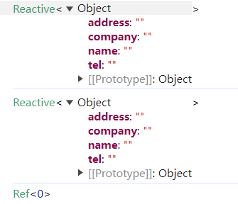

# VUE 相关

## vue 样式隔离

`Vue` 组件之间没有做到样式隔离，`Vue` 中的样式隔离，是通过 `scoped` 属性来实现的。当在 `<style>` 标签上使用 `scoped` 属性时。
基本原理概括为以下几个步骤：

1. 为当前组件模板的所有DOM节点添加相同的 `attribute`，添加的属性与其他的 `scope` 不重复，`data` 属性(形如：`data-v-123`)来表示他的唯一性。
2. 在每句 `css` 选择器的末尾（编译后的生成的 `css` 语句）加一个当前组件的 `data` 属性选择器（如`.box input[data-v-123]`）来私有化样式
3. 如果组件内部包含有其他组件，只会给其他组件的最外层标签加上当前组件的 `data` 属性

```vue
<template>
  <div class="example">This is an example</div>
</template>

<style scoped>
.example {
  color: blue;
}
</style>
```

```vue
<template>
  <div class="example" data-v-21e5b78>This is an example</div>
</template>

<style scoped>
.example[data-v-21e5b78] {
  color: blue;
}
</style>
```

## vue 响应式变量打印小技巧

打开调试控制台，找到右上角控制台设置，在偏好设置里找到控制台分类，在这个分类最后一个，勾选自定义格式设置工具


有趣的是，可以清楚的看出 `ref` 在处理对象是，底层是使用 `reactive` 处理的

## 动态修改 css 值

方法如下

1.通过在行内绑定变量

```vue
<script setup>
import { ref } from 'vue'
const color = ref('red')
</script>

<template>
  <p :style="`color: ${color}`">hello</p>
</template>
```

2.修改绑定的 class
3.使用 v-bind

```vue
<script setup>
import { ref } from 'vue'
const theme = ref({
    color: 'red',
})
</script>

<template>
  <p>hello</p>
</template>

<style scoped>
p {
  color: v-bind('theme.color');
}
</style>
```

## vue 官网 seo 优化

使用 `vite-plugin-seo-prerender` 插件

原理是用 `puppeteer` 生成静态页面，但是在访问时会带上 / 后缀，
如 `/home/`，后续在切换路径时，会变成 `/home/xxxx`，导致路由无法解析，
原因是，生成的目录是路由目录，`nginx` 做了 `301` 的转发

解决方法：在守卫钩子做下重定向

```js
router.beforeEach((to, from, next) => {
  // 目前只有一级路由，先简单判断
  if (to.path.startsWith("/") && to.path.endsWith("/")) {
    return next({ name: to.name, query: to.query });
  }
  return next();
});
```

## 自定义指令做按钮权限

一般是判断有没有权限，然后用 `removeChild` 方法删除子节点，但是会有弊端，在特定情况下会有问题

```html
<!-- 前面是虚拟节点 -->
<template v-if="xxx">
  <a v-if="xxx" v-permission="xxx">xxx</a>
</template>
<!-- 后面 v-if+自定义指令 -->
<a v-if="xxx" v-permission="xxx">xxx</a>
```

会报错：`TypeError: Cannot read properties of null (reading 'emitsOptions') at shouldUpdateComponent`

补充：用来判断组件也是不行的，组件内部的初始化事件还会执行（`remove`了节点，但是在 `vue` 里面还是存在的）

## vue3 createVnode 和 h 区别

两者都是用来创建虚拟节点的，使用上也差别不大

从源码上可以看到 `h` 是基于 `createVnode` 实现的，在使用上是做了优化的

```ts
// Actual implementation
export function h(type: any, propsOrChildren?: any, children?: any): VNode {
  const l = arguments.length
  if (l === 2) {
    if (isObject(propsOrChildren) && !isArray(propsOrChildren)) {
      // single vnode without props
      if (isVNode(propsOrChildren)) {
        return createVNode(type, null, [propsOrChildren])
      }
      // props without children
      return createVNode(type, propsOrChildren)
    } else {
      // omit props
      return createVNode(type, null, propsOrChildren)
    }
  } else {
    if (l > 3) {
      children = Array.prototype.slice.call(arguments, 2)
    } else if (l === 3 && isVNode(children)) {
      children = [children]
    }
    return createVNode(type, propsOrChildren, children)
  }
}
```

## v-if 和 v-show

1. `v-if` 是从解析编译过程中判断显示还是不渲染，`v-show` 则是判断是否添加 `display: none;` 做隐藏
2. `v-if` 是会重新渲染节点/组件，所以组件的生命周期会触发，在业务开发中要注意使用。比如 `a-form-item` 用 `v-if` 会重新渲染，改变默认值，影响重置功能。比如初始值是0，修改 `v-if` 判断，设置绑定变量为1，再让组件显示，这个时候重置会为1，因为初始值的存储是在 `a-form-item` 中执行的，不是`a-form`。
3. 一般在性能场景下会做差异使用

## 组件销毁

`elementUI` 中是通过修改 `key` 来让组件重新渲染

``` js
if (this.destroyOnClose) {
  this.$nextTick(() => {
    this.key++;
  });
}
```

`a-modal` 是通过三目运算符来控制组件的渲染

``` tsx
<Transition
{...transitionProps}
onBeforeEnter={onPrepare}
onAfterEnter={() => onVisibleChanged(true)}
onAfterLeave={() => onVisibleChanged(false)}
>
{visible || !destroyOnClose ? (
  <div
    {...attrs}
    ref={dialogRef}
    v-show={visible}
    key="dialog-element"
    role="document"
    style={[contentStyleRef.value, attrs.style as CSSProperties]}
    class={[prefixCls, attrs.class]}
    onMousedown={onMousedown}
    onMouseup={onMouseup}
  >
    <div tabindex={0} ref={sentinelStartRef} style={sentinelStyle} aria-hidden="true" />
    {modalRender ? modalRender({ originVNode: content }) : content}
    <div tabindex={0} ref={sentinelEndRef} style={sentinelStyle} aria-hidden="true" />
  </div>
) : null}
</Transition>
```

补充：在组件销毁/挂载节点不一致时，也会 `removeChild` 掉 `DOM`

``` js
const removeCurrentContainer = () => {
  // Portal will remove from `parentNode`.
  // Let's handle this again to avoid refactor issue.
  container.value?.parentNode?.removeChild(container.value);
};
```

## 节点挂载问题/样式影响

以 `antdV3` 为例，是使用 `vue` 的内置组件 `Teleport` 来实现，支持把节点挂载在 `vue` 的 `DOM` 以外，如 `body` 下面。

当在初始 `HTML` 结构中使用这个组件时，会有一些潜在的问题：（`vue3` 官网关于 `Teleport` 描述）

- `position: fixed` 能够相对于浏览器窗口放置有一个条件，那就是不能有任何祖先元素设置了 `transform`、`perspective` 或者 `filter` 样式属性。也就是说如果我们想要用 `CSS transform` 为祖先节点 `<div class="outer">` 设置动画，就会不小心破坏模态框的布局！
- 这个模态框的 `z-index` 受限于它的容器元素。如果有其他元素与 `<div class="outer">` 重叠并有更高的 `z-index`，则它会覆盖住我们的模态框。

```jsx
<Portal
visible={visible}
forceRender={forceRender}
getContainer={getContainer}
v-slots={{
  default: (childProps: IDialogChildProps) => {
    dialogProps = {
      ...dialogProps,
      ...childProps,
      afterClose: () => {
        afterClose?.();
        animatedVisible.value = false;
      },
    };
    return <Dialog {...dialogProps} v-slots={slots}></Dialog>;
  },
}}
/>

<Teleport to={container} v-slots={slots}></Teleport>
```

``` vue
<Teleport to="body">
  <div v-if="open" class="modal">
    <p>Hello from the modal!</p>
    <button @click="open = false">Close</button>
  </div>
</Teleport>
```

`elementUI` 的 `el-dialog` 是直接操作 `dom` 插入 `body` 下面的，`elementUIPlus` 也和上面一样

```js
if (this.appendToBody) {
  document.body.appendChild(this.$el);
}

// 销毁时移除
destroyed() {
  // if appendToBody is true, remove DOM node after destroy
  if (this.appendToBody && this.$el && this.$el.parentNode) {
    this.$el.parentNode.removeChild(this.$el);
  }
}
```

## 页面组件化好处

1. 有利于页面逻辑分离，便于维护
2. 有利于组件更新，当一个页面中的其余组件更新时，抽离出来的组件是可以判断是否要更新的，反之就要做更新。可以避免不必要的性能消耗

## key 设置为 index 问题如何复现

要用 `input` 等输入框控件

## vue3 组件再封装，暴露原方法

暴露 组件 `ref` 即可

```js
defineExpose({
    elRef, // 要 ref.value.elRef.xxxx 访问
})
```

## 业务组件变量子组件双向绑定

例如详情页面分模块组件抽离，`form` 变量如何和子组件就行双向绑定

```js
// vue3
const props = defineProps({  // 直接使用 form 即可隐形改变对象
    form: {
        type: Object,
        required: true,
    },
})
const formModal = defineModel({ required: true }) // 使用 defineModel 更佳

// vue2
const props = defineProps({
    value: {
        type: Object,
        default: () => ({})
    },
})
const keys = ['radio'] // 控制劫持范围
const formModal = computed(() => {
    const data = { ...props.value }
    for (const key of keys) {
        let val = data[key]
        Object.defineProperty(data, key, {
            set: newVal => {
                if (!Object.is(newVal, val)) { // 避免不必要的修改
                    val = newVal
                    emit('input', {
                        ...data,
                        [key]: val
                    })
                }
            },
            get: () => val
        })
    }
    return data
})

// 普通类型可以这么写
const modelVal = computed({
    get() {
        return props.value
    },
    set(val) {
        emit('input', val)
    }
})
```

## vue3 判断父组件是否监听某个事件

你可以参考 `v-model` 的原理在结合一下 `jsx` 中的写法推导出 `@change =>onChange`

但小程序不适用

```vue
<!-- 父组件 -->
<script setup>
import { ref } from "vue";
import Comp from "./Comp.vue";

const msg = ref("Hello World!");
const cc = (val) => {
  console.log(val);
};
</script>

<template>
  <h1>{{ msg }}</h1>
  <input v-model="msg" />
  <Comp :msg="123" @change="cc" />
</template>
```

```vue
<!-- 子组件 -->
<template>
  <div @click="handleClick">
    {{ msg }}
  </div>
</template>
<script setup>
import { defineEmits, defineProps } from "vue";
const props = defineProps({
  onChange: { type: Function },
  msg: { type: String },
});
const emit = defineEmits(["change"]);
const handleClick = () => {
  console.log(props.onChange);
  emit("change", 666);
};
console.log(props);
</script>
```
