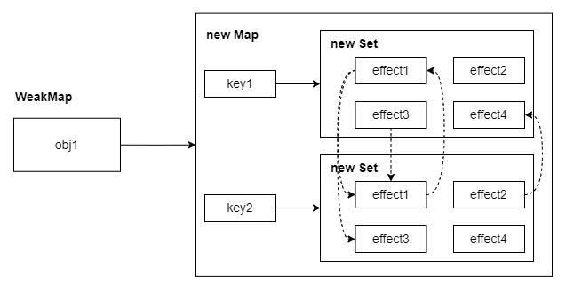

本文 vue3 版本为 3.2.41，会对源码做简化，方便阅读

# 以 reactive 为切入点探讨响应式及依赖搜集

预备知识：

1. vue2 的响应式是通过发布订阅模式完成的，在 get 里面搜集依赖，在 set 里面触发依赖；vue3 的大体模式也差不多
2. vue2 的依赖搜集是 dep + watcher 作双向依赖搜集完成的；vue3 是建立全局的 WeakMap 结构完成，以劫持监听的 obj 为 key，value 是一个 Map 类型，以属性名为 key，value 是一个 Set 类型，Set 里面存放的是 effect 函数，effect 就是副作用函数，用来更新



## reactive

```ts
// packages\reactivity\src\reactive.ts
export function reactive(target: object) {
  // 调用 createReactiveObject 方法创建 reactive
  return createReactiveObject(
    target,
    false,
    mutableHandlers,
    mutableCollectionHandlers,
    reactiveMap
  );
}

function createReactiveObject(
  target: Target,
  isReadonly: boolean,
  baseHandlers: ProxyHandler<any>,
  collectionHandlers: ProxyHandler<any>,
  // WeakMap 是类似 map 的数据结构，只能使用对象作为键，不能使用基本数据类型。
  // 并且是弱引用，当只有 WeakMap 引用时，它会被垃圾回收，WeakMap 中对应的条目也会被自动删除
  proxyMap: WeakMap<Target, any> 
) {
  // 看缓存有没有，有直接返回
  const existingProxy = proxyMap.get(target);
  if (existingProxy) {
    return existingProxy;
  }
  // 这里会判断类型，对象和数组会返回1
  const targetType = getTargetType(target);
  if (targetType === 0) {
    return target;
  }
  // 用 Proxy 做数据劫持，会传入 baseHandlers，即上面的 mutableHandlers
  const proxy = new Proxy(
    target,
    targetType === 2 ? collectionHandlers : baseHandlers
  );
  // 缓存
  proxyMap.set(target, proxy);
  return proxy;
}
```

```ts
// packages\reactivity\src\baseHandlers.ts
export const mutableHandlers: ProxyHandler<object> = {
  get,
  set,
  deleteProperty,
  has,
  ownKeys,
};
const get = /*#__PURE__*/ createGetter(); // 这里先看 get
const set = /*#__PURE__*/ createSetter();

function createGetter(isReadonly = false, shallow = false) {
  return function get(target: Target, key: string | symbol, receiver: object) {
    // ...省略部分代码
    track(target, TrackOpTypes.GET /** get */, key);

    // 扩展  shallowReactive api 做浅层响应，不会循环处理对象
    if (shallow) {
      return res;
    }

    if (isObject(res)) {
      // 对对象要循环处理
      return isReadonly ? readonly(res) : reactive(res);
    }

    return res;
  };
}
```

```ts
// packages\reactivity\src\effect.ts
export function track(target: object, type: TrackOpTypes, key: unknown) {
  if (shouldTrack && activeEffect) {
    // targetMap 是 WeakMap 结构，以劫持监听的 obj 为 key，value 是一个 Map 类型
    let depsMap = targetMap.get(target);
    if (!depsMap) {
      targetMap.set(target, (depsMap = new Map()));
    }
    // depsMap 是 Map 结构，以属性名为 key，value 是一个 Set 类型
    let dep = depsMap.get(key);
    if (!dep) {
      depsMap.set(key, (dep = createDep()));
    }

    const eventInfo = __DEV__
      ? { effect: activeEffect, target, type, key }
      : undefined;

    trackEffects(dep, eventInfo);
  }
}
export function trackEffects(
  dep: Dep,
  debuggerEventExtraInfo?: DebuggerEventExtraInfo
) {
  /** 做双向绑定
    * activeEffect 是当前运行的 ReactiveEffect 实例
    * 类似 vue2 中 watcher 和 dep 双向搜集依赖
    * 在这里打印 activeEffect.fn 
    * 控制台显示 componentUpdateFn 函数，正是渲染相关的
    *  if (!instance.isMounted) {
        let vnodeHook;
        const { el, props } = initialVNode;
        const { bm, m, parent } = instance;
        const isAsyncWrapperVNode = isAsyncWrap…
    * 比如 
        const obj = reactive({ name: '张三' });
        const com = computed(() => obj.name);
    * 在页面渲染获取 com 时会触发 obj 的 get，这时候 activeEffect 就是 com
    * activeEffect.fn 就是 () => obj.name
    */
  // todo 这里猜测 ReactiveEffect 有渲染、计算和监听类型
  dep.add(activeEffect!);
  activeEffect!.deps.push(dep);
}
```

讲回 set 方法处理

```ts
// packages\reactivity\src\baseHandlers.ts
const set = /*#__PURE__*/ createSetter();
function createSetter(shallow = false) {
  return function set(
    target: object,
    key: string | symbol,
    value: unknown,
    receiver: object
  ): boolean {
    let oldValue = (target as any)[key];
    // 判断是增加属性/值，还是更新
    const hadKey =
      isArray(target) && isIntegerKey(key)
        ? Number(key) < target.length
        : hasOwn(target, key);
    // 更新对应的值
    const result = Reflect.set(target, key, value, receiver);
    // 避免原型链属性修改触发
    if (target === toRaw(receiver)) {
      if (!hadKey) {
        trigger(target, TriggerOpTypes.ADD, key, value);
      } else if (hasChanged(value, oldValue)) {
        trigger(target, TriggerOpTypes.SET, key, value, oldValue);
      }
    }
    return result;
  };
}
```

```ts
// packages\reactivity\src\effect.ts
export function trigger(
  target: object,
  type: TriggerOpTypes,
  key?: unknown,
  newValue?: unknown,
  oldValue?: unknown,
  oldTarget?: Map<unknown, unknown> | Set<unknown>
) {
  // 从之前搜集的全局依赖获取
  const depsMap = targetMap.get(target);

  let deps: (Dep | undefined)[] = [];

  // 下面就是根据不同情况，获取要触发更新的 dep
  // schedule runs for SET | ADD | DELETE
  if (key !== void 0) {
    deps.push(depsMap.get(key));
  }

  // also run for iteration key on ADD | DELETE | Map.SET
  switch (type) {
    case TriggerOpTypes.ADD:
      if (!isArray(target)) {
        deps.push(depsMap.get(ITERATE_KEY/** '' */));
        if (isMap(target)) {
          deps.push(depsMap.get(MAP_KEY_ITERATE_KEY/** '' */));
        }
      } else if (isIntegerKey(key)) {
        // new index added to array -> length changes
        deps.push(depsMap.get("length"));
      }
      break;
    case TriggerOpTypes.SET:
      if (isMap(target)) {
        deps.push(depsMap.get(ITERATE_KEY/** '' */));
      }
      break;
  }

  if (deps.length === 1) {
    if (deps[0]) {
      triggerEffects(deps[0]);
    }
  } else {
    const effects: ReactiveEffect[] = [];
    for (const dep of deps) {
      if (dep) {
        effects.push(...dep);
      }
    }
    // createDep 返回的是一个 Set 集合，做过滤
    triggerEffects(createDep(effects));
  }
}
export function triggerEffects(
  dep: Dep | ReactiveEffect[]
) {
  // spread into array for stabilization
  const effects = isArray(dep) ? dep : [...dep]
  // 先处理计算属性api
  for (const effect of effects) {
    if (effect.computed) {
      triggerEffect(effect)
    }
  }
  for (const effect of effects) {
    if (!effect.computed) {
      triggerEffect(effect)
    }
  }
}
function triggerEffect(
  effect: ReactiveEffect,
) {
  // 执行 effect.run()，触发更新
  // run 就是 执行 fn()，即上面分享的 计算属性内容/渲染函数
  if (effect !== activeEffect || effect.allowRecurse) {
    if (effect.scheduler) {
      effect.scheduler()
    } else {
      effect.run()
    }
  }
}

```

## ref
```ts
// packages\reactivity\src\ref.ts
export function ref(value?: unknown) {
  return createRef(value, false)
}
function createRef(rawValue: unknown, shallow: boolean) {
  if (isRef(rawValue)) {
    return rawValue
  }
  return new RefImpl(rawValue, shallow)
}
class RefImpl<T> {
  private _value: T
  private _rawValue: T

  public dep?: Dep = undefined
  public readonly __v_isRef = true

  constructor(value: T, public readonly __v_isShallow: boolean) {
    this._rawValue = __v_isShallow ? value : toRaw(value)
    /**
     * toReactive 判断是否是对象，如果是对象，则使用 reactive，否则直接返回
     * 即对象类型的 ref 会使用 reactive，非对象类型用 class 处理
     * isObject(value) ? reactive(value) : value
     */
    this._value = __v_isShallow ? value : toReactive(value)
  }

  // 对 value 分别做 get/set 方法处理，所以使用时要用 .value 访问。
  get value() {
    trackRefValue(this)
    return this._value
  }

  set value(newVal) {
    const useDirectValue =
      this.__v_isShallow || isShallow(newVal) || isReadonly(newVal)
    newVal = useDirectValue ? newVal : toRaw(newVal)
    if (hasChanged(newVal, this._rawValue)) {
      this._rawValue = newVal
      this._value = useDirectValue ? newVal : toReactive(newVal)
      triggerRefValue(this, newVal)
    }
  }
}

export function trackRefValue(ref: RefBase<any>) {
  if (shouldTrack && activeEffect) {
    ref = toRaw(ref)
    // trackEffects 上面有讲，做了双向依赖收集
    trackEffects(ref.dep || (ref.dep = createDep()))
  }
}

export function triggerRefValue(ref: RefBase<any>, newVal?: any) {
  ref = toRaw(ref)
  if (ref.dep) {
    // triggerEffects 上面有讲，触发对应的依赖
    triggerEffects(ref.dep)
  }
}
```

## reactive 与 ref 区别
1. 处理的数据类型不同
2. ref定义的变量可以做直接赋值全部替换，本周是多套了一层 `{_value:xxx}`
3. ref定义的变量，需要通过 `.value` 访问，reactive定义的变量直接访问
4. ref 对普通数据类型做了优化，不用依赖于 proxy

1. ref 和 reactive 都有解构的风险，都可以用 const 处理

```vue
<script setup>
import { ref,reactive } from 'vue'

const msg = ref({
  a:1,
  b:2
})

msg.value = {a:2}  //  "a": 2 }

const msg2 = reactive({
  a:1,
  b:2
})

// 网上 reactive 派一般是怎么处理对象赋值，但是有明显缺陷
Object.assign(msg2,{a:2}) // { "a": 2, "b": 2 }

</script>

<template>
  <h1>{{ msg }}</h1>
  <h1>{{ msg2 }}</h1>
</template>

```

## 简易版依赖搜集派发
v3.2.7 为例
```js
let activeEffect; // 建一个全局变量，用于存储当前正在收集依赖的 effect 函数

// 全局依赖管理
// WeakMap<target, Map<key, Set<effect>>>
const targetMap = new WeakMap();

class ReactiveEffect {
  deps = [];
  /**
   * 扩展
   * constructor(
   *  public fn: () => T
   * ) { }
   * 源代码中怎么写赋值是因为，声明的 public 可以自动赋值同名变量
   */
  constructor(fn) {
    this.fn = fn;
  }
  run() {
    this.fn();
  }
}

// 收集依赖
function track(target, key) {
  let depMap = targetMap.get(target);
  if (!depMap) {
    targetMap.set(target, (depMap = new Map()));
  }
  let dep = depMap.get(key);
  if (!dep) {
    // 这里是用 createDep 生成的 new Set<ReactiveEffect>(effects)
    depMap.set(key, (dep = new Set()));
  }

  if (!dep.has(activeEffect)) {
    dep.add(activeEffect);
    activeEffect.deps.push(dep);
  }
}

// 派发更新
function trigger(target, key) {
  const depMap = targetMap.get(target);
  const dep = depMap.get(key);
  for (const effect of dep) {
    effect.run();
  }
}

/**
 *  创建一个响应式对象
 * @param {Object} obj
 */
function reactive(obj) {
  const proxy = new Proxy(obj, {
    get(target, key) {
      // Reflect 是 es6 引入的一个内置的对象，它提供了一系列的方法来操作对象
      const result = Reflect.get(target, key, proxy);
      track(target, key);
      return result;
    },
    set(target, key, value) {
      const result = Reflect.set(target, key, value, proxy);
      trigger(target, key);
      return result;
    },
  });

  return proxy;
}

/**
 * 定义一个 effect 函数，用于收集依赖
 * @param {function} fn
 */
function effect(fn) {
  activeEffect = new ReactiveEffect(fn);
  fn();
}

// 使用示例
const person = reactive({
  name: "张三",
  age: 18,
});
effect(() => {
  console.log(`person -> ${person.name} -> ${person.age}`);
});
effect(() => {
  console.log(`${person.name} -> ${person.age} -> person`);
});
setTimeout(() => {
  person.name = "李四";
}, 1000);
setTimeout(() => {
  person.age = 20;
}, 2000);
```

## 3.5 双向链表

https://juejin.cn/post/7418548134593249289
https://juejin.cn/post/7419666298940440585
https://juejin.cn/post/7416908856867078182
https://juejin.cn/post/7418389059288727604

# scoped 如何实现 css 作用域
[掉了两根头发后，我悟了！vue3的scoped原来是这样避免样式污染（上）](https://juejin.cn/post/7384633860520083508)

[掉了两根头发后，我悟了！vue3的scoped原来是这样避免样式污染（下）](https://juejin.cn/post/7386875278423982115)

通过增加自定义属性 data-v-x 配合 css 的属性选择器完成作用域处理，data-v-x 会生成唯一 id

- html 增加自定义属性 data-v-x
  + 编译时：根据 vue 文件路径和文件 code，利用 node 的 createHash 函数生成唯一 id，即 data-v-x 里面的 x；给编译后的vue组件对象增加一个属性__scopeId，属性值就是data-v-x。`const kt=Me(rt,[["__scopeId","data-v-ab97a25e"]]);export{kt as default};`
  + 运行时：在 mountElement 函数生成 DOM 时，调用 setAttribute 方法给标签设置自定义属性 data-v-x，即传入的 __scopeId
- CSS 选择器添加对应的属性选择器 [data-v-x]
  + 编译时：同样生成唯一 id，然后替换掉原来的选择器。

> 题外：css 的 v-bind 原理就是 css 的自定义变量，生成自定义变量，在使用 v-bind 的地方用 var() 处理

```css
:root {
  // css 变量属性名需要以两个减号（--）开始
  --text-color: 16px;
}
p {
  color: var(--text-color); // 使用
}
```

# diff 算法

## vue3 diff 算法

前置知识
用 JavaScript 实现寻找最长严格递增子序列长度的代码
```js
function lengthOfLIS(nums) {
    if (nums.length === 0) return 0;

    const dp = new Array(nums.length).fill(1); // 初始化 dp 数组

    for (let i = 1; i < nums.length; i++) {
        for (let j = 0; j < i; j++) {
            if (nums[j] < nums[i]) {
                dp[i] = Math.max(dp[i], dp[j] + 1);
                /**
                 * [1, 1, 1, 1, 1, 1, 1, 1]
                 * 对比到5时
                 * [1, 1, 1, 2, 1, 1, 1, 1]
                 * 对比到3时
                 * [1, 1, 1, 2, 2, 1, 1, 1]
                 * 对比到7时，dp[4]+1
                 * [1, 1, 1, 2, 2, 3, 1, 1]
                 * ...
                 * [1, 1, 1, 2, 2, 3, 4, 4]
                 * 原理通过之前对比的最大值+1就是当前的值
                 * 比如，对比到7时，序列应该是 2,3,7
                 * 即前面的最长序列是 2,3，或者是 2,5，就可以递增1，变成3
                 */
            }
        }
    }

    return Math.max(...dp); // 返回 dp 中的最大值
}

// 示例用法
const nums = [10, 9, 2, 5, 3, 7, 101, 18];
const output = lengthOfLIS(nums);
console.log(output); // 输出 4
```

不同于 vue2 的双端 diff 算法，vue3 使用的是快速 diff 算法（部分/全部有key的情况下生效），性能时优于双端 diff 算法的，借鉴了纯文本Diff算法的思路，步骤如下
- 对比头部节点，相同则复用
- 对比尾部节点，相同则复用
- 对比剩余节点
  + 只有新节点：创建新节点
  + 只有老节点：删除老节点
  + 都有：
    - 获取新节点和老节点的最长递增子序列
    - 更新那些能找到对应新子节点的旧子节点
    - 卸载那些找不到对应新子节点的旧子节点
    - 从后往前遍历新子节点


### 静态提升
jsx 写法时没有的，所以官方是提倡使用 template 写法

``` html
<div>
  <div>foo</div> <!-- 需提升 -->
  <div>bar</div> <!-- 需提升 -->
  <div>{{ dynamic }}</div>
</div>
```

像上面的前两个节点是不需要更新的，是可以不经历 diff 比较的，可以把对应的节点移出渲染函数外。

参考链接：

[官网静态提升](https://cn.vuejs.org/guide/extras/rendering-mechanism#static-hoisting)

[编译优化之“静态提升”](https://vue-compiler.iamouyang.cn/template/hoistStatic.html)

### 靶向更新（更新类型标记）
```
<!-- 仅含 class 绑定 -->
<div :class="{ active }"></div>

<!-- 仅含 id 和 value 绑定 -->
<input :id="id" :value="value">

<!-- 仅含文本子节点 -->
<div>{{ dynamic }}</div>
```
- 编译阶段：如上面的示例，需要对比更新的地方只是节点的部分，会生成对应的标记。如节点1的标记是`PatchFlags.CLASS`。
- 运行阶段：
  + 会把所有的动态节点放在 block 节点的 dynamicChildren 属性里面，block 节点在根节点和 v-if、v-for 下都会生成
  + 然后在渲染时会把所有动态节点进行 diff，最终会通过 patchElement 函数根据 PatchFlags 来判断是什么类型的节点，执行对应的处理方法。比如 class 和 style 的处理是不一样的

参考链接：

[官网更新类型标记](https://cn.vuejs.org/guide/extras/rendering-mechanism#patch-flags)

[靶向更新](https://vue-compiler.iamouyang.cn/template/patchFlag.html)

### 树结构打平
就是上面说的block 节点，会包含所有动态节点

[树结构打平](https://cn.vuejs.org/guide/extras/rendering-mechanism#tree-flattening)

## 与 vue2/react 对比
vue2 使用的是双端 diff 算法，通过新旧的头头尾尾对比，向中间靠拢
react18 的 Fiber 是一个单向链表结构，简单来说，就是只能从左往右处理。eact18 没有使用双端 diff 算法，官方解释是 fiber 节点上都没有反向指针，认为对于列表反转和需要进行双端搜索的场景是少见的

## key 作用
在 vue 中是用来辅助节点唯一性判断，但是不是完全根据 key 来判断的，比如下面是 vue2 的判断逻辑，可以看出来，key 是其中一个判断条件，但是不是唯一的判断条件。
```js
function sameVnode(a, b) {
  return (
    a.key === b.key &&
    a.asyncFactory === b.asyncFactory &&
    ((a.tag === b.tag &&
      a.isComment === b.isComment &&
      isDef(a.data) === isDef(b.data) &&
      sameInputType(a, b)) ||
      (isTrue(a.isAsyncPlaceholder) && isUndef(b.asyncFactory.error)))
  )
}
```
```js
// vue3
export function isSameVNodeType(n1: VNode, n2: VNode): boolean {
  return n1.type === n2.type && n1.key === n2.key
}
```

以 index 为 key 会导致的问题：
1. 不必要的性能消耗，因为不能通过 key 来判断节点是否相同，所以每次都会重新渲染。以下为例，点击 ADD 按钮时，会重新渲染所有节点，而不是只渲染新增的节点。可以通过 f12 观察（手动修改节点内容也可以）
```vue
<template>
  <div>
    <div v-for="(item, index) in arr" :key="index">
      {{ item }}1111111
     </div>
    <button @click="arr.unshift('d')">ADD</button>
  </div>
</template>

<script lang="ts" setup>
import { ref } from "vue";
const arr = ref(["a", "b", "c"]);
</script>
```

2. 可能会导致渲染错误，比如列表顺序改变，但是没有使用 key，会导致渲染错误。如下所示，在输入框有值的情况下，新增节点会导致错位
```vue
<template>
  <div>
    <div v-for="(item, index) in arr" :key="index">
      {{ item }}
      <input type="text" />
    </div>
    <button @click="arr.unshift('d')">ADD</button>
  </div>
</template>

<script lang="ts" setup>
import { ref } from "vue";
const arr = ref(["a", "b", "c"]);
</script>
```

此外，如上文所述，在缺乏 key 的情况下，vue3 无法使用快速 diff 算法，对于节点会采用就地更新，性能会下降。

> vue 官网描述

Vue 默认按照“就地更新”的策略来更新通过 v-for 渲染的元素列表。当数据项的顺序改变时，Vue 不会随之移动 DOM 元素的顺序，而是就地更新每个元素，确保它们在原本指定的索引位置上渲染。

默认模式是高效的，但只适用于列表渲染输出的结果不依赖子组件状态或者临时 DOM 状态 (例如表单输入值) 的情况。

# nextTick 方法

官网描述的是：

- vue3 等待下一次 DOM 更新刷新的工具方法。
- vue2 将回调延迟到下次 DOM 更新循环之后执行。在修改数据之后立即使用它，然后等待 DOM 更新。它跟全局方法 Vue.nextTick 一样，不同的是回调的 this 自动绑定到调用它的实例上。

因为操作 DOM 的方法都是同步宏任务，所以放要执行的函数放在微任务/宏任务中，必然是要等待 DOM 更新完成之后才能执行。

## vue2 nextTick 实现

```js
// 优先使用 Promise 生成微任务
if (typeof Promise !== "undefined" && isNative(Promise)) {
  const p = Promise.resolve();
  timerFunc = () => {
    p.then(flushCallbacks);
  };
  isUsingMicroTask = true;
} else if (
  !isIE &&
  typeof MutationObserver !== "undefined" &&
  (isNative(MutationObserver) ||
    MutationObserver.toString() === "[object MutationObserverConstructor]")
) {
  // MutationObserver 接口提供了监视对 DOM 树所做更改的能力。
  // MutationObserver 也是一个微任务
  let counter = 1;
  const observer = new MutationObserver(flushCallbacks);
  // 创造监听元素
  const textNode = document.createTextNode(String(counter));
  observer.observe(textNode, {
    characterData: true,
  });
  timerFunc = () => {
    counter = (counter + 1) % 2;
    // 修改文案，触发监听
    textNode.data = String(counter);
  };
  isUsingMicroTask = true;
} else if (typeof setImmediate !== "undefined" && isNative(setImmediate)) {
  timerFunc = () => {
    // 该方法用来把一些需要长时间运行的操作放在一个回调函数里，在浏览器完成后面的其他语句后，就立刻执行这个回调函数。
    // 宏任务
    // 非标准
    setImmediate(flushCallbacks);
  };
} else {
  // 宏任务
  timerFunc = () => {
    setTimeout(flushCallbacks, 0);
  };
}
```

## vue3 nextTick 实现
```js
// 由于不兼容 IE 等落后浏览器，所以直接使用 Promise 生成微任务
const resolvedPromise = /*#__PURE__*/ Promise.resolve() as Promise<any>
let currentFlushPromise: Promise<void> | null = null

export function nextTick<T = void>(
  this: T,
  fn?: (this: T) => void
): Promise<void> {
  const p = currentFlushPromise || resolvedPromise
  return fn ? p.then(this ? fn.bind(this) : fn) : p
}
```

# 虚拟 DOM
vue react 使用的是虚拟 DOM

svelte 是直接操作真实 DOM

## 虚拟 DOM 的优势
1. 跨平台：uniapp/React Native/weex，通过抽离操作 DOM 的能力，实现跨平台
2. 性能优化：对比直接操作 dom提高了上限，降低了下限（虽然可以通过静态编译，v-one订单来做优化，但终究还是要经过函数处理）
3. 简化开发：抽离 dom 的处理，向 MVVM 模式靠拢，降低开发者心智负担

## 去虚拟 DOM
Svelte 将你的代码编译成体积小、不依赖框架的普通 JS 代码，让你的应用程序无论启动还是运行都变得迅速。
（但只适合小项目，组件数量到一定地步时，没有优势）

理论上，也可以跨平台，从编译后的产物可以看起来，对原生的 DOM 操作方法做了封装，所以可以从这里下手，兼容跨端的能力
